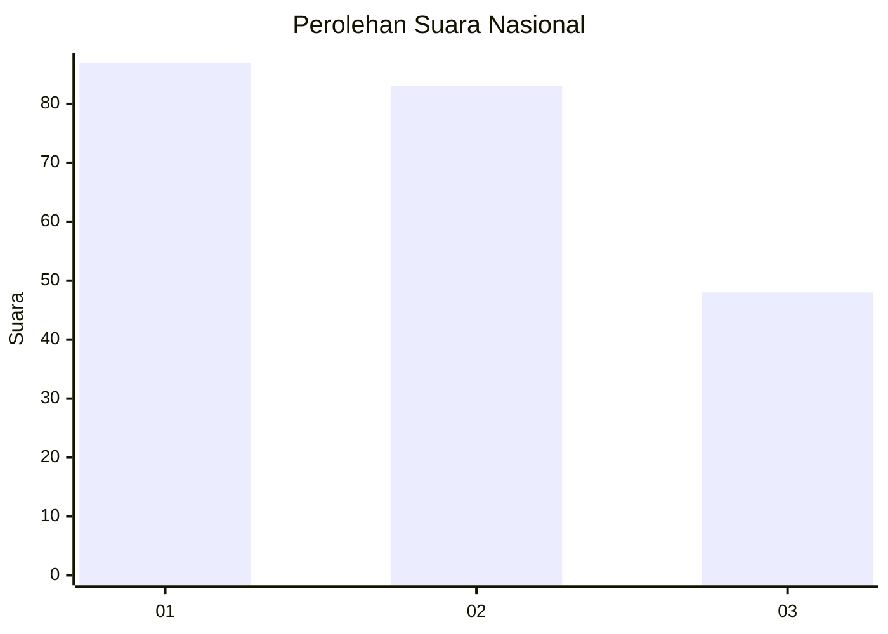
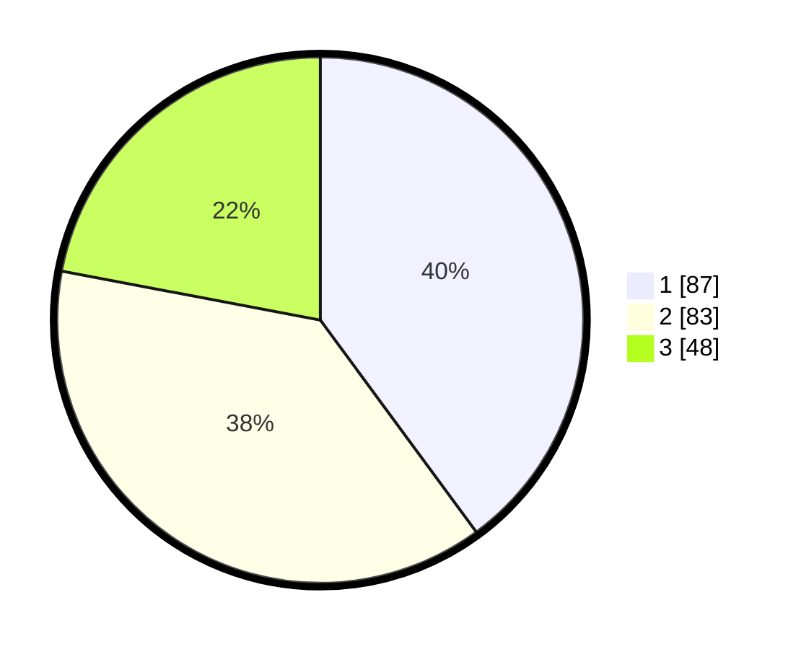

# Hasil

## Grafik

## Tabel

| No.    | Nama Paslon    | Suara | Suara (raw) | Persentase |
|:------ |:-------------- | -----:| -----------:| ----------:|
| 100025 | ANIES MUHAIMIN | 87    | [87][p-1]   | 39,91      |
| 100026 | PRABOWO GIBRAN | 83    | [83][p-2]   | 38,07      |
| 100027 | GANJAR MAHFUD  | 48    | [48][p-3]   | 22,02      |

[p-1]: https://github.com/gigit-pemilu/pemilu-2024/blob/main/pilpres/hitung-suara/sub/31-dki-jakarta/sub/74-jakarta-selatan/sub/05-kebayoran-lama/sub/1005-grogol-selatan/sub/043-tps/sub/paslon-1.txt
[p-2]: https://github.com/gigit-pemilu/pemilu-2024/blob/main/pilpres/hitung-suara/sub/31-dki-jakarta/sub/74-jakarta-selatan/sub/05-kebayoran-lama/sub/1005-grogol-selatan/sub/043-tps/sub/paslon-2.txt
[p-3]: https://github.com/gigit-pemilu/pemilu-2024/blob/main/pilpres/hitung-suara/sub/31-dki-jakarta/sub/74-jakarta-selatan/sub/05-kebayoran-lama/sub/1005-grogol-selatan/sub/043-tps/sub/paslon-3.txt

## Foto C Plano

https://sirekap-obj-formc.kpu.go.id/6b29/pemilu/ppwp/31/74/05/10/05/3174051005043-20240215-005302--22768fed-abcf-40ae-b64a-b4edb10189c1.jpg

https://sirekap-obj-formc.kpu.go.id/6b29/pemilu/ppwp/31/74/05/10/05/3174051005043-20240215-005626--cd54903f-88e5-43d1-bc3d-bd6623ecab98.jpg

https://sirekap-obj-formc.kpu.go.id/6b29/pemilu/ppwp/31/74/05/10/05/3174051005043-20240215-005637--6dd7b12e-b654-4a9e-8c4f-d03f30faa4d2.jpg

## Metadata

| Key        | Value               |
| ---------- | ------------------- |
| Time Stamp | 2024-02-25 11:00:00 |

