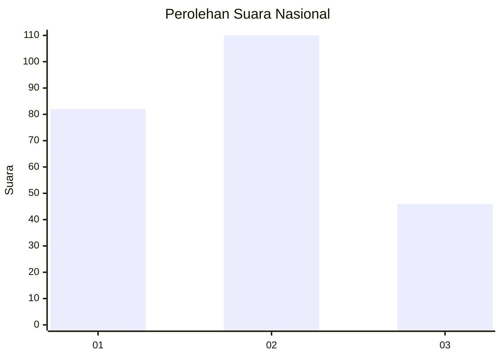
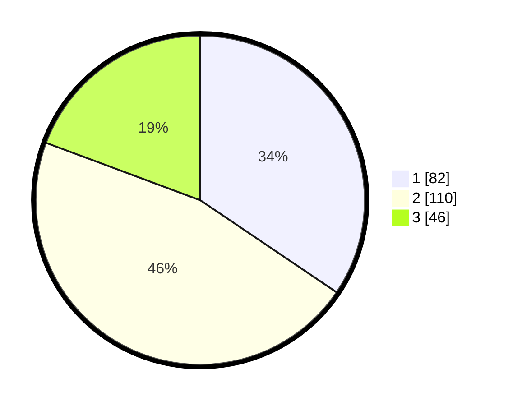

# Hasil

## Grafik

## Tabel

| No.    | Nama Paslon    | Suara | Suara (raw) | Persentase |
|:------ |:-------------- | -----:| -----------:| ----------:|
| 100025 | ANIES MUHAIMIN | 82    | [82][p-1]   | 34,45      |
| 100026 | PRABOWO GIBRAN | 110   | [110][p-2]  | 46,22      |
| 100027 | GANJAR MAHFUD  | 46    | [46][p-3]   | 19,33      |

[p-1]: https://github.com/gigit-pemilu/pemilu-2024/blob/main/pilpres/hitung-suara/sub/31-dki-jakarta/sub/74-jakarta-selatan/sub/05-kebayoran-lama/sub/1005-grogol-selatan/sub/061-tps/sub/paslon-1.txt
[p-2]: https://github.com/gigit-pemilu/pemilu-2024/blob/main/pilpres/hitung-suara/sub/31-dki-jakarta/sub/74-jakarta-selatan/sub/05-kebayoran-lama/sub/1005-grogol-selatan/sub/061-tps/sub/paslon-2.txt
[p-3]: https://github.com/gigit-pemilu/pemilu-2024/blob/main/pilpres/hitung-suara/sub/31-dki-jakarta/sub/74-jakarta-selatan/sub/05-kebayoran-lama/sub/1005-grogol-selatan/sub/061-tps/sub/paslon-3.txt

## Foto C Plano

https://sirekap-obj-formc.kpu.go.id/bda1/pemilu/ppwp/31/74/05/10/05/3174051005061-20240215-002915--2306da4a-815d-434d-a6b7-9b05954e4584.jpg

https://sirekap-obj-formc.kpu.go.id/bda1/pemilu/ppwp/31/74/05/10/05/3174051005061-20240215-003013--86b64c44-e06d-4b6b-8dc9-917d63680387.jpg

https://sirekap-obj-formc.kpu.go.id/bda1/pemilu/ppwp/31/74/05/10/05/3174051005061-20240215-003111--c00c5d00-9a1f-4987-be81-0b8abdcd66b0.jpg

## Metadata

| Key        | Value               |
| ---------- | ------------------- |
| Time Stamp | 2024-02-24 22:31:28 |

