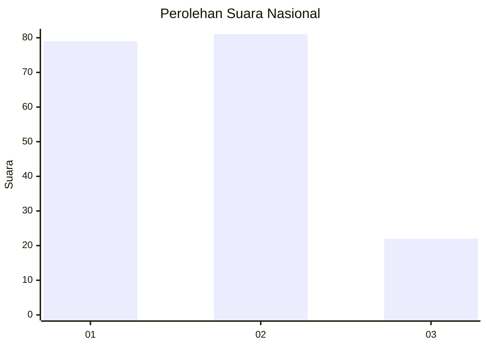
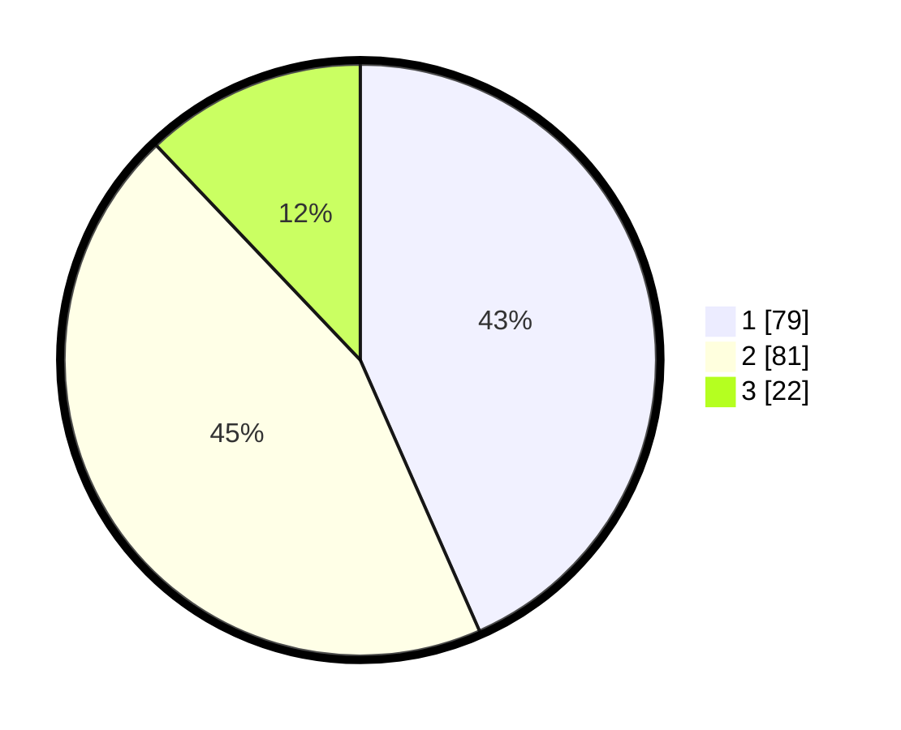

# Hasil

## Grafik

## Tabel

| No.    | Nama Paslon    | Suara | Suara (raw) | Persentase |
|:------ |:-------------- | -----:| -----------:| ----------:|
| 100025 | ANIES MUHAIMIN | 79    | [79][p-1]   | 43,41      |
| 100026 | PRABOWO GIBRAN | 81    | [81][p-2]   | 44,51      |
| 100027 | GANJAR MAHFUD  | 22    | [22][p-3]   | 12,09      |

[p-1]: https://github.com/gigit-pemilu/pemilu-2024/blob/main/pilpres/hitung-suara/sub/31-dki-jakarta/sub/74-jakarta-selatan/sub/05-kebayoran-lama/sub/1005-grogol-selatan/sub/118-tps/sub/paslon-1.txt
[p-2]: https://github.com/gigit-pemilu/pemilu-2024/blob/main/pilpres/hitung-suara/sub/31-dki-jakarta/sub/74-jakarta-selatan/sub/05-kebayoran-lama/sub/1005-grogol-selatan/sub/118-tps/sub/paslon-2.txt
[p-3]: https://github.com/gigit-pemilu/pemilu-2024/blob/main/pilpres/hitung-suara/sub/31-dki-jakarta/sub/74-jakarta-selatan/sub/05-kebayoran-lama/sub/1005-grogol-selatan/sub/118-tps/sub/paslon-3.txt

## Foto C Plano

https://sirekap-obj-formc.kpu.go.id/03e6/pemilu/ppwp/31/74/05/10/05/3174051005118-20240215-031020--07aa87de-ca6c-49c5-84dc-9d000d57a779.jpg

https://sirekap-obj-formc.kpu.go.id/03e6/pemilu/ppwp/31/74/05/10/05/3174051005118-20240215-031036--89698121-4cd0-4a7a-832f-071ce1288594.jpg

https://sirekap-obj-formc.kpu.go.id/03e6/pemilu/ppwp/31/74/05/10/05/3174051005118-20240215-031051--bebf34f5-8e23-46e7-99ea-b0d5ee885cc2.jpg

## Metadata

| Key        | Value               |
| ---------- | ------------------- |
| Time Stamp | 2024-02-24 22:31:28 |

