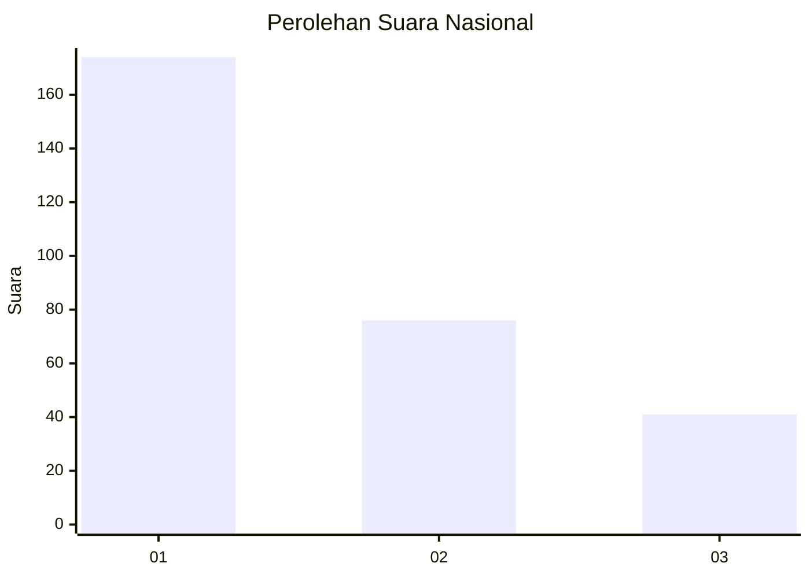
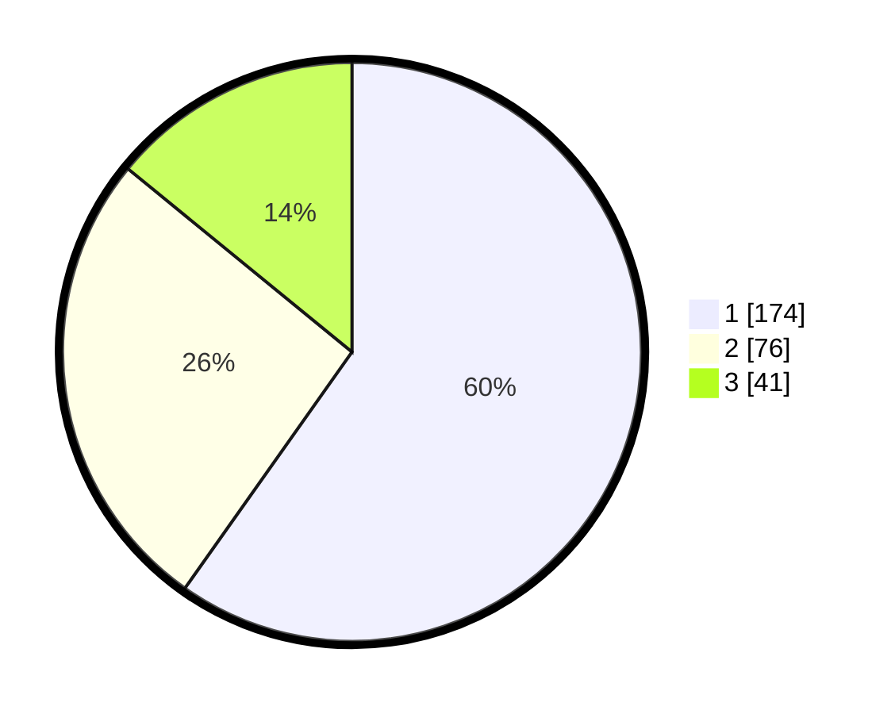

# Hasil

## Grafik

## Tabel

| No.    | Nama Paslon    | Suara | Suara (raw) | Persentase |
|:------ |:-------------- | -----:| -----------:| ----------:|
| 100025 | ANIES MUHAIMIN | 174   | [174][p-1]  | 59,79      |
| 100026 | PRABOWO GIBRAN | 76    | [76][p-2]   | 26,12      |
| 100027 | GANJAR MAHFUD  | 41    | [41][p-3]   | 14,09      |

[p-1]: https://github.com/gigit-pemilu/pemilu-2024/blob/main/pilpres/hitung-suara/sub/31-dki-jakarta/sub/74-jakarta-selatan/sub/05-kebayoran-lama/sub/1005-grogol-selatan/sub/134-tps/sub/paslon-1.txt
[p-2]: https://github.com/gigit-pemilu/pemilu-2024/blob/main/pilpres/hitung-suara/sub/31-dki-jakarta/sub/74-jakarta-selatan/sub/05-kebayoran-lama/sub/1005-grogol-selatan/sub/134-tps/sub/paslon-2.txt
[p-3]: https://github.com/gigit-pemilu/pemilu-2024/blob/main/pilpres/hitung-suara/sub/31-dki-jakarta/sub/74-jakarta-selatan/sub/05-kebayoran-lama/sub/1005-grogol-selatan/sub/134-tps/sub/paslon-3.txt

## Foto C Plano

https://sirekap-obj-formc.kpu.go.id/0b1f/pemilu/ppwp/31/74/05/10/05/3174051005134-20240214-220303--579305ed-ecf9-449d-9459-c6a3040d9d6b.jpg

https://sirekap-obj-formc.kpu.go.id/0b1f/pemilu/ppwp/31/74/05/10/05/3174051005134-20240214-220507--fcbeccfd-c63e-427b-831c-204135dd3583.jpg

https://sirekap-obj-formc.kpu.go.id/0b1f/pemilu/ppwp/31/74/05/10/05/3174051005134-20240214-221231--f60a3e79-37e5-4cca-a349-44e3dfa832fa.jpg

## Metadata

| Key        | Value               |
| ---------- | ------------------- |
| Time Stamp | 2024-02-24 22:31:28 |

