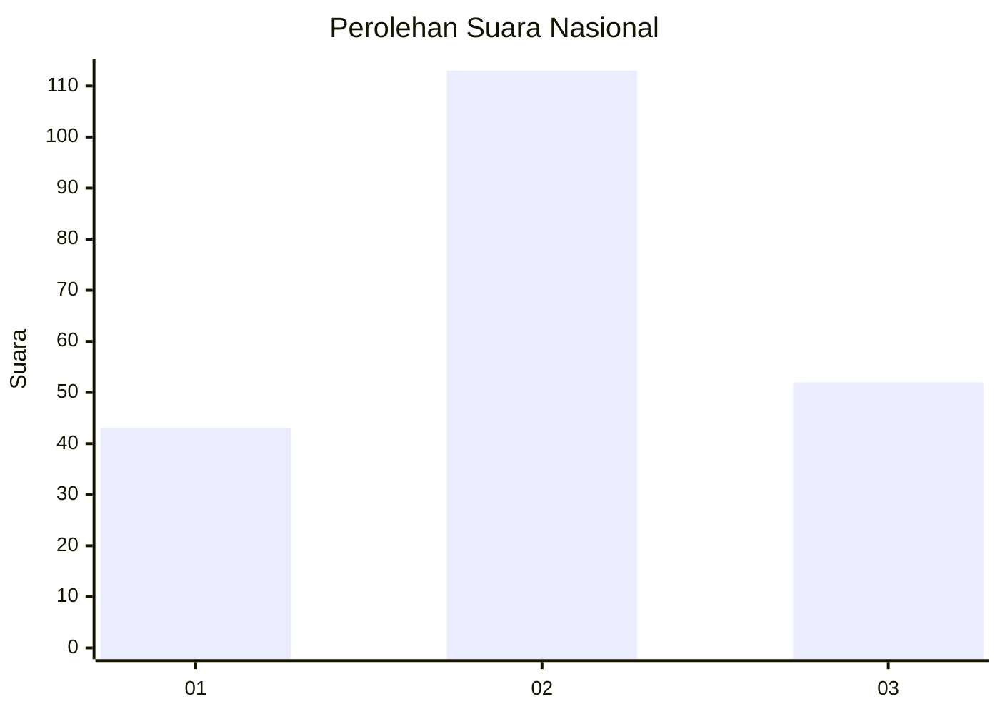
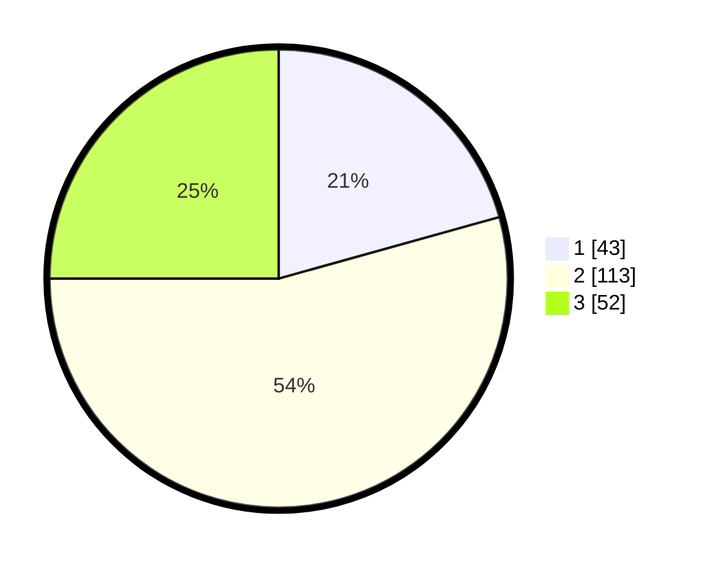

# Hasil

## Grafik

## Tabel

| No.    | Nama Paslon    | Suara | Suara (raw) | Persentase |
|:------ |:-------------- | -----:| -----------:| ----------:|
| 100025 | ANIES MUHAIMIN | 43    | [43][p-1]   | 20,67      |
| 100026 | PRABOWO GIBRAN | 113   | [113][p-2]  | 54,33      |
| 100027 | GANJAR MAHFUD  | 52    | [52][p-3]   | 25,00      |

[p-1]: https://github.com/gigit-pemilu/pemilu-2024/blob/main/pilpres/hitung-suara/sub/31-dki-jakarta/sub/74-jakarta-selatan/sub/05-kebayoran-lama/sub/1005-grogol-selatan/sub/137-tps/sub/paslon-1.txt
[p-2]: https://github.com/gigit-pemilu/pemilu-2024/blob/main/pilpres/hitung-suara/sub/31-dki-jakarta/sub/74-jakarta-selatan/sub/05-kebayoran-lama/sub/1005-grogol-selatan/sub/137-tps/sub/paslon-2.txt
[p-3]: https://github.com/gigit-pemilu/pemilu-2024/blob/main/pilpres/hitung-suara/sub/31-dki-jakarta/sub/74-jakarta-selatan/sub/05-kebayoran-lama/sub/1005-grogol-selatan/sub/137-tps/sub/paslon-3.txt

## Foto C Plano

https://sirekap-obj-formc.kpu.go.id/993f/pemilu/ppwp/31/74/05/10/05/3174051005137-20240216-080032--230bcd94-973a-4c8c-af35-e352ad9b3919.jpg

https://sirekap-obj-formc.kpu.go.id/993f/pemilu/ppwp/31/74/05/10/05/3174051005137-20240216-080037--cdecd782-3047-46ec-88d8-f3f6516e4d0b.jpg

https://sirekap-obj-formc.kpu.go.id/993f/pemilu/ppwp/31/74/05/10/05/3174051005137-20240216-080108--dcf31984-bcb2-4eea-a500-86d7d6fa4413.jpg

## Metadata

| Key        | Value               |
| ---------- | ------------------- |
| Time Stamp | 2024-02-24 22:31:28 |

