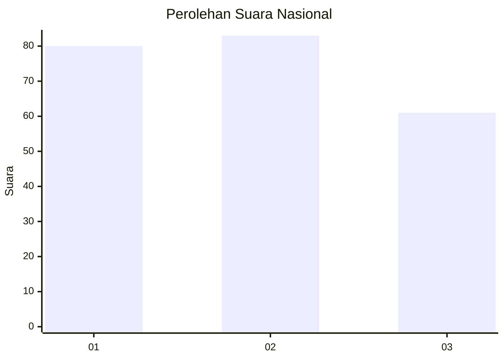
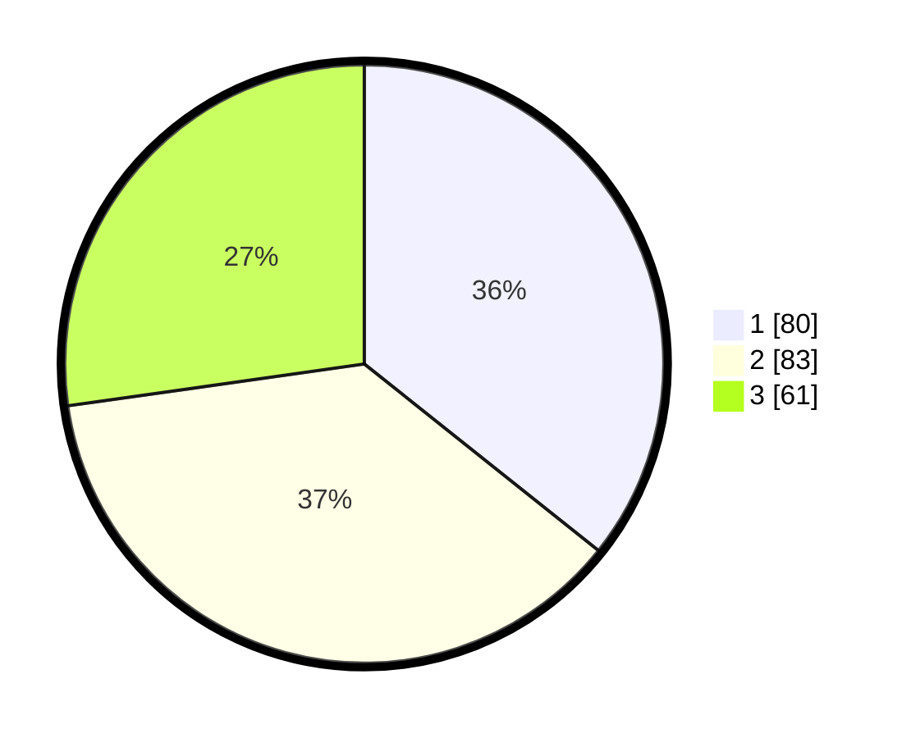

# Hasil

## Grafik

## Tabel

| No.    | Nama Paslon    | Suara | Suara (raw) | Persentase |
|:------ |:-------------- | -----:| -----------:| ----------:|
| 100025 | ANIES MUHAIMIN | 80    | [80][p-1]   | 35,71      |
| 100026 | PRABOWO GIBRAN | 83    | [83][p-2]   | 37,05      |
| 100027 | GANJAR MAHFUD  | 61    | [61][p-3]   | 27,23      |

[p-1]: https://github.com/gigit-pemilu/pemilu-2024/blob/main/pilpres/hitung-suara/sub/31-dki-jakarta/sub/74-jakarta-selatan/sub/05-kebayoran-lama/sub/1005-grogol-selatan/sub/144-tps/sub/paslon-1.txt
[p-2]: https://github.com/gigit-pemilu/pemilu-2024/blob/main/pilpres/hitung-suara/sub/31-dki-jakarta/sub/74-jakarta-selatan/sub/05-kebayoran-lama/sub/1005-grogol-selatan/sub/144-tps/sub/paslon-2.txt
[p-3]: https://github.com/gigit-pemilu/pemilu-2024/blob/main/pilpres/hitung-suara/sub/31-dki-jakarta/sub/74-jakarta-selatan/sub/05-kebayoran-lama/sub/1005-grogol-selatan/sub/144-tps/sub/paslon-3.txt

## Foto C Plano

https://sirekap-obj-formc.kpu.go.id/3e45/pemilu/ppwp/31/74/05/10/05/3174051005144-20240215-001049--d4791831-2adf-4e50-b673-053537340206.jpg

https://sirekap-obj-formc.kpu.go.id/3e45/pemilu/ppwp/31/74/05/10/05/3174051005144-20240215-001256--8ed870e5-82b7-487c-8ef2-e860d0301abe.jpg

https://sirekap-obj-formc.kpu.go.id/3e45/pemilu/ppwp/31/74/05/10/05/3174051005144-20240215-001623--41c3181e-aa74-426a-8172-9a5511c0e7da.jpg

## Metadata

| Key        | Value               |
| ---------- | ------------------- |
| Time Stamp | 2024-02-24 22:31:28 |

