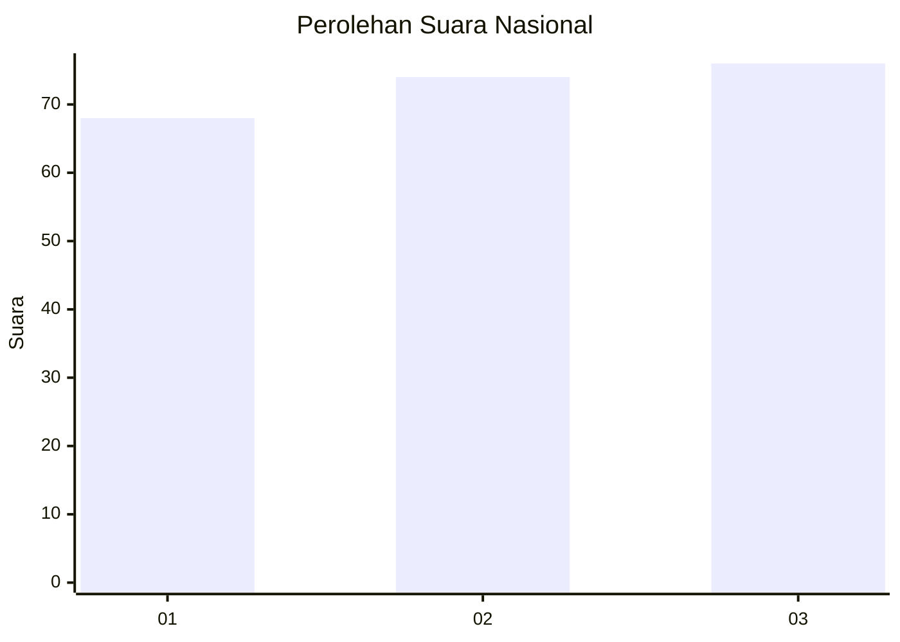
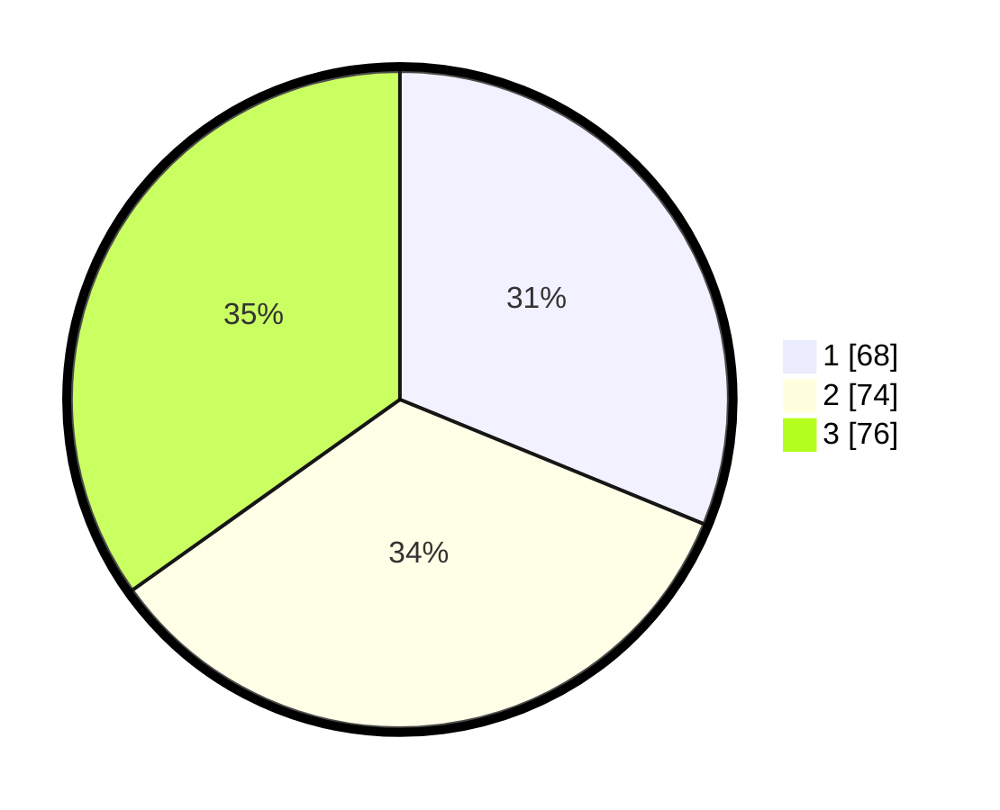

# Hasil

## Grafik

## Tabel

| No.    | Nama Paslon    | Suara | Suara (raw) | Persentase |
|:------ |:-------------- | -----:| -----------:| ----------:|
| 100025 | ANIES MUHAIMIN | 68    | [68][p-1]   | 31,19      |
| 100026 | PRABOWO GIBRAN | 74    | [74][p-2]   | 33,94      |
| 100027 | GANJAR MAHFUD  | 76    | [76][p-3]   | 34,86      |

[p-1]: https://github.com/gigit-pemilu/pemilu-2024/blob/main/pilpres/hitung-suara/sub/31-dki-jakarta/sub/74-jakarta-selatan/sub/05-kebayoran-lama/sub/1006-kebayoran-lama-selatan/sub/005-tps/sub/paslon-1.txt
[p-2]: https://github.com/gigit-pemilu/pemilu-2024/blob/main/pilpres/hitung-suara/sub/31-dki-jakarta/sub/74-jakarta-selatan/sub/05-kebayoran-lama/sub/1006-kebayoran-lama-selatan/sub/005-tps/sub/paslon-2.txt
[p-3]: https://github.com/gigit-pemilu/pemilu-2024/blob/main/pilpres/hitung-suara/sub/31-dki-jakarta/sub/74-jakarta-selatan/sub/05-kebayoran-lama/sub/1006-kebayoran-lama-selatan/sub/005-tps/sub/paslon-3.txt

## Foto C Plano

https://sirekap-obj-formc.kpu.go.id/2f50/pemilu/ppwp/31/74/05/10/06/3174051006005-20240214-221643--15674b9d-e767-484f-8b5c-8124473a43f8.jpg

https://sirekap-obj-formc.kpu.go.id/2f50/pemilu/ppwp/31/74/05/10/06/3174051006005-20240214-222026--ed0e4d32-3d3e-43f2-983a-5601888295fe.jpg

https://sirekap-obj-formc.kpu.go.id/2f50/pemilu/ppwp/31/74/05/10/06/3174051006005-20240214-221359--99709d02-4d2d-4d52-a598-e825e7640c3a.jpg

## Metadata

| Key        | Value               |
| ---------- | ------------------- |
| Time Stamp | 2024-02-24 22:31:28 |

