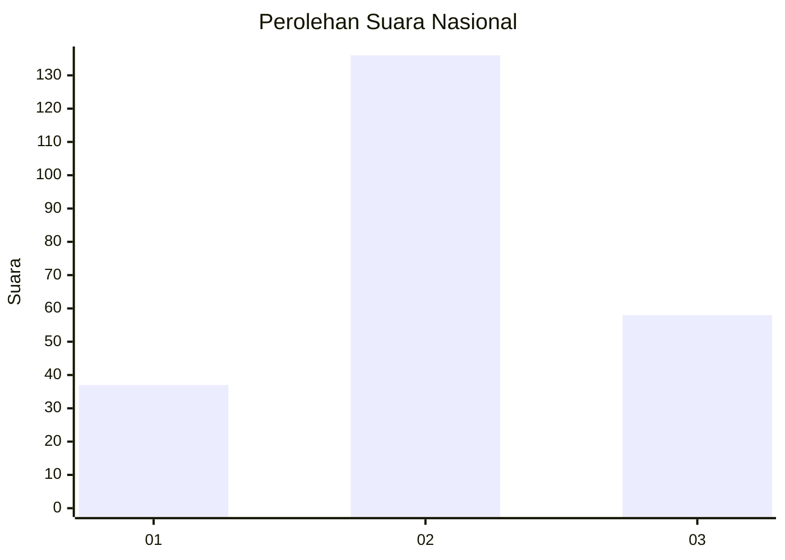
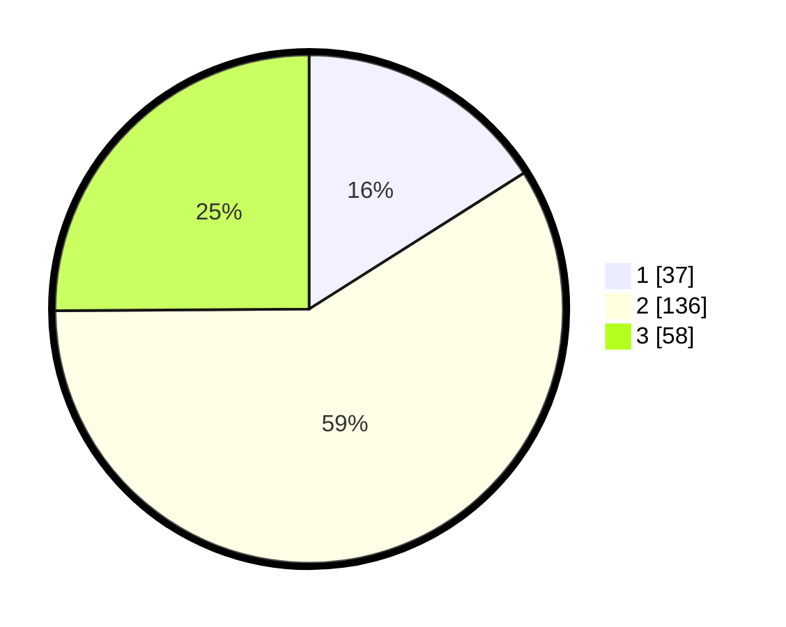

# Hasil

## Grafik

## Tabel

| No.    | Nama Paslon    | Suara | Suara (raw) | Persentase |
|:------ |:-------------- | -----:| -----------:| ----------:|
| 100025 | ANIES MUHAIMIN | 37    | [37][p-1]   | 16,02      |
| 100026 | PRABOWO GIBRAN | 136   | [136][p-2]  | 58,87      |
| 100027 | GANJAR MAHFUD  | 58    | [58][p-3]   | 25,11      |

[p-1]: https://github.com/gigit-pemilu/pemilu-2024/blob/main/pilpres/hitung-suara/sub/31-dki-jakarta/sub/74-jakarta-selatan/sub/05-kebayoran-lama/sub/1006-kebayoran-lama-selatan/sub/009-tps/sub/paslon-1.txt
[p-2]: https://github.com/gigit-pemilu/pemilu-2024/blob/main/pilpres/hitung-suara/sub/31-dki-jakarta/sub/74-jakarta-selatan/sub/05-kebayoran-lama/sub/1006-kebayoran-lama-selatan/sub/009-tps/sub/paslon-2.txt
[p-3]: https://github.com/gigit-pemilu/pemilu-2024/blob/main/pilpres/hitung-suara/sub/31-dki-jakarta/sub/74-jakarta-selatan/sub/05-kebayoran-lama/sub/1006-kebayoran-lama-selatan/sub/009-tps/sub/paslon-3.txt

## Foto C Plano

https://sirekap-obj-formc.kpu.go.id/4fa2/pemilu/ppwp/31/74/05/10/06/3174051006009-20240214-222250--2a4b63f9-7776-4261-aa2a-ace7d7d3b67f.jpg

https://sirekap-obj-formc.kpu.go.id/4fa2/pemilu/ppwp/31/74/05/10/06/3174051006009-20240214-222446--eb899632-58f8-4ea5-b66b-afbdeafef36e.jpg

https://sirekap-obj-formc.kpu.go.id/4fa2/pemilu/ppwp/31/74/05/10/06/3174051006009-20240214-222752--14d4c7af-3fac-4188-ae53-dc7e742fa420.jpg

## Metadata

| Key        | Value               |
| ---------- | ------------------- |
| Time Stamp | 2024-02-25 11:00:00 |

