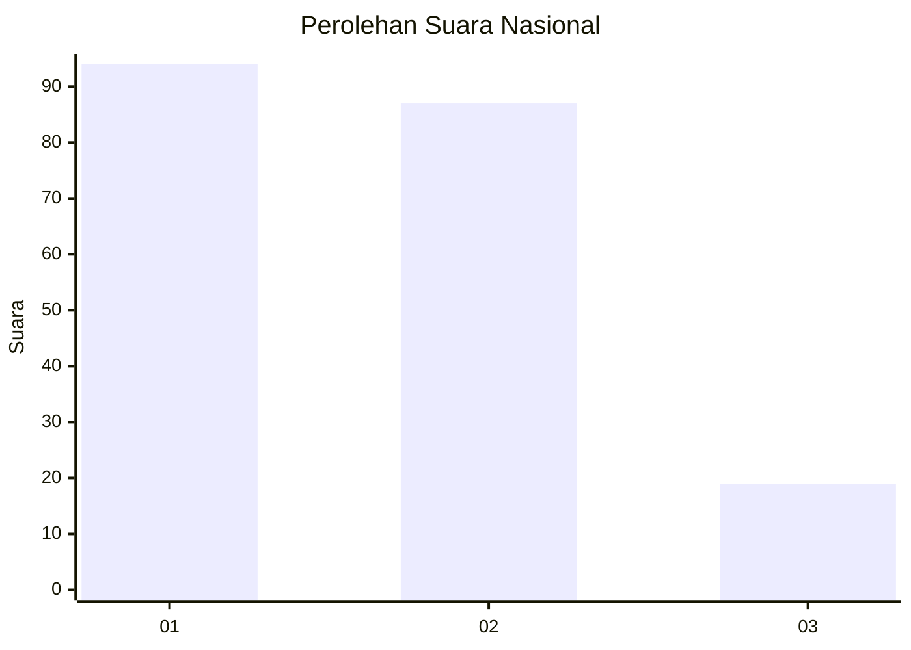
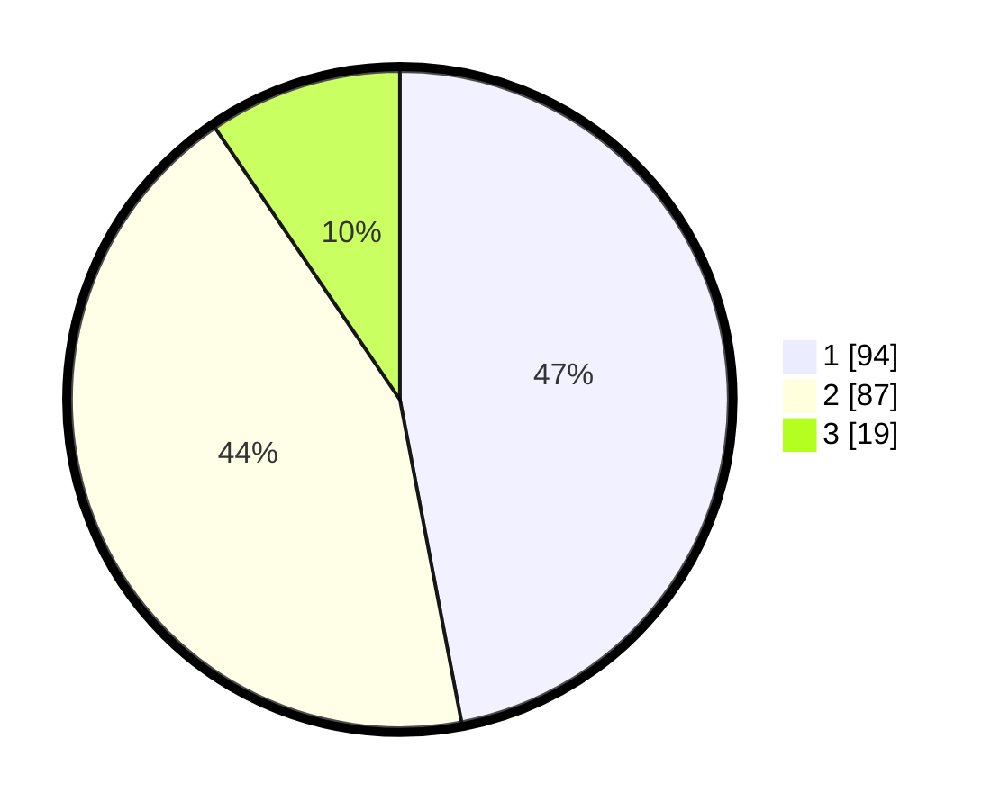

# Hasil

## Grafik

## Tabel

| No.    | Nama Paslon    | Suara | Suara (raw) | Persentase |
|:------ |:-------------- | -----:| -----------:| ----------:|
| 100025 | ANIES MUHAIMIN | 94    | [94][p-1]   | 47,00      |
| 100026 | PRABOWO GIBRAN | 87    | [87][p-2]   | 43,50      |
| 100027 | GANJAR MAHFUD  | 19    | [19][p-3]   | 9,50       |

[p-1]: https://github.com/gigit-pemilu/pemilu-2024/blob/main/pilpres/hitung-suara/sub/31-dki-jakarta/sub/74-jakarta-selatan/sub/05-kebayoran-lama/sub/1006-kebayoran-lama-selatan/sub/026-tps/sub/paslon-1.txt
[p-2]: https://github.com/gigit-pemilu/pemilu-2024/blob/main/pilpres/hitung-suara/sub/31-dki-jakarta/sub/74-jakarta-selatan/sub/05-kebayoran-lama/sub/1006-kebayoran-lama-selatan/sub/026-tps/sub/paslon-2.txt
[p-3]: https://github.com/gigit-pemilu/pemilu-2024/blob/main/pilpres/hitung-suara/sub/31-dki-jakarta/sub/74-jakarta-selatan/sub/05-kebayoran-lama/sub/1006-kebayoran-lama-selatan/sub/026-tps/sub/paslon-3.txt

## Foto C Plano

https://sirekap-obj-formc.kpu.go.id/92eb/pemilu/ppwp/31/74/05/10/06/3174051006026-20240214-234203--0bbd99b8-0aae-4c06-b2c1-a4c4cc62328e.jpg

https://sirekap-obj-formc.kpu.go.id/92eb/pemilu/ppwp/31/74/05/10/06/3174051006026-20240215-003901--a3b7ad9c-2c0a-4e51-81d7-993851480af7.jpg

https://sirekap-obj-formc.kpu.go.id/92eb/pemilu/ppwp/31/74/05/10/06/3174051006026-20240215-003929--0c9d3522-4fa1-47e8-b97c-1fbe3f866dd8.jpg

## Metadata

| Key        | Value               |
| ---------- | ------------------- |
| Time Stamp | 2024-02-24 22:31:28 |

