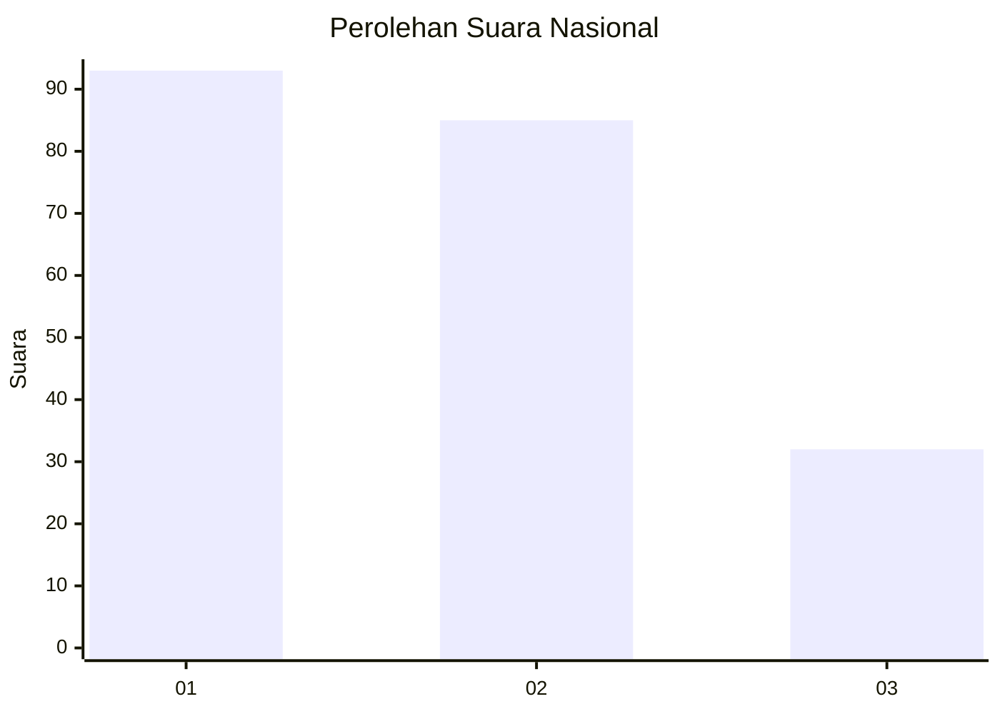
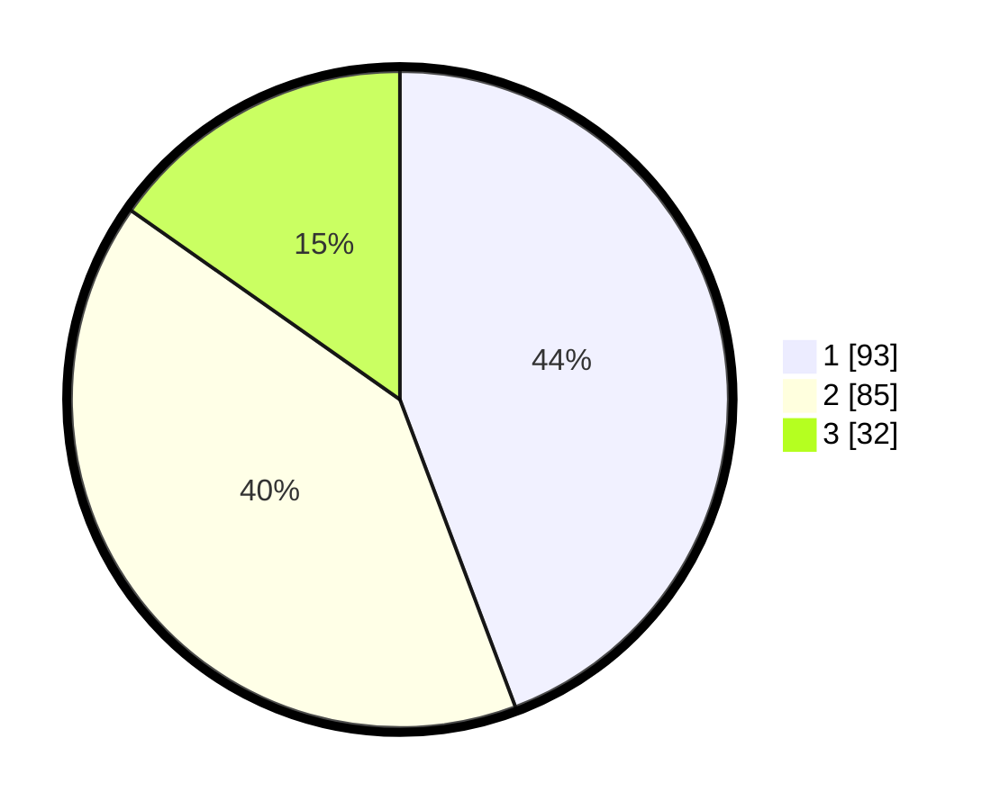

# Hasil

## Grafik

## Tabel

| No.    | Nama Paslon    | Suara | Suara (raw) | Persentase |
|:------ |:-------------- | -----:| -----------:| ----------:|
| 100025 | ANIES MUHAIMIN | 93    | [93][p-1]   | 44,29      |
| 100026 | PRABOWO GIBRAN | 85    | [85][p-2]   | 40,48      |
| 100027 | GANJAR MAHFUD  | 32    | [32][p-3]   | 15,24      |

[p-1]: https://github.com/gigit-pemilu/pemilu-2024/blob/main/pilpres/hitung-suara/sub/31-dki-jakarta/sub/74-jakarta-selatan/sub/05-kebayoran-lama/sub/1006-kebayoran-lama-selatan/sub/032-tps/sub/paslon-1.txt
[p-2]: https://github.com/gigit-pemilu/pemilu-2024/blob/main/pilpres/hitung-suara/sub/31-dki-jakarta/sub/74-jakarta-selatan/sub/05-kebayoran-lama/sub/1006-kebayoran-lama-selatan/sub/032-tps/sub/paslon-2.txt
[p-3]: https://github.com/gigit-pemilu/pemilu-2024/blob/main/pilpres/hitung-suara/sub/31-dki-jakarta/sub/74-jakarta-selatan/sub/05-kebayoran-lama/sub/1006-kebayoran-lama-selatan/sub/032-tps/sub/paslon-3.txt

## Foto C Plano

https://sirekap-obj-formc.kpu.go.id/df4f/pemilu/ppwp/31/74/05/10/06/3174051006032-20240214-223646--ee33a342-e6b4-48a0-a3a1-48f9eeecc319.jpg

https://sirekap-obj-formc.kpu.go.id/df4f/pemilu/ppwp/31/74/05/10/06/3174051006032-20240214-223729--8b260587-84cf-41f8-8a70-18345d7cde63.jpg

https://sirekap-obj-formc.kpu.go.id/df4f/pemilu/ppwp/31/74/05/10/06/3174051006032-20240214-223812--f2fec187-a35a-4377-b8ab-1cd7caed7657.jpg

## Metadata

| Key        | Value               |
| ---------- | ------------------- |
| Time Stamp | 2024-02-24 22:31:28 |

