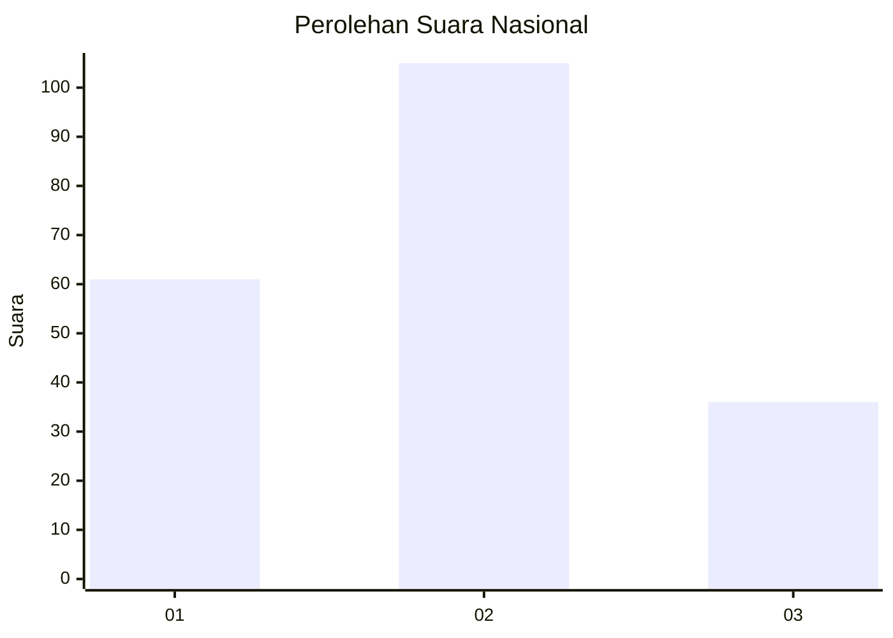
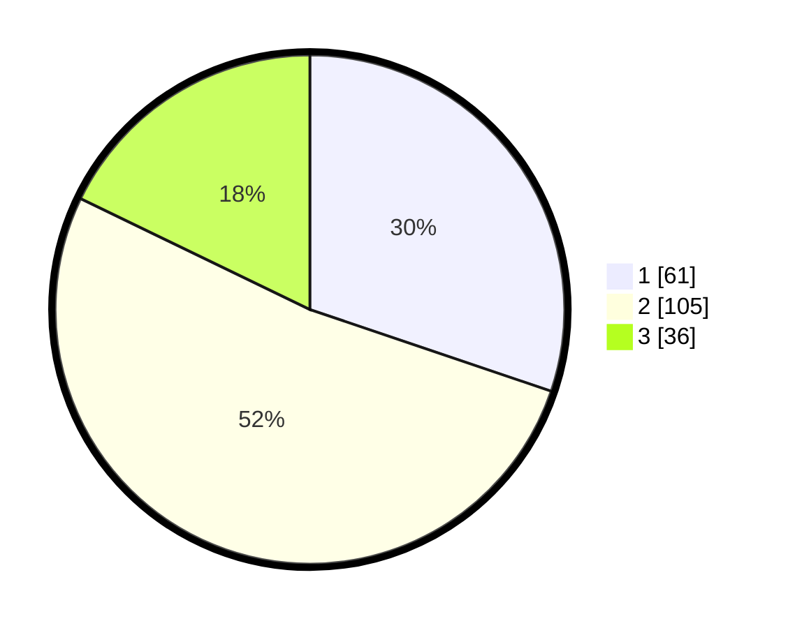

# Hasil

## Grafik

## Tabel

| No.    | Nama Paslon    | Suara | Suara (raw) | Persentase |
|:------ |:-------------- | -----:| -----------:| ----------:|
| 100025 | ANIES MUHAIMIN | 61    | [61][p-1]   | 30,20      |
| 100026 | PRABOWO GIBRAN | 105   | [105][p-2]  | 51,98      |
| 100027 | GANJAR MAHFUD  | 36    | [36][p-3]   | 17,82      |

[p-1]: https://github.com/gigit-pemilu/pemilu-2024/blob/main/pilpres/hitung-suara/sub/31-dki-jakarta/sub/74-jakarta-selatan/sub/05-kebayoran-lama/sub/1006-kebayoran-lama-selatan/sub/036-tps/sub/paslon-1.txt
[p-2]: https://github.com/gigit-pemilu/pemilu-2024/blob/main/pilpres/hitung-suara/sub/31-dki-jakarta/sub/74-jakarta-selatan/sub/05-kebayoran-lama/sub/1006-kebayoran-lama-selatan/sub/036-tps/sub/paslon-2.txt
[p-3]: https://github.com/gigit-pemilu/pemilu-2024/blob/main/pilpres/hitung-suara/sub/31-dki-jakarta/sub/74-jakarta-selatan/sub/05-kebayoran-lama/sub/1006-kebayoran-lama-selatan/sub/036-tps/sub/paslon-3.txt

## Foto C Plano

https://sirekap-obj-formc.kpu.go.id/f6dc/pemilu/ppwp/31/74/05/10/06/3174051006036-20240219-203322--29673637-cf48-4d0f-8d7e-c11ad943d7af.jpg

https://sirekap-obj-formc.kpu.go.id/f6dc/pemilu/ppwp/31/74/05/10/06/3174051006036-20240219-203333--292281ad-8690-450d-833b-0d8b780700e4.jpg

https://sirekap-obj-formc.kpu.go.id/f6dc/pemilu/ppwp/31/74/05/10/06/3174051006036-20240219-203341--f101e2f8-c4d4-4f58-8358-8922762613f6.jpg

## Metadata

| Key        | Value               |
| ---------- | ------------------- |
| Time Stamp | 2024-02-25 22:00:00 |

