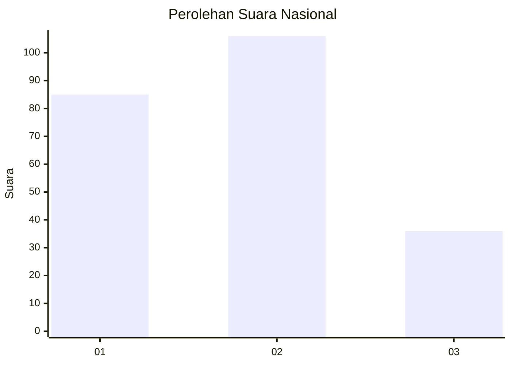
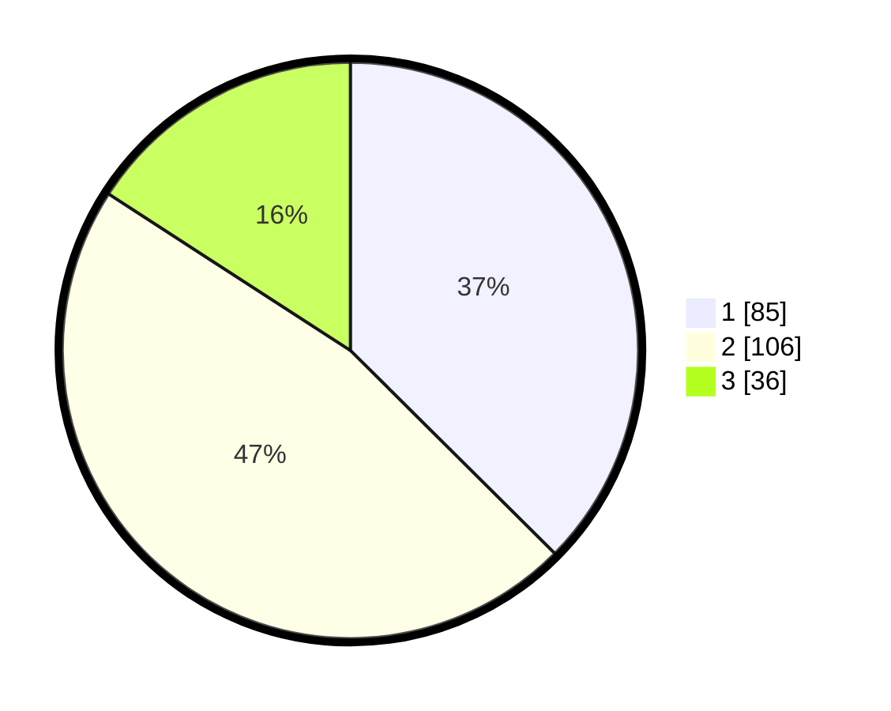

# Hasil

## Grafik

## Tabel

| No.    | Nama Paslon    | Suara | Suara (raw) | Persentase |
|:------ |:-------------- | -----:| -----------:| ----------:|
| 100025 | ANIES MUHAIMIN | 85    | [85][p-1]   | 37,44      |
| 100026 | PRABOWO GIBRAN | 106   | [106][p-2]  | 46,70      |
| 100027 | GANJAR MAHFUD  | 36    | [36][p-3]   | 15,86      |

[p-1]: https://github.com/gigit-pemilu/pemilu-2024/blob/main/pilpres/hitung-suara/sub/31-dki-jakarta/sub/74-jakarta-selatan/sub/05-kebayoran-lama/sub/1006-kebayoran-lama-selatan/sub/084-tps/sub/paslon-1.txt
[p-2]: https://github.com/gigit-pemilu/pemilu-2024/blob/main/pilpres/hitung-suara/sub/31-dki-jakarta/sub/74-jakarta-selatan/sub/05-kebayoran-lama/sub/1006-kebayoran-lama-selatan/sub/084-tps/sub/paslon-2.txt
[p-3]: https://github.com/gigit-pemilu/pemilu-2024/blob/main/pilpres/hitung-suara/sub/31-dki-jakarta/sub/74-jakarta-selatan/sub/05-kebayoran-lama/sub/1006-kebayoran-lama-selatan/sub/084-tps/sub/paslon-3.txt

## Foto C Plano

https://sirekap-obj-formc.kpu.go.id/db2e/pemilu/ppwp/31/74/05/10/06/3174051006084-20240214-222039--baecb583-2920-41e6-9810-e96f5574c96e.jpg

https://sirekap-obj-formc.kpu.go.id/db2e/pemilu/ppwp/31/74/05/10/06/3174051006084-20240214-221724--5555e8a7-d9c5-4f3a-81f6-c8c019afef8f.jpg

https://sirekap-obj-formc.kpu.go.id/db2e/pemilu/ppwp/31/74/05/10/06/3174051006084-20240214-222251--dfcd55d6-9a8b-4ee6-86f0-0c4e60b22ba5.jpg

## Metadata

| Key        | Value               |
| ---------- | ------------------- |
| Time Stamp | 2024-02-24 22:31:28 |

