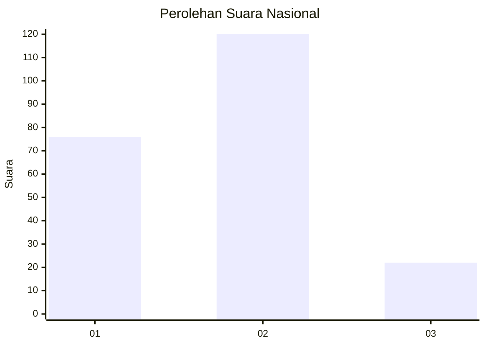
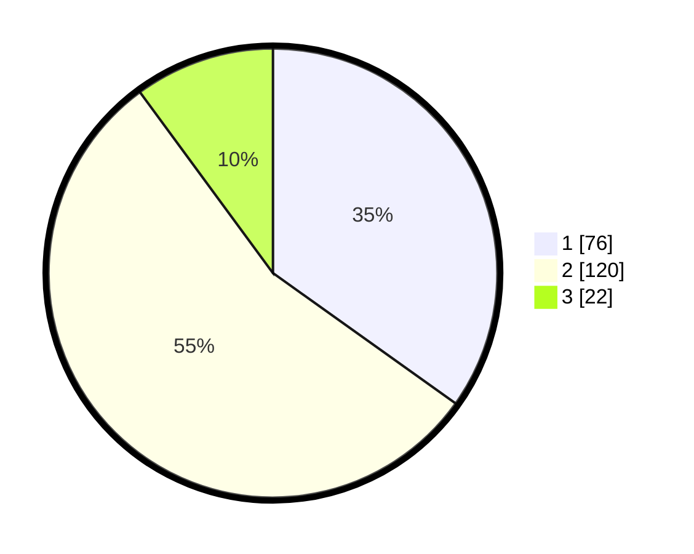

# Hasil

## Grafik

## Tabel

| No.    | Nama Paslon    | Suara | Suara (raw) | Persentase |
|:------ |:-------------- | -----:| -----------:| ----------:|
| 100025 | ANIES MUHAIMIN | 76    | [76][p-1]   | 34,86      |
| 100026 | PRABOWO GIBRAN | 120   | [120][p-2]  | 55,05      |
| 100027 | GANJAR MAHFUD  | 22    | [22][p-3]   | 10,09      |

[p-1]: https://github.com/gigit-pemilu/pemilu-2024/blob/main/pilpres/hitung-suara/sub/31-dki-jakarta/sub/74-jakarta-selatan/sub/05-kebayoran-lama/sub/1006-kebayoran-lama-selatan/sub/096-tps/sub/paslon-1.txt
[p-2]: https://github.com/gigit-pemilu/pemilu-2024/blob/main/pilpres/hitung-suara/sub/31-dki-jakarta/sub/74-jakarta-selatan/sub/05-kebayoran-lama/sub/1006-kebayoran-lama-selatan/sub/096-tps/sub/paslon-2.txt
[p-3]: https://github.com/gigit-pemilu/pemilu-2024/blob/main/pilpres/hitung-suara/sub/31-dki-jakarta/sub/74-jakarta-selatan/sub/05-kebayoran-lama/sub/1006-kebayoran-lama-selatan/sub/096-tps/sub/paslon-3.txt

## Foto C Plano

https://sirekap-obj-formc.kpu.go.id/ea93/pemilu/ppwp/31/74/05/10/06/3174051006096-20240214-221412--5f93d78e-12bd-4bf3-b250-ef97dfcea87d.jpg

https://sirekap-obj-formc.kpu.go.id/ea93/pemilu/ppwp/31/74/05/10/06/3174051006096-20240214-215309--d3582c80-912d-4cb5-99e9-0697fdc4abde.jpg

https://sirekap-obj-formc.kpu.go.id/ea93/pemilu/ppwp/31/74/05/10/06/3174051006096-20240214-215735--da983e08-ef19-4300-87e0-aee3d24ed6cf.jpg

## Metadata

| Key        | Value               |
| ---------- | ------------------- |
| Time Stamp | 2024-02-15 04:00:24 |

