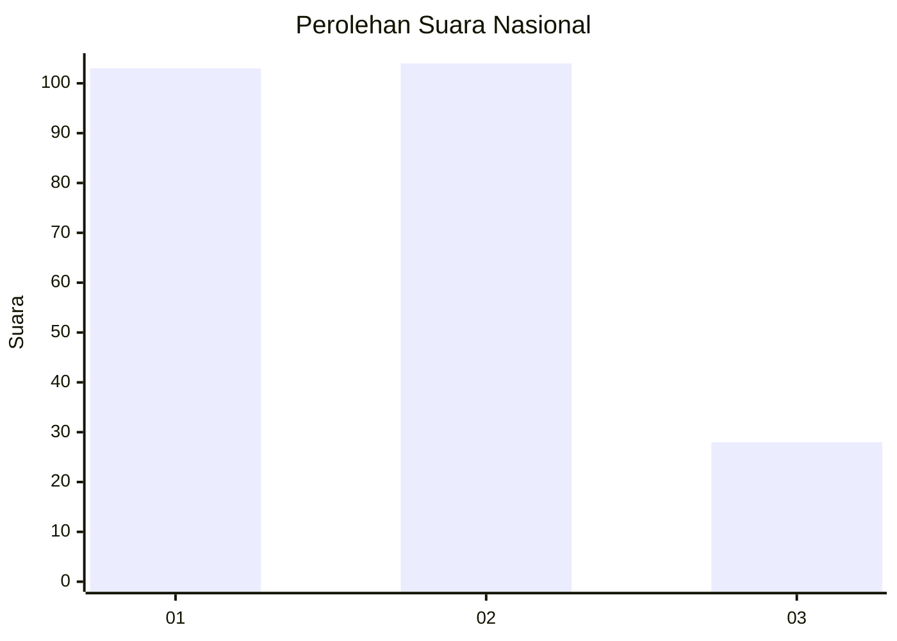
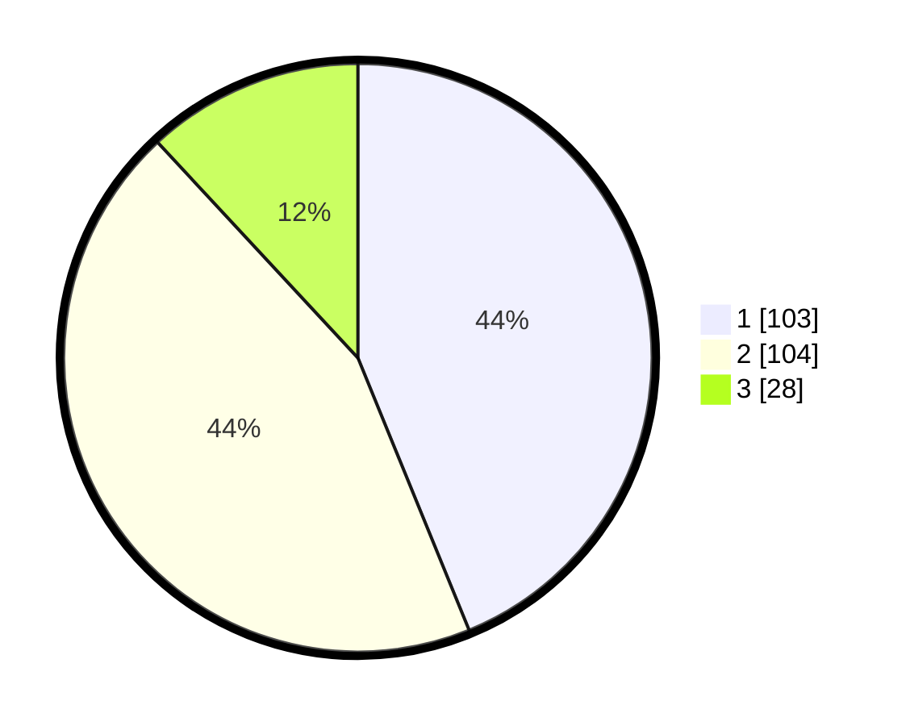

# Hasil

## Grafik

## Tabel

| No.    | Nama Paslon    | Suara | Suara (raw) | Persentase |
|:------ |:-------------- | -----:| -----------:| ----------:|
| 100025 | ANIES MUHAIMIN | 103   | [103][p-1]  | 43,83      |
| 100026 | PRABOWO GIBRAN | 104   | [104][p-2]  | 44,26      |
| 100027 | GANJAR MAHFUD  | 28    | [28][p-3]   | 11,91      |

[p-1]: https://github.com/gigit-pemilu/pemilu-2024/blob/main/pilpres/hitung-suara/sub/31-dki-jakarta/sub/74-jakarta-selatan/sub/05-kebayoran-lama/sub/1006-kebayoran-lama-selatan/sub/100-tps/sub/paslon-1.txt
[p-2]: https://github.com/gigit-pemilu/pemilu-2024/blob/main/pilpres/hitung-suara/sub/31-dki-jakarta/sub/74-jakarta-selatan/sub/05-kebayoran-lama/sub/1006-kebayoran-lama-selatan/sub/100-tps/sub/paslon-2.txt
[p-3]: https://github.com/gigit-pemilu/pemilu-2024/blob/main/pilpres/hitung-suara/sub/31-dki-jakarta/sub/74-jakarta-selatan/sub/05-kebayoran-lama/sub/1006-kebayoran-lama-selatan/sub/100-tps/sub/paslon-3.txt

## Foto C Plano

https://sirekap-obj-formc.kpu.go.id/6d5c/pemilu/ppwp/31/74/05/10/06/3174051006100-20240215-010019--da7ec4fe-3807-4c5c-936b-403cc59c5082.jpg

https://sirekap-obj-formc.kpu.go.id/6d5c/pemilu/ppwp/31/74/05/10/06/3174051006100-20240215-010528--af96c23e-0483-4a27-9a34-7866b34bc6c7.jpg

https://sirekap-obj-formc.kpu.go.id/6d5c/pemilu/ppwp/31/74/05/10/06/3174051006100-20240215-010831--3615a88c-9adf-4d6e-8ba2-7706038b45dc.jpg

## Metadata

| Key        | Value               |
| ---------- | ------------------- |
| Time Stamp | 2024-02-25 12:00:00 |

