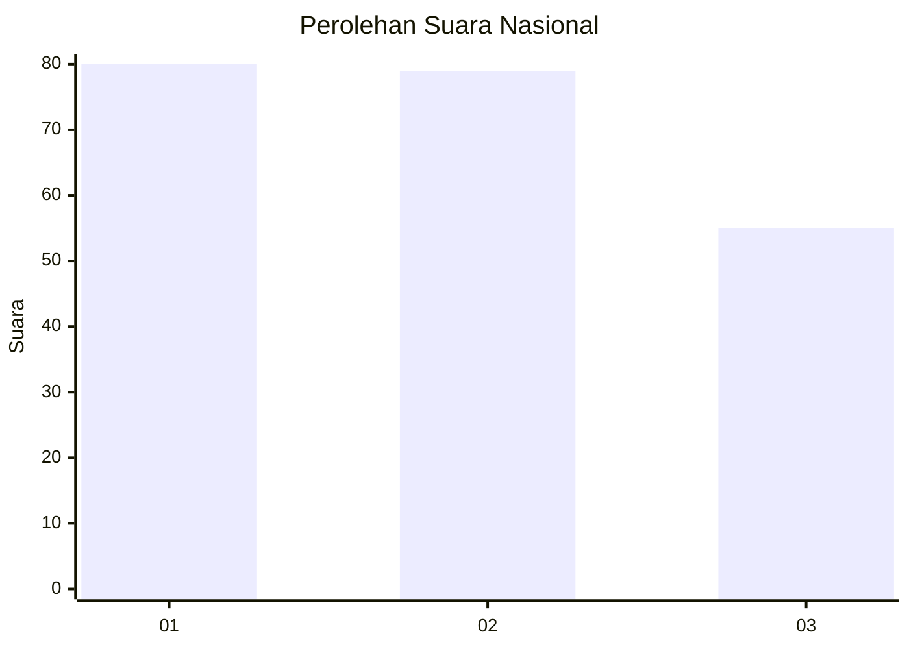
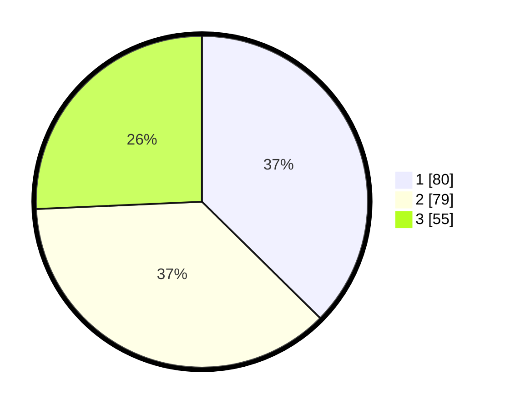

# Hasil

## Grafik

## Tabel

| No.    | Nama Paslon    | Suara | Suara (raw) | Persentase |
|:------ |:-------------- | -----:| -----------:| ----------:|
| 100025 | ANIES MUHAIMIN | 80    | [80][p-1]   | 37,38      |
| 100026 | PRABOWO GIBRAN | 79    | [79][p-2]   | 36,92      |
| 100027 | GANJAR MAHFUD  | 55    | [55][p-3]   | 25,70      |

[p-1]: https://github.com/gigit-pemilu/pemilu-2024/blob/main/pilpres/hitung-suara/sub/31-dki-jakarta/sub/74-jakarta-selatan/sub/05-kebayoran-lama/sub/1006-kebayoran-lama-selatan/sub/104-tps/sub/paslon-1.txt
[p-2]: https://github.com/gigit-pemilu/pemilu-2024/blob/main/pilpres/hitung-suara/sub/31-dki-jakarta/sub/74-jakarta-selatan/sub/05-kebayoran-lama/sub/1006-kebayoran-lama-selatan/sub/104-tps/sub/paslon-2.txt
[p-3]: https://github.com/gigit-pemilu/pemilu-2024/blob/main/pilpres/hitung-suara/sub/31-dki-jakarta/sub/74-jakarta-selatan/sub/05-kebayoran-lama/sub/1006-kebayoran-lama-selatan/sub/104-tps/sub/paslon-3.txt

## Foto C Plano

https://sirekap-obj-formc.kpu.go.id/c63a/pemilu/ppwp/31/74/05/10/06/3174051006104-20240214-220702--8c75cbe3-11d4-44a5-8975-62bf0e31e222.jpg

https://sirekap-obj-formc.kpu.go.id/c63a/pemilu/ppwp/31/74/05/10/06/3174051006104-20240214-221900--4506a6aa-c5ed-4dbb-aae7-1a90244d6e3f.jpg

https://sirekap-obj-formc.kpu.go.id/c63a/pemilu/ppwp/31/74/05/10/06/3174051006104-20240214-221949--527745f9-5826-4950-9697-ba7ecdd1328d.jpg

## Metadata

| Key        | Value               |
| ---------- | ------------------- |
| Time Stamp | 2024-02-24 22:31:28 |

