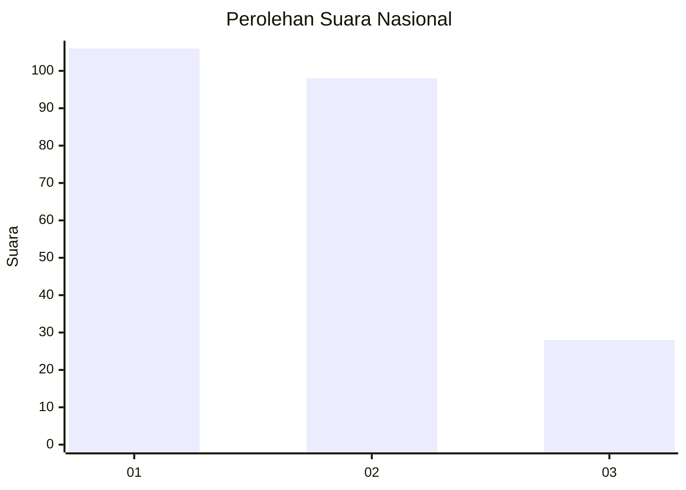
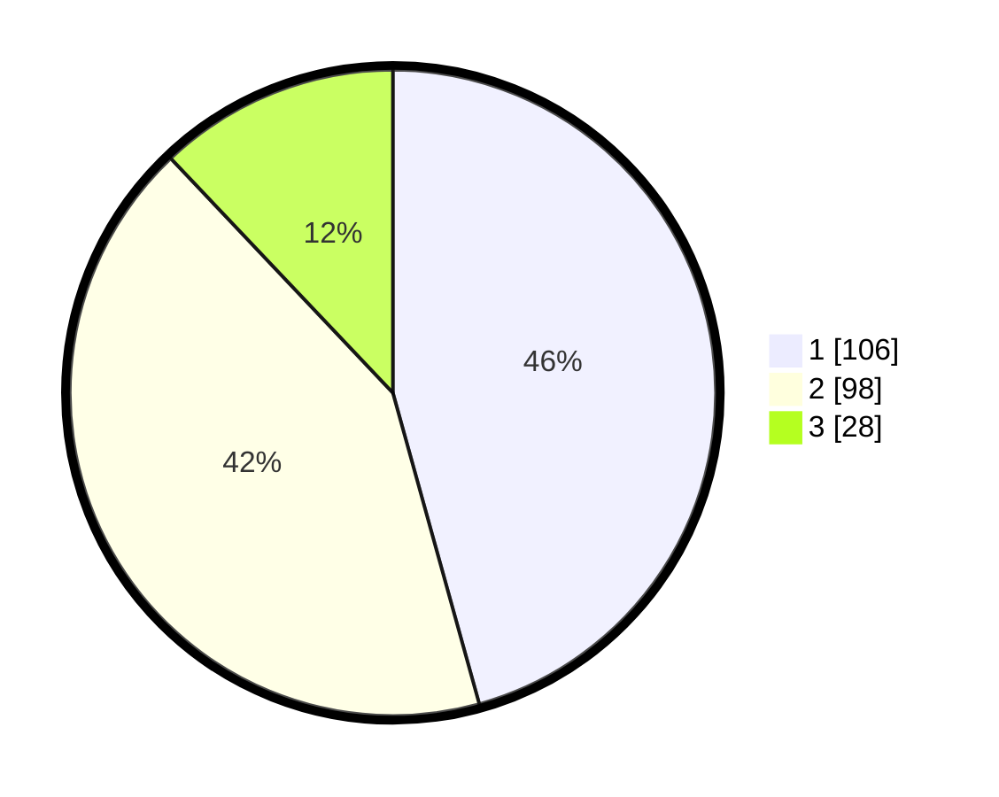

# Hasil

## Grafik

## Tabel

| No.    | Nama Paslon    | Suara | Suara (raw) | Persentase |
|:------ |:-------------- | -----:| -----------:| ----------:|
| 100025 | ANIES MUHAIMIN | 106   | [106][p-1]  | 45,69      |
| 100026 | PRABOWO GIBRAN | 98    | [98][p-2]   | 42,24      |
| 100027 | GANJAR MAHFUD  | 28    | [28][p-3]   | 12,07      |

[p-1]: https://github.com/gigit-pemilu/pemilu-2024/blob/main/pilpres/hitung-suara/sub/31-dki-jakarta/sub/74-jakarta-selatan/sub/05-kebayoran-lama/sub/1006-kebayoran-lama-selatan/sub/106-tps/sub/paslon-1.txt
[p-2]: https://github.com/gigit-pemilu/pemilu-2024/blob/main/pilpres/hitung-suara/sub/31-dki-jakarta/sub/74-jakarta-selatan/sub/05-kebayoran-lama/sub/1006-kebayoran-lama-selatan/sub/106-tps/sub/paslon-2.txt
[p-3]: https://github.com/gigit-pemilu/pemilu-2024/blob/main/pilpres/hitung-suara/sub/31-dki-jakarta/sub/74-jakarta-selatan/sub/05-kebayoran-lama/sub/1006-kebayoran-lama-selatan/sub/106-tps/sub/paslon-3.txt

## Foto C Plano

https://sirekap-obj-formc.kpu.go.id/2bd1/pemilu/ppwp/31/74/05/10/06/3174051006106-20240214-204921--6b7e6eeb-7a8e-4b83-a20d-916a711e9772.jpg

https://sirekap-obj-formc.kpu.go.id/2bd1/pemilu/ppwp/31/74/05/10/06/3174051006106-20240214-202133--8e52384c-e077-4cda-ac30-2db8d7a0b61c.jpg

https://sirekap-obj-formc.kpu.go.id/2bd1/pemilu/ppwp/31/74/05/10/06/3174051006106-20240214-202524--723a5f63-f73f-44d6-a998-39866adad610.jpg

## Metadata

| Key        | Value               |
| ---------- | ------------------- |
| Time Stamp | 2024-02-15 01:47:43 |

