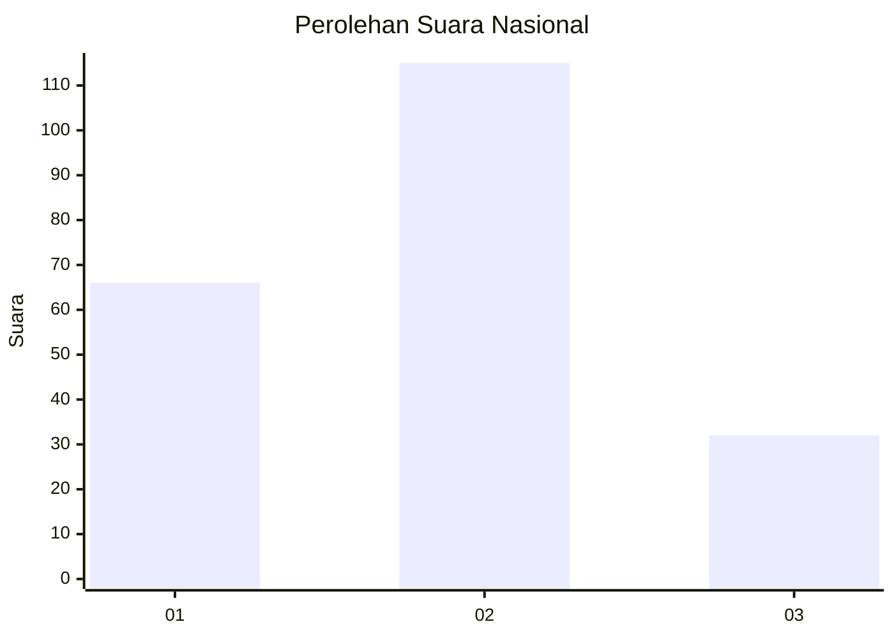
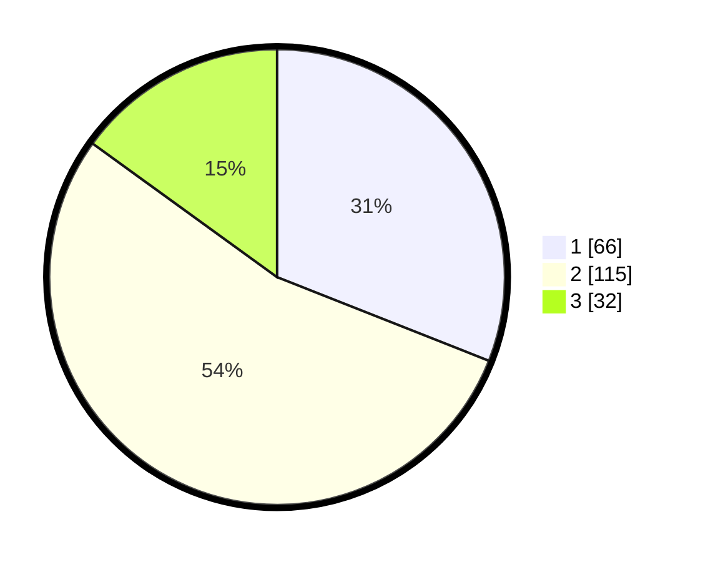

# Hasil

## Grafik

## Tabel

| No.    | Nama Paslon    | Suara | Suara (raw) | Persentase |
|:------ |:-------------- | -----:| -----------:| ----------:|
| 100025 | ANIES MUHAIMIN | 66    | [66][p-1]   | 30,99      |
| 100026 | PRABOWO GIBRAN | 115   | [115][p-2]  | 53,99      |
| 100027 | GANJAR MAHFUD  | 32    | [32][p-3]   | 15,02      |

[p-1]: https://github.com/gigit-pemilu/pemilu-2024/blob/main/pilpres/hitung-suara/sub/31-dki-jakarta/sub/74-jakarta-selatan/sub/05-kebayoran-lama/sub/1006-kebayoran-lama-selatan/sub/116-tps/sub/paslon-1.txt
[p-2]: https://github.com/gigit-pemilu/pemilu-2024/blob/main/pilpres/hitung-suara/sub/31-dki-jakarta/sub/74-jakarta-selatan/sub/05-kebayoran-lama/sub/1006-kebayoran-lama-selatan/sub/116-tps/sub/paslon-2.txt
[p-3]: https://github.com/gigit-pemilu/pemilu-2024/blob/main/pilpres/hitung-suara/sub/31-dki-jakarta/sub/74-jakarta-selatan/sub/05-kebayoran-lama/sub/1006-kebayoran-lama-selatan/sub/116-tps/sub/paslon-3.txt

## Foto C Plano

https://sirekap-obj-formc.kpu.go.id/8ff2/pemilu/ppwp/31/74/05/10/06/3174051006116-20240214-224617--abe0164e-5cf7-4a25-9142-40bc174818d7.jpg

https://sirekap-obj-formc.kpu.go.id/8ff2/pemilu/ppwp/31/74/05/10/06/3174051006116-20240214-225734--1f0dd1b9-5ecc-4c15-91f3-e18401e83ca0.jpg

https://sirekap-obj-formc.kpu.go.id/8ff2/pemilu/ppwp/31/74/05/10/06/3174051006116-20240214-225841--09ab8aed-0138-4fdb-88c4-4a0f802e7321.jpg

## Metadata

| Key        | Value               |
| ---------- | ------------------- |
| Time Stamp | 2024-02-24 22:31:28 |

