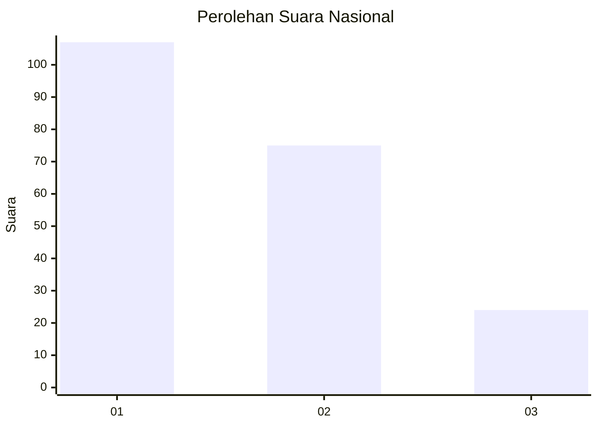
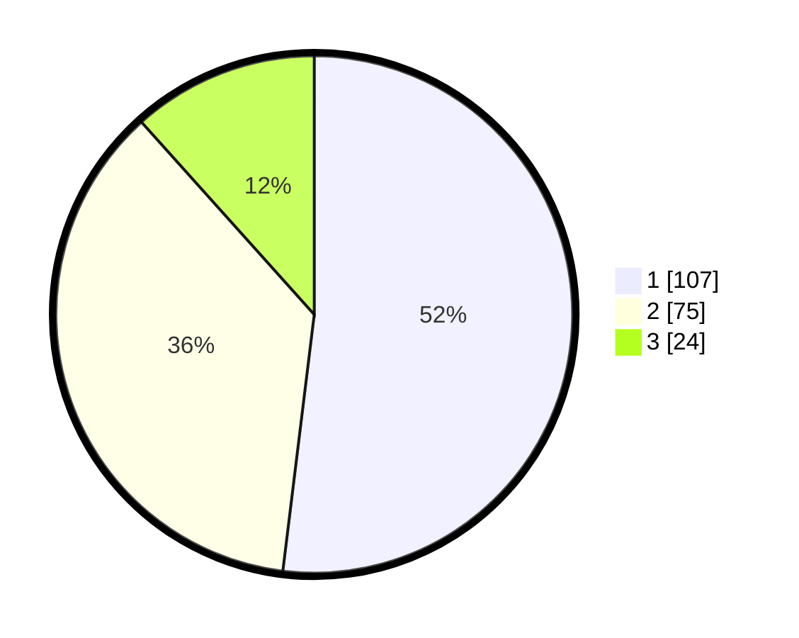

# Hasil

## Grafik

## Tabel

| No.    | Nama Paslon    | Suara | Suara (raw) | Persentase |
|:------ |:-------------- | -----:| -----------:| ----------:|
| 100025 | ANIES MUHAIMIN | 107   | [107][p-1]  | 51,94      |
| 100026 | PRABOWO GIBRAN | 75    | [75][p-2]   | 36,41      |
| 100027 | GANJAR MAHFUD  | 24    | [24][p-3]   | 11,65      |

[p-1]: https://github.com/gigit-pemilu/pemilu-2024/blob/main/pilpres/hitung-suara/sub/31-dki-jakarta/sub/74-jakarta-selatan/sub/06-cilandak/sub/1001-cilandak-barat/sub/003-tps/sub/paslon-1.txt
[p-2]: https://github.com/gigit-pemilu/pemilu-2024/blob/main/pilpres/hitung-suara/sub/31-dki-jakarta/sub/74-jakarta-selatan/sub/06-cilandak/sub/1001-cilandak-barat/sub/003-tps/sub/paslon-2.txt
[p-3]: https://github.com/gigit-pemilu/pemilu-2024/blob/main/pilpres/hitung-suara/sub/31-dki-jakarta/sub/74-jakarta-selatan/sub/06-cilandak/sub/1001-cilandak-barat/sub/003-tps/sub/paslon-3.txt

## Foto C Plano

https://sirekap-obj-formc.kpu.go.id/01ab/pemilu/ppwp/31/74/06/10/01/3174061001003-20240216-151629--a560c10b-6fa7-43df-9d12-13fae7fa6ed2.jpg

https://sirekap-obj-formc.kpu.go.id/01ab/pemilu/ppwp/31/74/06/10/01/3174061001003-20240216-151957--641fdde2-1e9e-4353-ab5e-925c1a97cd22.jpg

https://sirekap-obj-formc.kpu.go.id/01ab/pemilu/ppwp/31/74/06/10/01/3174061001003-20240216-152047--185e0a91-26b2-4fb4-8edb-d605ea18180d.jpg

## Metadata

| Key        | Value               |
| ---------- | ------------------- |
| Time Stamp | 2024-02-19 12:00:00 |

