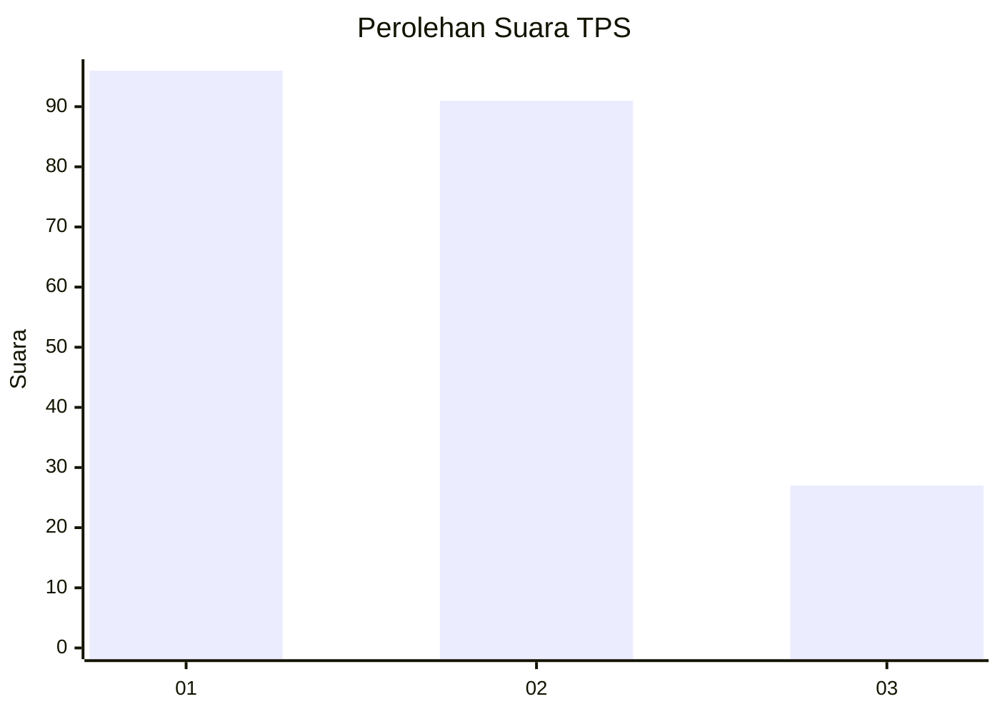
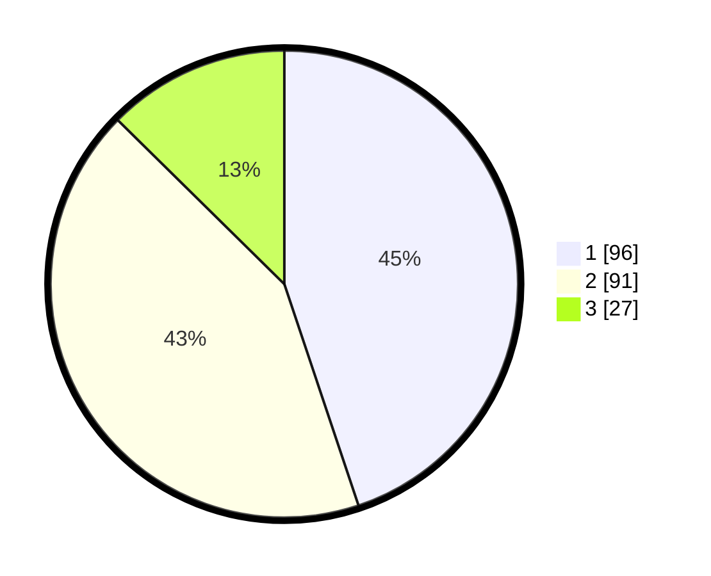

# Hasil

## Grafik

## Tabel

| No. | Nama Paslon    | Suara | Suara (raw) | Persentase |
|:--- |:-------------- | -----:| -----------:| ----------:|
| 1   | ANIES MUHAIMIN | 96    | [96][p-1]   | 44,86      |
| 2   | PRABOWO GIBRAN | 91    | [91][p-2]   | 42,52      |
| 3   | GANJAR MAHFUD  | 27    | [27][p-3]   | 12,62      |

[p-1]: https://github.com/gigit-pemilu/pemilu-2024-31-dki-jakarta/blob/main/pilpres/hitung-suara/sub/31-dki-jakarta/sub/74-jakarta-selatan/sub/06-cilandak/sub/1001-cilandak-barat/sub/004-tps/sub/paslon-1.txt
[p-2]: https://github.com/gigit-pemilu/pemilu-2024-31-dki-jakarta/blob/main/pilpres/hitung-suara/sub/31-dki-jakarta/sub/74-jakarta-selatan/sub/06-cilandak/sub/1001-cilandak-barat/sub/004-tps/sub/paslon-2.txt
[p-3]: https://github.com/gigit-pemilu/pemilu-2024-31-dki-jakarta/blob/main/pilpres/hitung-suara/sub/31-dki-jakarta/sub/74-jakarta-selatan/sub/06-cilandak/sub/1001-cilandak-barat/sub/004-tps/sub/paslon-3.txt

## Foto C Plano

https://sirekap-obj-formc.kpu.go.id/e266/pemilu/ppwp/31/74/06/10/01/3174061001004-20240216-153813--7c0228b1-4fd9-4c34-a4cd-ff1b6b3ef0c1.jpg

https://sirekap-obj-formc.kpu.go.id/e266/pemilu/ppwp/31/74/06/10/01/3174061001004-20240216-154327--d703412e-b31a-45c8-9040-226151ba6f1d.jpg

https://sirekap-obj-formc.kpu.go.id/e266/pemilu/ppwp/31/74/06/10/01/3174061001004-20240216-154532--7fe303a1-3d72-48d0-99ba-8823f4b7689c.jpg

## Metadata

| Key        | Value               |
| ---------- | ------------------- |
| Time Stamp | 2024-02-19 12:00:00 |

