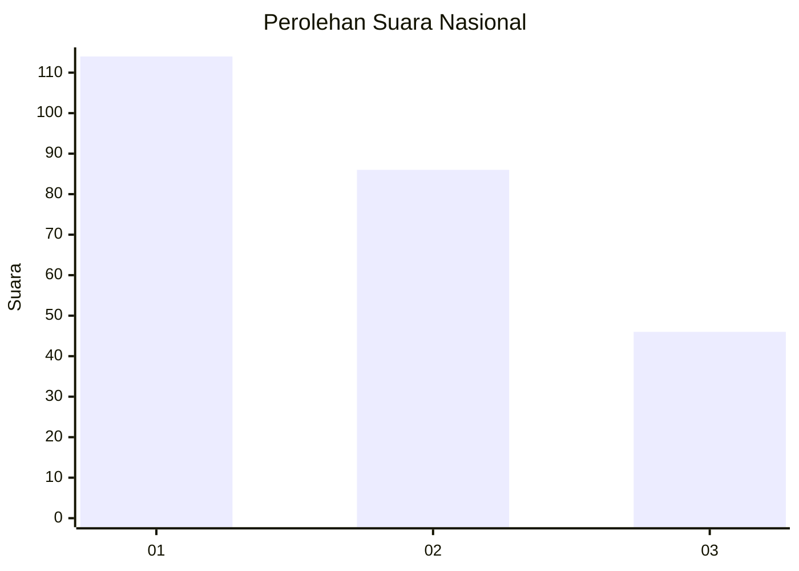
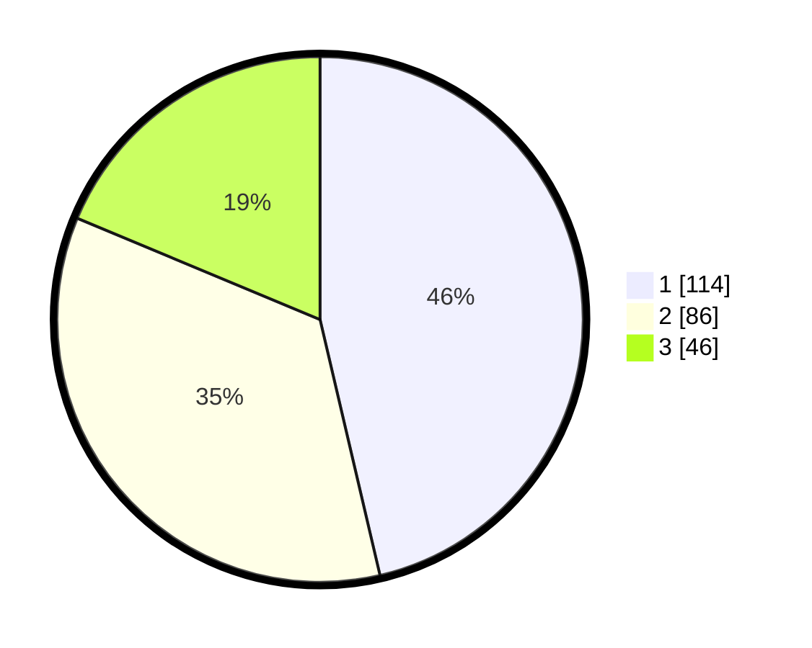

# Hasil

## Grafik

## Tabel

| No.    | Nama Paslon    | Suara | Suara (raw) | Persentase |
|:------ |:-------------- | -----:| -----------:| ----------:|
| 100025 | ANIES MUHAIMIN | 114   | [114][p-1]  | 46,34      |
| 100026 | PRABOWO GIBRAN | 86    | [86][p-2]   | 34,96      |
| 100027 | GANJAR MAHFUD  | 46    | [46][p-3]   | 18,70      |

[p-1]: https://github.com/gigit-pemilu/pemilu-2024/blob/main/pilpres/hitung-suara/sub/31-dki-jakarta/sub/74-jakarta-selatan/sub/06-cilandak/sub/1001-cilandak-barat/sub/007-tps/sub/paslon-1.txt
[p-2]: https://github.com/gigit-pemilu/pemilu-2024/blob/main/pilpres/hitung-suara/sub/31-dki-jakarta/sub/74-jakarta-selatan/sub/06-cilandak/sub/1001-cilandak-barat/sub/007-tps/sub/paslon-2.txt
[p-3]: https://github.com/gigit-pemilu/pemilu-2024/blob/main/pilpres/hitung-suara/sub/31-dki-jakarta/sub/74-jakarta-selatan/sub/06-cilandak/sub/1001-cilandak-barat/sub/007-tps/sub/paslon-3.txt

## Foto C Plano

https://sirekap-obj-formc.kpu.go.id/79a6/pemilu/ppwp/31/74/06/10/01/3174061001007-20240216-160043--8a9683ce-bb78-4cf7-b866-e68689f5afdb.jpg

https://sirekap-obj-formc.kpu.go.id/79a6/pemilu/ppwp/31/74/06/10/01/3174061001007-20240216-160127--ef979558-89af-440a-a063-385666a86d68.jpg

https://sirekap-obj-formc.kpu.go.id/79a6/pemilu/ppwp/31/74/06/10/01/3174061001007-20240216-160209--7c57898a-fd31-4700-944d-269fcb48e7cd.jpg

## Metadata

| Key        | Value               |
| ---------- | ------------------- |
| Time Stamp | 2024-02-19 12:00:00 |

