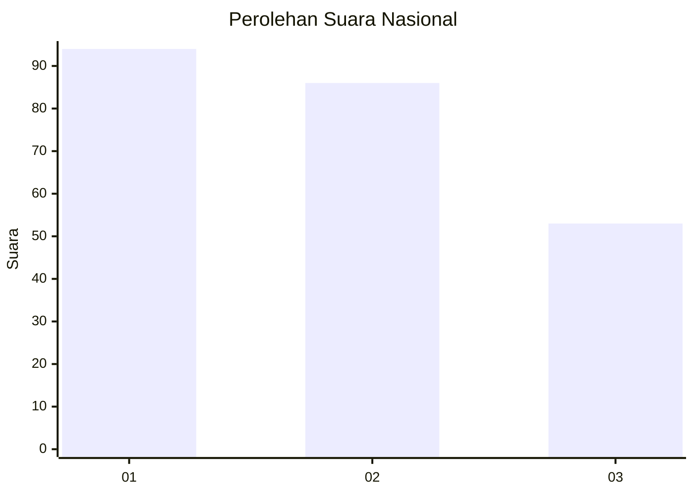
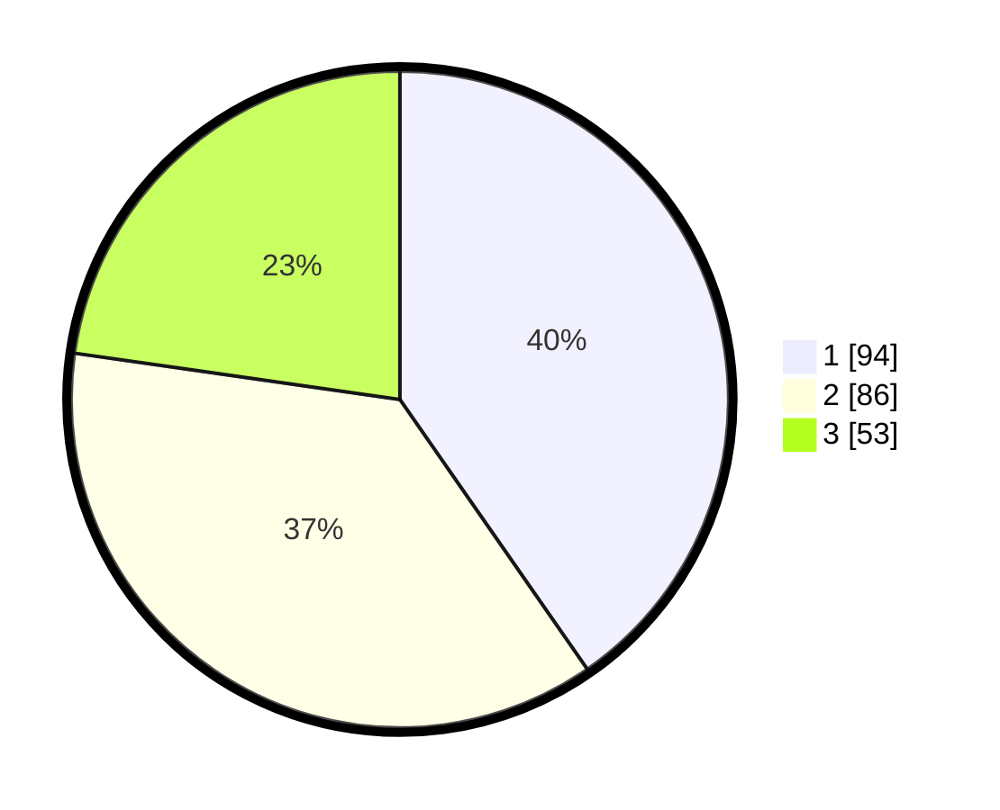

# Hasil

## Grafik

## Tabel

| No.    | Nama Paslon    | Suara | Suara (raw) | Persentase |
|:------ |:-------------- | -----:| -----------:| ----------:|
| 100025 | ANIES MUHAIMIN | 94    | [94][p-1]   | 40,34      |
| 100026 | PRABOWO GIBRAN | 86    | [86][p-2]   | 36,91      |
| 100027 | GANJAR MAHFUD  | 53    | [53][p-3]   | 22,75      |

[p-1]: https://github.com/gigit-pemilu/pemilu-2024/blob/main/pilpres/hitung-suara/sub/31-dki-jakarta/sub/74-jakarta-selatan/sub/06-cilandak/sub/1001-cilandak-barat/sub/030-tps/sub/paslon-1.txt
[p-2]: https://github.com/gigit-pemilu/pemilu-2024/blob/main/pilpres/hitung-suara/sub/31-dki-jakarta/sub/74-jakarta-selatan/sub/06-cilandak/sub/1001-cilandak-barat/sub/030-tps/sub/paslon-2.txt
[p-3]: https://github.com/gigit-pemilu/pemilu-2024/blob/main/pilpres/hitung-suara/sub/31-dki-jakarta/sub/74-jakarta-selatan/sub/06-cilandak/sub/1001-cilandak-barat/sub/030-tps/sub/paslon-3.txt

## Foto C Plano

https://sirekap-obj-formc.kpu.go.id/9a10/pemilu/ppwp/31/74/06/10/01/3174061001030-20240216-175150--3501bae7-05a8-4ab3-8c92-12d955e8883c.jpg

https://sirekap-obj-formc.kpu.go.id/9a10/pemilu/ppwp/31/74/06/10/01/3174061001030-20240216-175239--8902895a-3351-407f-8bef-5573788d7c3d.jpg

https://sirekap-obj-formc.kpu.go.id/9a10/pemilu/ppwp/31/74/06/10/01/3174061001030-20240216-175307--dd5231c6-aee5-4b8f-bce0-7c0e3db422a1.jpg

## Metadata

| Key        | Value               |
| ---------- | ------------------- |
| Time Stamp | 2024-02-19 13:00:00 |

