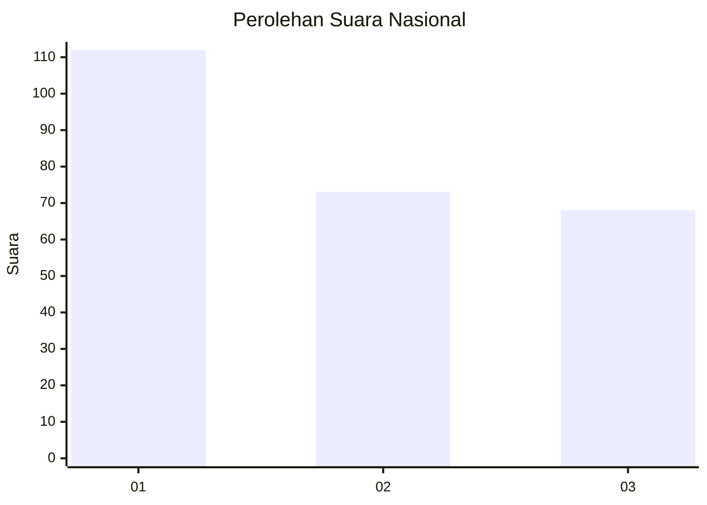
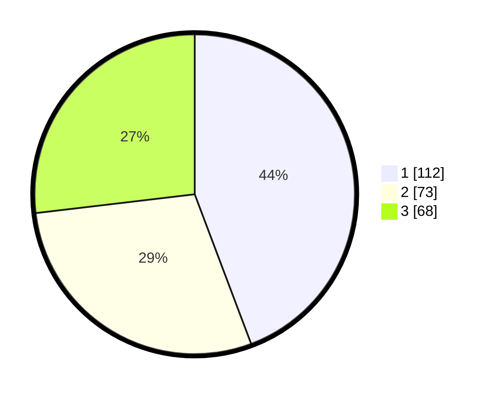

# Hasil

## Grafik

## Tabel

| No.    | Nama Paslon    | Suara | Suara (raw) | Persentase |
|:------ |:-------------- | -----:| -----------:| ----------:|
| 100025 | ANIES MUHAIMIN | 112   | [112][p-1]  | 44,27      |
| 100026 | PRABOWO GIBRAN | 73    | [73][p-2]   | 28,85      |
| 100027 | GANJAR MAHFUD  | 68    | [68][p-3]   | 26,88      |

[p-1]: https://github.com/gigit-pemilu/pemilu-2024/blob/main/pilpres/hitung-suara/sub/31-dki-jakarta/sub/74-jakarta-selatan/sub/06-cilandak/sub/1001-cilandak-barat/sub/066-tps/sub/paslon-1.txt
[p-2]: https://github.com/gigit-pemilu/pemilu-2024/blob/main/pilpres/hitung-suara/sub/31-dki-jakarta/sub/74-jakarta-selatan/sub/06-cilandak/sub/1001-cilandak-barat/sub/066-tps/sub/paslon-2.txt
[p-3]: https://github.com/gigit-pemilu/pemilu-2024/blob/main/pilpres/hitung-suara/sub/31-dki-jakarta/sub/74-jakarta-selatan/sub/06-cilandak/sub/1001-cilandak-barat/sub/066-tps/sub/paslon-3.txt

## Foto C Plano

https://sirekap-obj-formc.kpu.go.id/f533/pemilu/ppwp/31/74/06/10/01/3174061001066-20240215-005654--38646637-f931-437a-bc62-8e30efda646e.jpg

https://sirekap-obj-formc.kpu.go.id/f533/pemilu/ppwp/31/74/06/10/01/3174061001066-20240215-005614--158a9530-4546-4bb8-a4e2-39377b88934b.jpg

https://sirekap-obj-formc.kpu.go.id/f533/pemilu/ppwp/31/74/06/10/01/3174061001066-20240215-005731--72c6bacd-3e52-43ff-a475-8ae84fbbc527.jpg

## Metadata

| Key        | Value               |
| ---------- | ------------------- |
| Time Stamp | 2024-02-20 16:00:00 |

