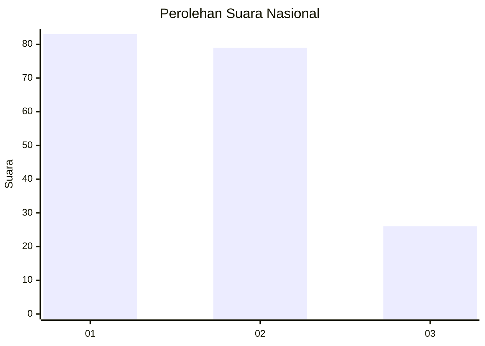
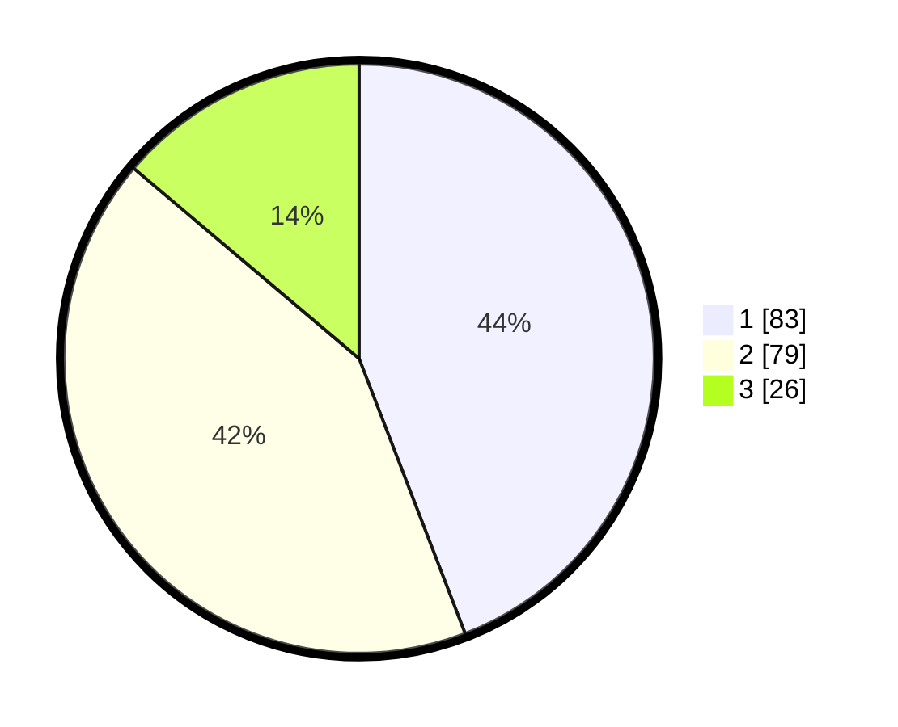

# Hasil

## Grafik

## Tabel

| No.    | Nama Paslon    | Suara | Suara (raw) | Persentase |
|:------ |:-------------- | -----:| -----------:| ----------:|
| 100025 | ANIES MUHAIMIN | 83    | [83][p-1]   | 44,15      |
| 100026 | PRABOWO GIBRAN | 79    | [79][p-2]   | 42,02      |
| 100027 | GANJAR MAHFUD  | 26    | [26][p-3]   | 13,83      |

[p-1]: https://github.com/gigit-pemilu/pemilu-2024/blob/main/pilpres/hitung-suara/sub/31-dki-jakarta/sub/74-jakarta-selatan/sub/06-cilandak/sub/1001-cilandak-barat/sub/114-tps/sub/paslon-1.txt
[p-2]: https://github.com/gigit-pemilu/pemilu-2024/blob/main/pilpres/hitung-suara/sub/31-dki-jakarta/sub/74-jakarta-selatan/sub/06-cilandak/sub/1001-cilandak-barat/sub/114-tps/sub/paslon-2.txt
[p-3]: https://github.com/gigit-pemilu/pemilu-2024/blob/main/pilpres/hitung-suara/sub/31-dki-jakarta/sub/74-jakarta-selatan/sub/06-cilandak/sub/1001-cilandak-barat/sub/114-tps/sub/paslon-3.txt

## Foto C Plano

https://sirekap-obj-formc.kpu.go.id/adee/pemilu/ppwp/31/74/06/10/01/3174061001114-20240218-154952--90836647-cc42-4df3-8069-9fef42bd62d9.jpg

https://sirekap-obj-formc.kpu.go.id/adee/pemilu/ppwp/31/74/06/10/01/3174061001114-20240218-155034--12ff49ea-a56f-408a-b03b-bf8156d1917c.jpg

https://sirekap-obj-formc.kpu.go.id/adee/pemilu/ppwp/31/74/06/10/01/3174061001114-20240218-155058--ffa049e7-c325-490b-9bdc-6a95ef409bfd.jpg

## Metadata

| Key        | Value               |
| ---------- | ------------------- |
| Time Stamp | 2024-02-20 16:00:00 |

