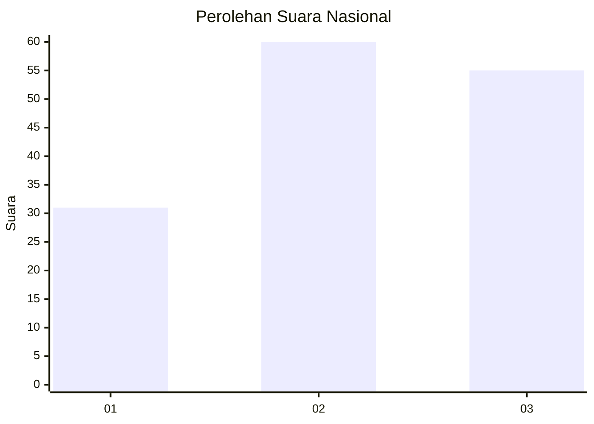
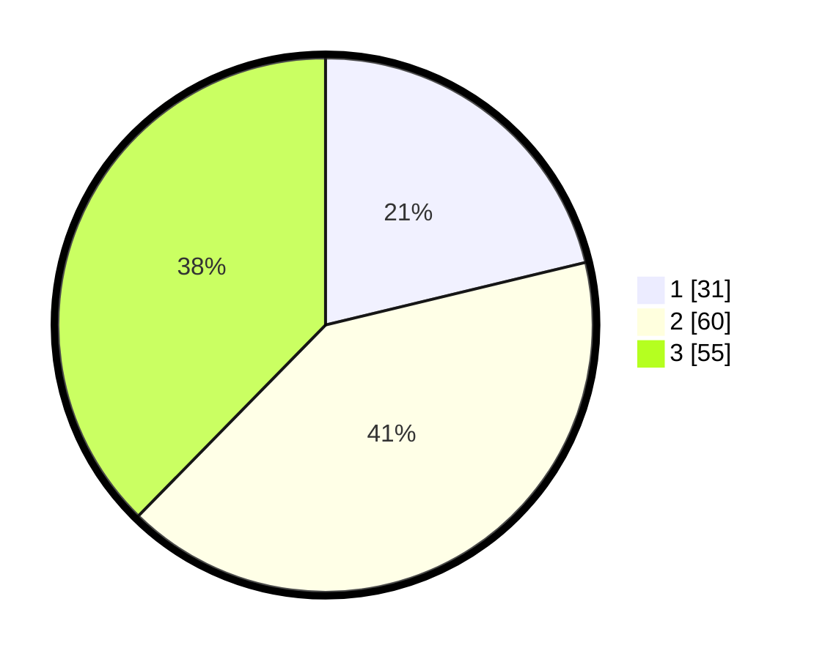

# Hasil

## Grafik

## Tabel

| No.    | Nama Paslon    | Suara | Suara (raw) | Persentase |
|:------ |:-------------- | -----:| -----------:| ----------:|
| 100025 | ANIES MUHAIMIN | 31    | [31][p-1]   | 21,23      |
| 100026 | PRABOWO GIBRAN | 60    | [60][p-2]   | 41,10      |
| 100027 | GANJAR MAHFUD  | 55    | [55][p-3]   | 37,67      |

[p-1]: https://github.com/gigit-pemilu/pemilu-2024/blob/main/pilpres/hitung-suara/sub/31-dki-jakarta/sub/74-jakarta-selatan/sub/06-cilandak/sub/1001-cilandak-barat/sub/118-tps/sub/paslon-1.txt
[p-2]: https://github.com/gigit-pemilu/pemilu-2024/blob/main/pilpres/hitung-suara/sub/31-dki-jakarta/sub/74-jakarta-selatan/sub/06-cilandak/sub/1001-cilandak-barat/sub/118-tps/sub/paslon-2.txt
[p-3]: https://github.com/gigit-pemilu/pemilu-2024/blob/main/pilpres/hitung-suara/sub/31-dki-jakarta/sub/74-jakarta-selatan/sub/06-cilandak/sub/1001-cilandak-barat/sub/118-tps/sub/paslon-3.txt

## Foto C Plano

https://sirekap-obj-formc.kpu.go.id/ef84/pemilu/ppwp/31/74/06/10/01/3174061001118-20240218-155454--b04785e4-de84-4877-909a-eb3cbd12858d.jpg

https://sirekap-obj-formc.kpu.go.id/ef84/pemilu/ppwp/31/74/06/10/01/3174061001118-20240218-155603--f840b5a9-8fa5-46c3-a525-b49d2433615c.jpg

https://sirekap-obj-formc.kpu.go.id/ef84/pemilu/ppwp/31/74/06/10/01/3174061001118-20240218-155544--c611f9b6-57f8-4905-822e-94b50b1c03e6.jpg

## Metadata

| Key        | Value               |
| ---------- | ------------------- |
| Time Stamp | 2024-02-20 16:00:00 |

