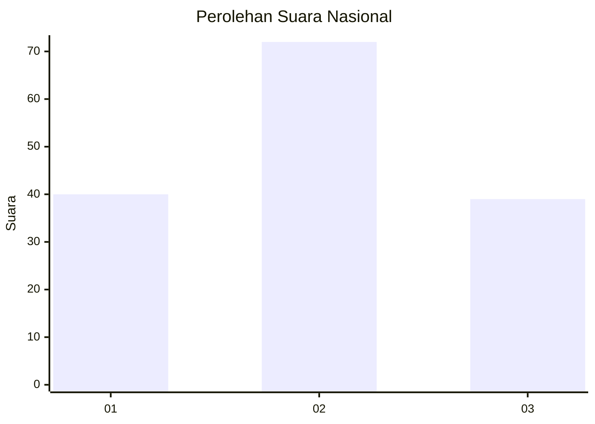
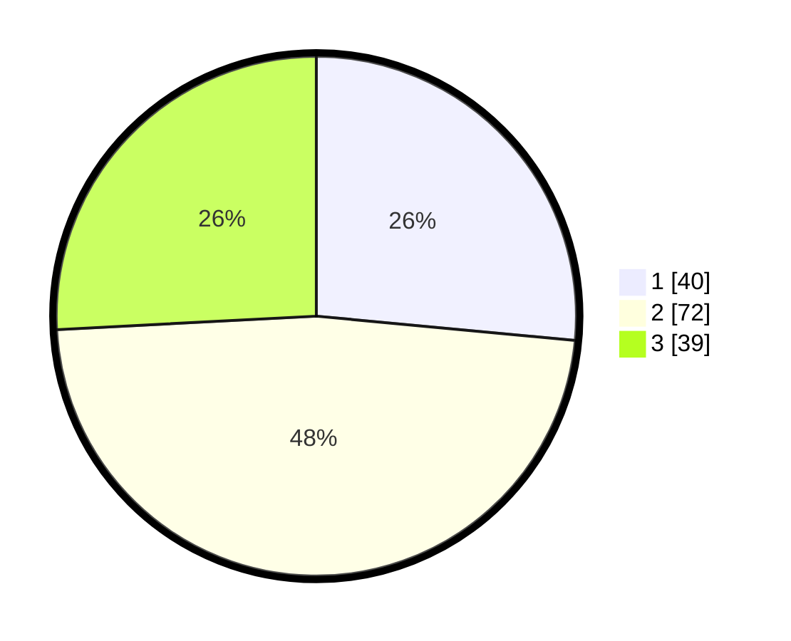

# Hasil

## Grafik

## Tabel

| No.    | Nama Paslon    | Suara | Suara (raw) | Persentase |
|:------ |:-------------- | -----:| -----------:| ----------:|
| 100025 | ANIES MUHAIMIN | 40    | [40][p-1]   | 26,49      |
| 100026 | PRABOWO GIBRAN | 72    | [72][p-2]   | 47,68      |
| 100027 | GANJAR MAHFUD  | 39    | [39][p-3]   | 25,83      |

[p-1]: https://github.com/gigit-pemilu/pemilu-2024/blob/main/pilpres/hitung-suara/sub/31-dki-jakarta/sub/74-jakarta-selatan/sub/06-cilandak/sub/1001-cilandak-barat/sub/138-tps/sub/paslon-1.txt
[p-2]: https://github.com/gigit-pemilu/pemilu-2024/blob/main/pilpres/hitung-suara/sub/31-dki-jakarta/sub/74-jakarta-selatan/sub/06-cilandak/sub/1001-cilandak-barat/sub/138-tps/sub/paslon-2.txt
[p-3]: https://github.com/gigit-pemilu/pemilu-2024/blob/main/pilpres/hitung-suara/sub/31-dki-jakarta/sub/74-jakarta-selatan/sub/06-cilandak/sub/1001-cilandak-barat/sub/138-tps/sub/paslon-3.txt

## Foto C Plano

https://sirekap-obj-formc.kpu.go.id/b3bf/pemilu/ppwp/31/74/06/10/01/3174061001138-20240214-202323--289f31b8-f355-4c6b-b3c0-e41c2ee1dce9.jpg

https://sirekap-obj-formc.kpu.go.id/b3bf/pemilu/ppwp/31/74/06/10/01/3174061001138-20240214-193628--2d79ed32-e162-4833-a41c-b7d9f86521c0.jpg

https://sirekap-obj-formc.kpu.go.id/b3bf/pemilu/ppwp/31/74/06/10/01/3174061001138-20240214-200349--1dbe9a11-4d95-4c43-8923-dfa5df28d176.jpg

## Metadata

| Key        | Value               |
| ---------- | ------------------- |
| Time Stamp | 2024-02-21 17:00:00 |

