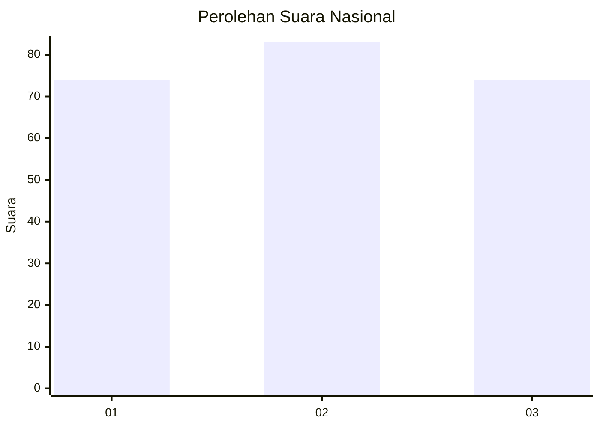
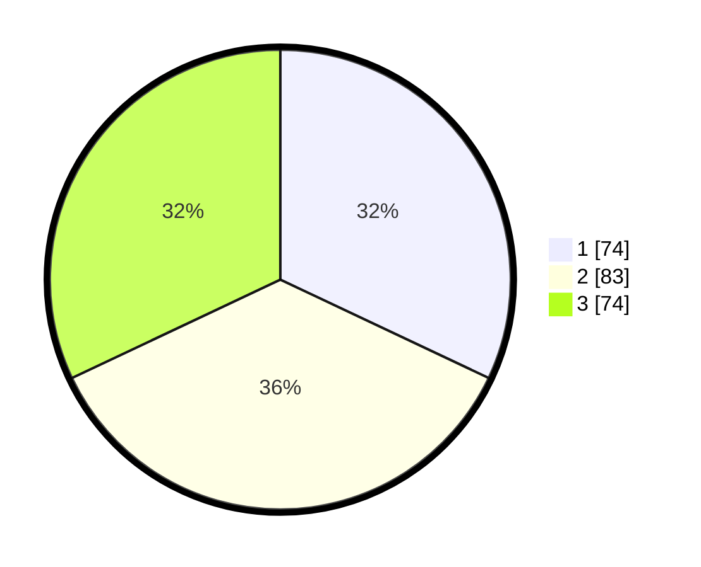

# Hasil

## Grafik

## Tabel

| No.    | Nama Paslon    | Suara | Suara (raw) | Persentase |
|:------ |:-------------- | -----:| -----------:| ----------:|
| 100025 | ANIES MUHAIMIN | 74    | [74][p-1]   | 32,03      |
| 100026 | PRABOWO GIBRAN | 83    | [83][p-2]   | 35,93      |
| 100027 | GANJAR MAHFUD  | 74    | [74][p-3]   | 32,03      |

[p-1]: https://github.com/gigit-pemilu/pemilu-2024/blob/main/pilpres/hitung-suara/sub/31-dki-jakarta/sub/74-jakarta-selatan/sub/06-cilandak/sub/1001-cilandak-barat/sub/148-tps/sub/paslon-1.txt
[p-2]: https://github.com/gigit-pemilu/pemilu-2024/blob/main/pilpres/hitung-suara/sub/31-dki-jakarta/sub/74-jakarta-selatan/sub/06-cilandak/sub/1001-cilandak-barat/sub/148-tps/sub/paslon-2.txt
[p-3]: https://github.com/gigit-pemilu/pemilu-2024/blob/main/pilpres/hitung-suara/sub/31-dki-jakarta/sub/74-jakarta-selatan/sub/06-cilandak/sub/1001-cilandak-barat/sub/148-tps/sub/paslon-3.txt

## Foto C Plano

https://sirekap-obj-formc.kpu.go.id/92a7/pemilu/ppwp/31/74/06/10/01/3174061001148-20240214-155040--ca83b2a8-bc3c-423b-82fc-a55b3f54d8eb.jpg

https://sirekap-obj-formc.kpu.go.id/92a7/pemilu/ppwp/31/74/06/10/01/3174061001148-20240214-155140--22b80fcf-9ded-497c-8f6c-aa1770dc015d.jpg

https://sirekap-obj-formc.kpu.go.id/92a7/pemilu/ppwp/31/74/06/10/01/3174061001148-20240214-155433--8fe002c1-0a55-4548-9b8e-25f7416e5bd0.jpg

## Metadata

| Key        | Value               |
| ---------- | ------------------- |
| Time Stamp | 2024-02-25 11:00:00 |

