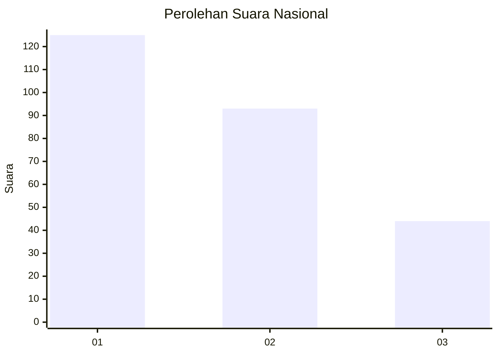
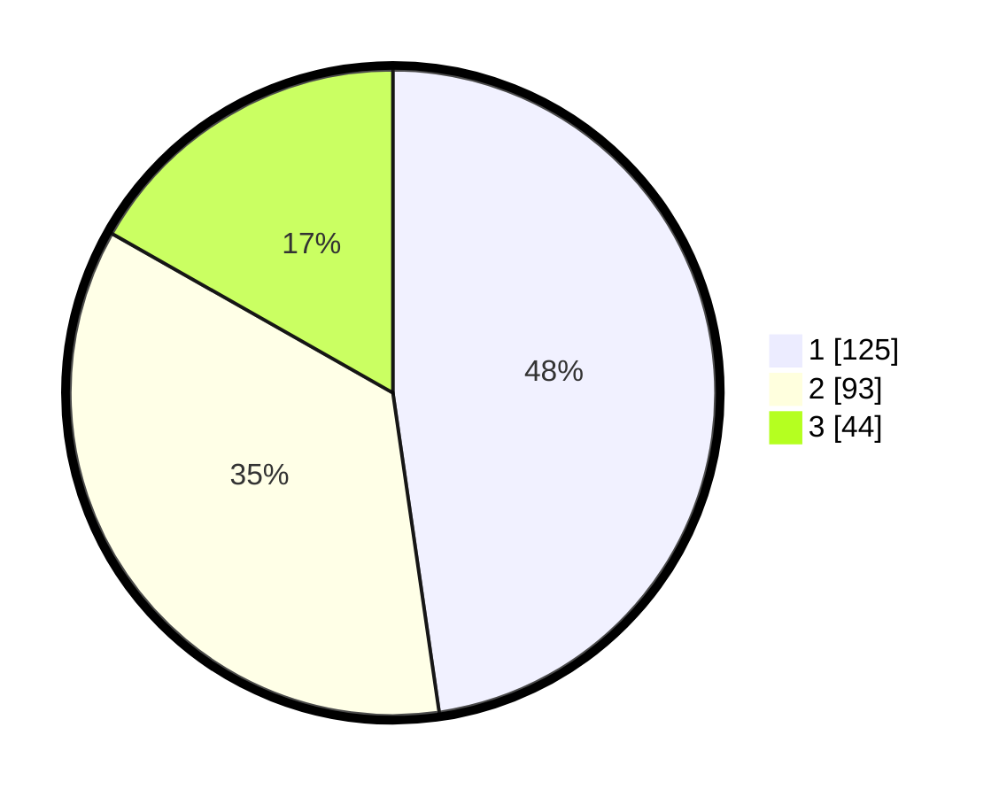

# Hasil

## Grafik

## Tabel

| No. | Nama Paslon    | Suara | Suara (raw) | Persentase |
|:--- |:-------------- | -----:| -----------:| ----------:|
| 1   | ANIES MUHAIMIN | 125   | [125][p-1]  | 47,71      |
| 2   | PRABOWO GIBRAN | 93    | [93][p-2]   | 35,50      |
| 3   | GANJAR MAHFUD  | 44    | [44][p-3]   | 16,79      |

[p-1]: https://github.com/gigit-pemilu/pemilu-2024/blob/main/pilpres/hitung-suara/sub/31-dki-jakarta/sub/74-jakarta-selatan/sub/06-cilandak/sub/1001-cilandak-barat/sub/153-tps/sub/paslon-1.txt
[p-2]: https://github.com/gigit-pemilu/pemilu-2024/blob/main/pilpres/hitung-suara/sub/31-dki-jakarta/sub/74-jakarta-selatan/sub/06-cilandak/sub/1001-cilandak-barat/sub/153-tps/sub/paslon-2.txt
[p-3]: https://github.com/gigit-pemilu/pemilu-2024/blob/main/pilpres/hitung-suara/sub/31-dki-jakarta/sub/74-jakarta-selatan/sub/06-cilandak/sub/1001-cilandak-barat/sub/153-tps/sub/paslon-3.txt

## Foto C Plano

https://sirekap-obj-formc.kpu.go.id/988e/pemilu/ppwp/31/74/06/10/01/3174061001153-20240218-175306--69d23eeb-1cdb-4cfa-ba78-fe432be2d053.jpg

https://sirekap-obj-formc.kpu.go.id/988e/pemilu/ppwp/31/74/06/10/01/3174061001153-20240218-175442--c3c802e1-3b34-44a7-a7ab-3a9c1a36f960.jpg

https://sirekap-obj-formc.kpu.go.id/988e/pemilu/ppwp/31/74/06/10/01/3174061001153-20240218-175403--0d1ebb7e-7c45-4fc8-8914-e4bd8c077745.jpg

## Metadata

| Key        | Value               |
| ---------- | ------------------- |
| Time Stamp | 2024-02-24 22:31:28 |

