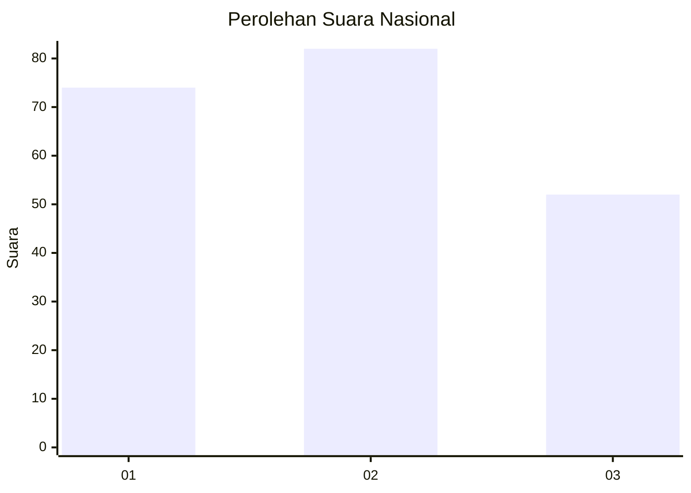
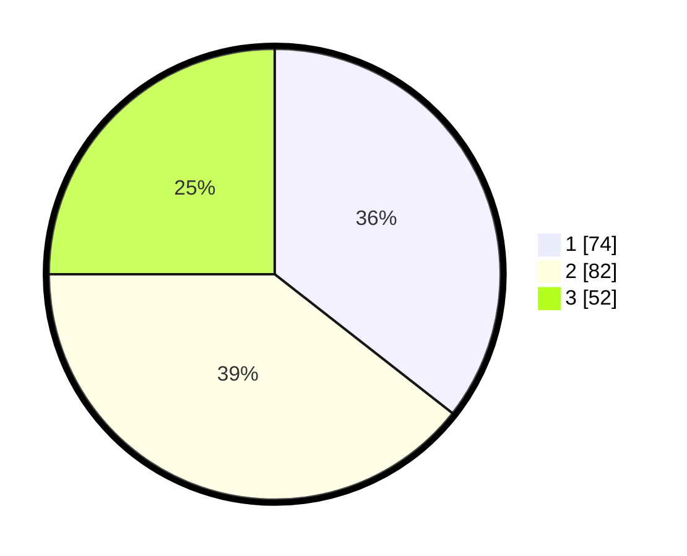

# Hasil

## Grafik

## Tabel

| No.    | Nama Paslon    | Suara | Suara (raw) | Persentase |
|:------ |:-------------- | -----:| -----------:| ----------:|
| 100025 | ANIES MUHAIMIN | 74    | [74][p-1]   | 35,58      |
| 100026 | PRABOWO GIBRAN | 82    | [82][p-2]   | 39,42      |
| 100027 | GANJAR MAHFUD  | 52    | [52][p-3]   | 25,00      |

[p-1]: https://github.com/gigit-pemilu/pemilu-2024/blob/main/pilpres/hitung-suara/sub/31-dki-jakarta/sub/74-jakarta-selatan/sub/06-cilandak/sub/1001-cilandak-barat/sub/158-tps/sub/paslon-1.txt
[p-2]: https://github.com/gigit-pemilu/pemilu-2024/blob/main/pilpres/hitung-suara/sub/31-dki-jakarta/sub/74-jakarta-selatan/sub/06-cilandak/sub/1001-cilandak-barat/sub/158-tps/sub/paslon-2.txt
[p-3]: https://github.com/gigit-pemilu/pemilu-2024/blob/main/pilpres/hitung-suara/sub/31-dki-jakarta/sub/74-jakarta-selatan/sub/06-cilandak/sub/1001-cilandak-barat/sub/158-tps/sub/paslon-3.txt

## Foto C Plano

https://sirekap-obj-formc.kpu.go.id/6414/pemilu/ppwp/31/74/06/10/01/3174061001158-20240214-193635--31b5b217-9b6d-4a24-a834-d43a4031c43f.jpg

https://sirekap-obj-formc.kpu.go.id/6414/pemilu/ppwp/31/74/06/10/01/3174061001158-20240214-193650--1fb461c1-2fee-4aee-a188-8214156d68b8.jpg

https://sirekap-obj-formc.kpu.go.id/6414/pemilu/ppwp/31/74/06/10/01/3174061001158-20240214-193656--49ce7c7e-1a50-4a5f-a643-d4a8fd852f95.jpg

## Metadata

| Key        | Value               |
| ---------- | ------------------- |
| Time Stamp | 2024-02-24 22:31:28 |

