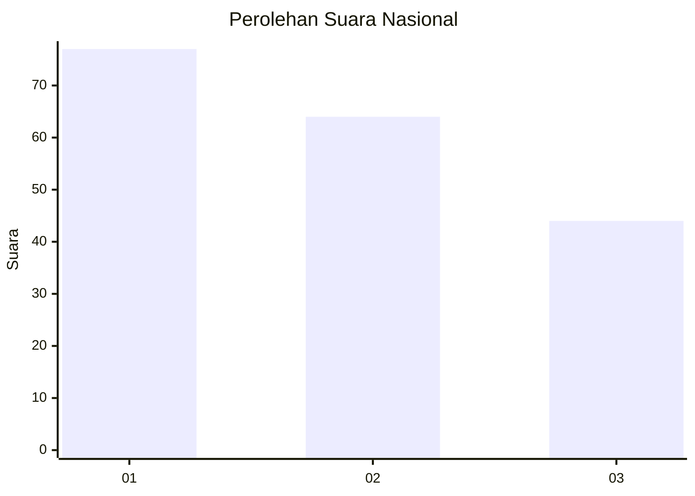
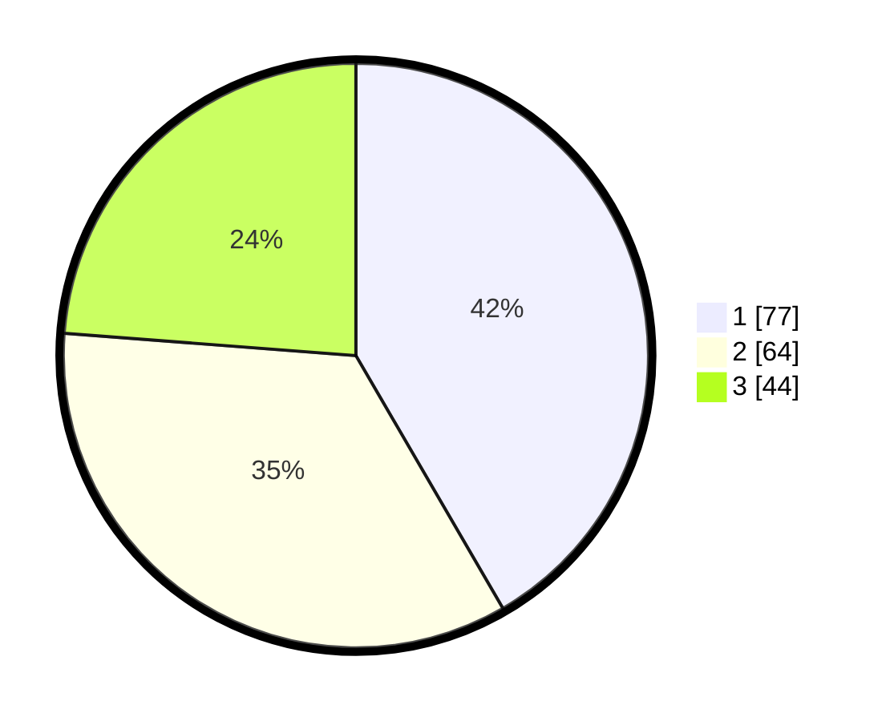

# Hasil

## Grafik

## Tabel

| No.    | Nama Paslon    | Suara | Suara (raw) | Persentase |
|:------ |:-------------- | -----:| -----------:| ----------:|
| 100025 | ANIES MUHAIMIN | 77    | [77][p-1]   | 41,62      |
| 100026 | PRABOWO GIBRAN | 64    | [64][p-2]   | 34,59      |
| 100027 | GANJAR MAHFUD  | 44    | [44][p-3]   | 23,78      |

[p-1]: https://github.com/gigit-pemilu/pemilu-2024/blob/main/pilpres/hitung-suara/sub/31-dki-jakarta/sub/74-jakarta-selatan/sub/06-cilandak/sub/1001-cilandak-barat/sub/159-tps/sub/paslon-1.txt
[p-2]: https://github.com/gigit-pemilu/pemilu-2024/blob/main/pilpres/hitung-suara/sub/31-dki-jakarta/sub/74-jakarta-selatan/sub/06-cilandak/sub/1001-cilandak-barat/sub/159-tps/sub/paslon-2.txt
[p-3]: https://github.com/gigit-pemilu/pemilu-2024/blob/main/pilpres/hitung-suara/sub/31-dki-jakarta/sub/74-jakarta-selatan/sub/06-cilandak/sub/1001-cilandak-barat/sub/159-tps/sub/paslon-3.txt

## Foto C Plano

https://sirekap-obj-formc.kpu.go.id/fb09/pemilu/ppwp/31/74/06/10/01/3174061001159-20240214-193317--855201a9-f46b-4649-87b5-10422be929b9.jpg

https://sirekap-obj-formc.kpu.go.id/fb09/pemilu/ppwp/31/74/06/10/01/3174061001159-20240214-193327--cff58001-9b53-4f59-baf1-9eb14b23798a.jpg

https://sirekap-obj-formc.kpu.go.id/fb09/pemilu/ppwp/31/74/06/10/01/3174061001159-20240214-193335--20629f8e-b2a6-4f6f-ac0b-62fa8dfb4e01.jpg

## Metadata

| Key        | Value               |
| ---------- | ------------------- |
| Time Stamp | 2024-02-24 22:31:28 |

