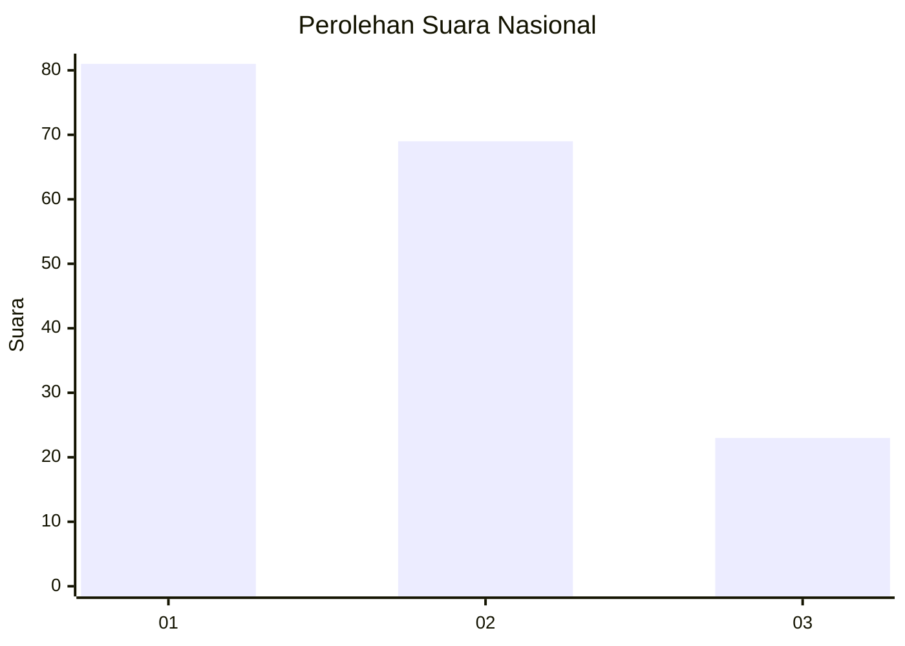
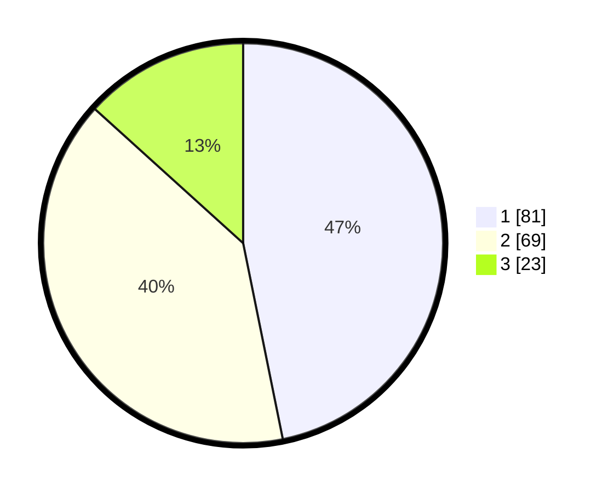

# Hasil

## Grafik

## Tabel

| No.    | Nama Paslon    | Suara | Suara (raw) | Persentase |
|:------ |:-------------- | -----:| -----------:| ----------:|
| 100025 | ANIES MUHAIMIN | 81    | [81][p-1]   | 46,82      |
| 100026 | PRABOWO GIBRAN | 69    | [69][p-2]   | 39,88      |
| 100027 | GANJAR MAHFUD  | 23    | [23][p-3]   | 13,29      |

[p-1]: https://github.com/gigit-pemilu/pemilu-2024/blob/main/pilpres/hitung-suara/sub/31-dki-jakarta/sub/74-jakarta-selatan/sub/06-cilandak/sub/1001-cilandak-barat/sub/160-tps/sub/paslon-1.txt
[p-2]: https://github.com/gigit-pemilu/pemilu-2024/blob/main/pilpres/hitung-suara/sub/31-dki-jakarta/sub/74-jakarta-selatan/sub/06-cilandak/sub/1001-cilandak-barat/sub/160-tps/sub/paslon-2.txt
[p-3]: https://github.com/gigit-pemilu/pemilu-2024/blob/main/pilpres/hitung-suara/sub/31-dki-jakarta/sub/74-jakarta-selatan/sub/06-cilandak/sub/1001-cilandak-barat/sub/160-tps/sub/paslon-3.txt

## Foto C Plano

https://sirekap-obj-formc.kpu.go.id/82a3/pemilu/ppwp/31/74/06/10/01/3174061001160-20240218-175611--95664a20-e54a-4cdf-a746-f1ea48c1d8c8.jpg

https://sirekap-obj-formc.kpu.go.id/82a3/pemilu/ppwp/31/74/06/10/01/3174061001160-20240218-175749--1d07ca06-b312-4749-b19c-569acfebe355.jpg

https://sirekap-obj-formc.kpu.go.id/82a3/pemilu/ppwp/31/74/06/10/01/3174061001160-20240218-175708--73a6e97a-7ec9-4dc0-909b-8a3b41e47bfc.jpg

## Metadata

| Key        | Value               |
| ---------- | ------------------- |
| Time Stamp | 2024-02-25 10:00:00 |

