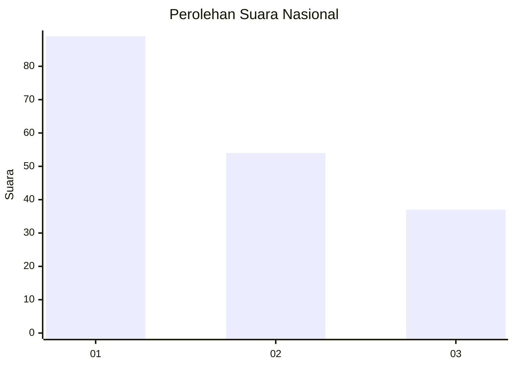
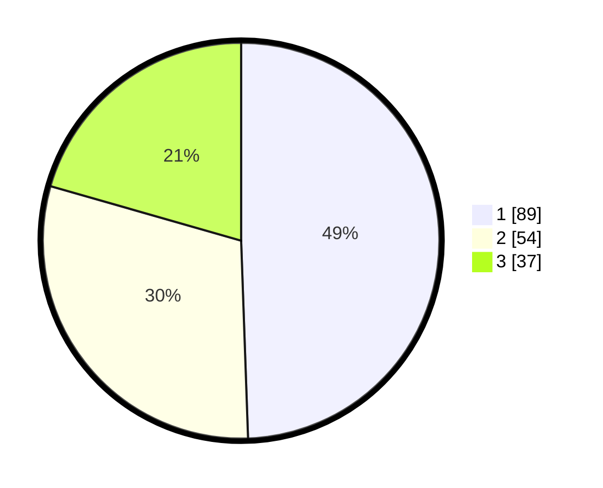

# Hasil

## Grafik

## Tabel

| No.    | Nama Paslon    | Suara | Suara (raw) | Persentase |
|:------ |:-------------- | -----:| -----------:| ----------:|
| 100025 | ANIES MUHAIMIN | 89    | [89][p-1]   | 49,44      |
| 100026 | PRABOWO GIBRAN | 54    | [54][p-2]   | 30,00      |
| 100027 | GANJAR MAHFUD  | 37    | [37][p-3]   | 20,56      |

[p-1]: https://github.com/gigit-pemilu/pemilu-2024/blob/main/pilpres/hitung-suara/sub/31-dki-jakarta/sub/74-jakarta-selatan/sub/06-cilandak/sub/1001-cilandak-barat/sub/169-tps/sub/paslon-1.txt
[p-2]: https://github.com/gigit-pemilu/pemilu-2024/blob/main/pilpres/hitung-suara/sub/31-dki-jakarta/sub/74-jakarta-selatan/sub/06-cilandak/sub/1001-cilandak-barat/sub/169-tps/sub/paslon-2.txt
[p-3]: https://github.com/gigit-pemilu/pemilu-2024/blob/main/pilpres/hitung-suara/sub/31-dki-jakarta/sub/74-jakarta-selatan/sub/06-cilandak/sub/1001-cilandak-barat/sub/169-tps/sub/paslon-3.txt

## Foto C Plano

https://sirekap-obj-formc.kpu.go.id/ae18/pemilu/ppwp/31/74/06/10/01/3174061001169-20240214-155921--cc5f95fd-2fb9-401b-bae3-f7ce89f35851.jpg

https://sirekap-obj-formc.kpu.go.id/ae18/pemilu/ppwp/31/74/06/10/01/3174061001169-20240214-222407--d7aad751-d348-4b53-98a5-5c7e51a6a730.jpg

https://sirekap-obj-formc.kpu.go.id/ae18/pemilu/ppwp/31/74/06/10/01/3174061001169-20240214-160109--274d40a3-20e4-4fa7-9860-38f4caef069a.jpg

## Metadata

| Key        | Value               |
| ---------- | ------------------- |
| Time Stamp | 2024-02-24 22:31:28 |

