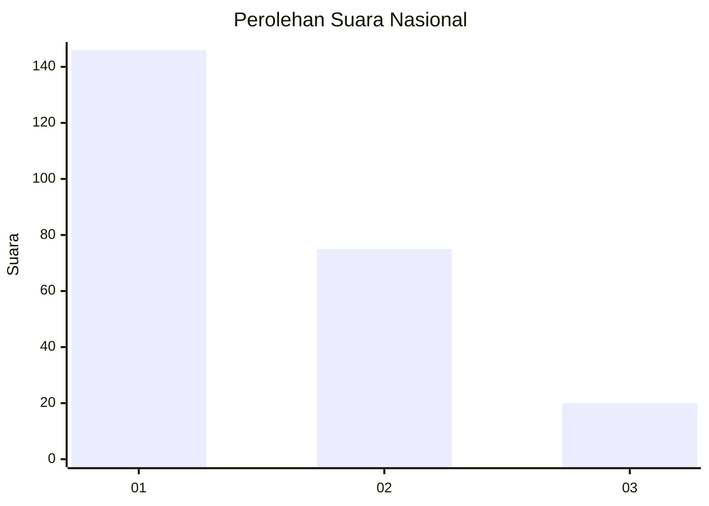
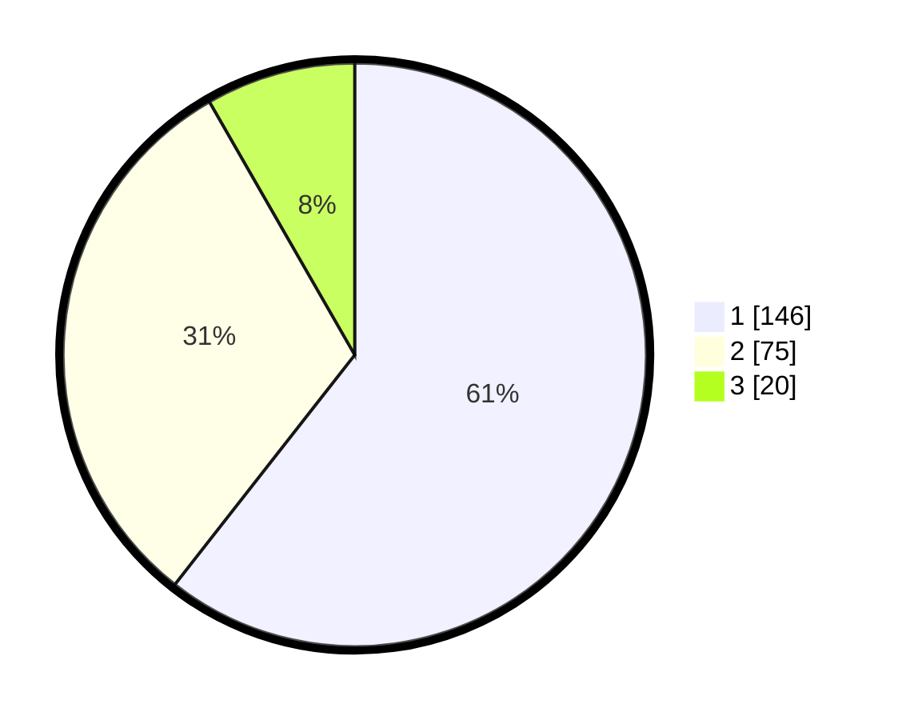

# Hasil

## Grafik

## Tabel

| No. | Nama Paslon    | Suara | Suara (raw) | Persentase |
|:--- |:-------------- | -----:| -----------:| ----------:|
| 1   | ANIES MUHAIMIN | 146   | [146][p-1]  | 60,58      |
| 2   | PRABOWO GIBRAN | 75    | [75][p-2]   | 31,12      |
| 3   | GANJAR MAHFUD  | 20    | [20][p-3]   | 8,30       |

[p-1]: https://github.com/gigit-pemilu/pemilu-2024/blob/main/pilpres/hitung-suara/sub/31-dki-jakarta/sub/74-jakarta-selatan/sub/06-cilandak/sub/1002-lebak-bulus/sub/004-tps/sub/paslon-1.txt
[p-2]: https://github.com/gigit-pemilu/pemilu-2024/blob/main/pilpres/hitung-suara/sub/31-dki-jakarta/sub/74-jakarta-selatan/sub/06-cilandak/sub/1002-lebak-bulus/sub/004-tps/sub/paslon-2.txt
[p-3]: https://github.com/gigit-pemilu/pemilu-2024/blob/main/pilpres/hitung-suara/sub/31-dki-jakarta/sub/74-jakarta-selatan/sub/06-cilandak/sub/1002-lebak-bulus/sub/004-tps/sub/paslon-3.txt

## Foto C Plano

https://sirekap-obj-formc.kpu.go.id/9c51/pemilu/ppwp/31/74/06/10/02/3174061002004-20240214-203844--f547be5d-301b-4c33-8433-6ecf1ae075df.jpg

https://sirekap-obj-formc.kpu.go.id/9c51/pemilu/ppwp/31/74/06/10/02/3174061002004-20240214-203739--06ed1a76-16f9-4424-aeaf-b354dc134848.jpg

https://sirekap-obj-formc.kpu.go.id/9c51/pemilu/ppwp/31/74/06/10/02/3174061002004-20240214-203949--35af077a-8a9a-4989-96c7-c7fdddee083e.jpg

## Metadata

| Key        | Value               |
| ---------- | ------------------- |
| Time Stamp | 2024-02-22 13:00:00 |

