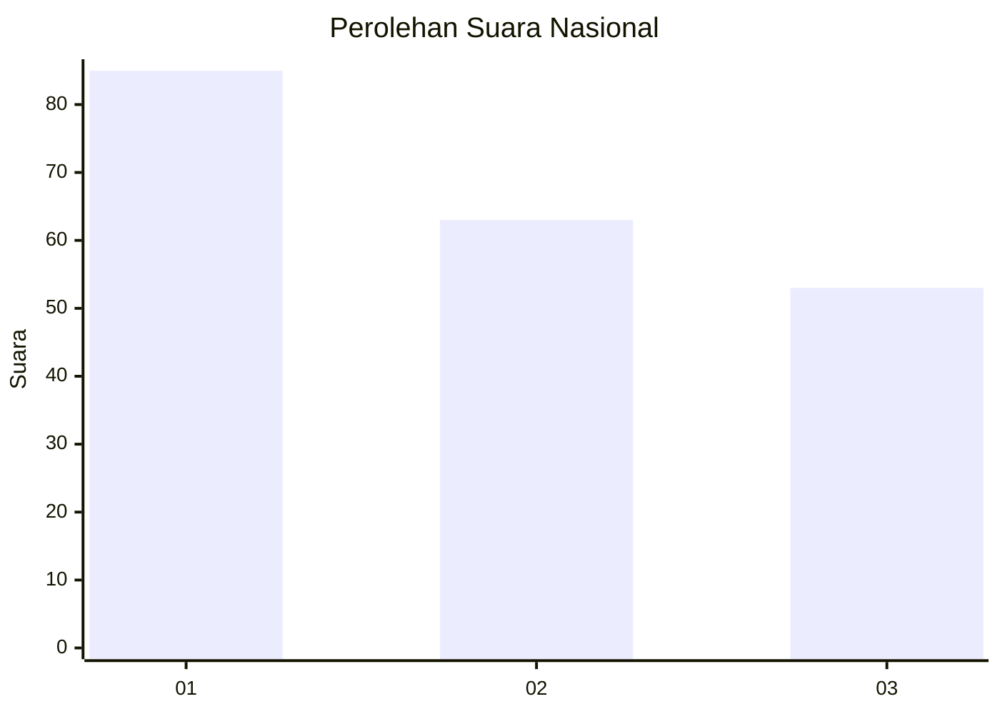
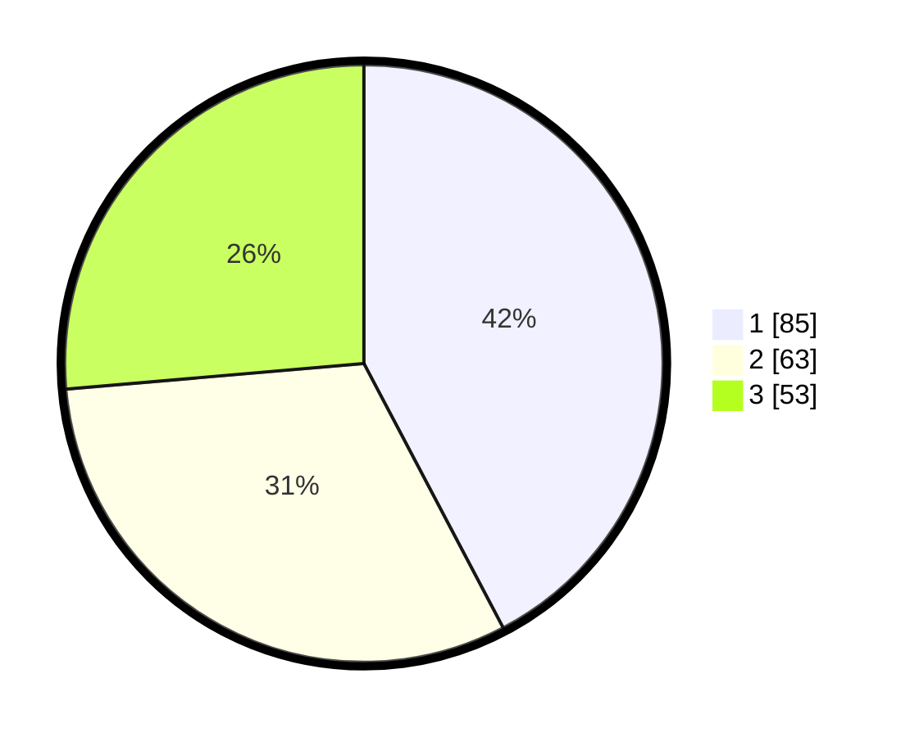

# Hasil

## Grafik

## Tabel

| No.    | Nama Paslon    | Suara | Suara (raw) | Persentase |
|:------ |:-------------- | -----:| -----------:| ----------:|
| 100025 | ANIES MUHAIMIN | 85    | [85][p-1]   | 42,29      |
| 100026 | PRABOWO GIBRAN | 63    | [63][p-2]   | 31,34      |
| 100027 | GANJAR MAHFUD  | 53    | [53][p-3]   | 26,37      |

[p-1]: https://github.com/gigit-pemilu/pemilu-2024/blob/main/pilpres/hitung-suara/sub/31-dki-jakarta/sub/74-jakarta-selatan/sub/06-cilandak/sub/1002-lebak-bulus/sub/012-tps/sub/paslon-1.txt
[p-2]: https://github.com/gigit-pemilu/pemilu-2024/blob/main/pilpres/hitung-suara/sub/31-dki-jakarta/sub/74-jakarta-selatan/sub/06-cilandak/sub/1002-lebak-bulus/sub/012-tps/sub/paslon-2.txt
[p-3]: https://github.com/gigit-pemilu/pemilu-2024/blob/main/pilpres/hitung-suara/sub/31-dki-jakarta/sub/74-jakarta-selatan/sub/06-cilandak/sub/1002-lebak-bulus/sub/012-tps/sub/paslon-3.txt

## Foto C Plano

https://sirekap-obj-formc.kpu.go.id/5d3f/pemilu/ppwp/31/74/06/10/02/3174061002012-20240215-160346--b5c044ea-f0bf-41a7-86ab-f55575467ad8.jpg

https://sirekap-obj-formc.kpu.go.id/5d3f/pemilu/ppwp/31/74/06/10/02/3174061002012-20240216-204722--e7ce07cd-4744-4391-9a9a-3655290b01d8.jpg

https://sirekap-obj-formc.kpu.go.id/5d3f/pemilu/ppwp/31/74/06/10/02/3174061002012-20240216-194902--9f08a63c-ec47-4007-887f-66c3a84e3fc8.jpg

## Metadata

| Key        | Value               |
| ---------- | ------------------- |
| Time Stamp | 2024-02-17 18:30:00 |

