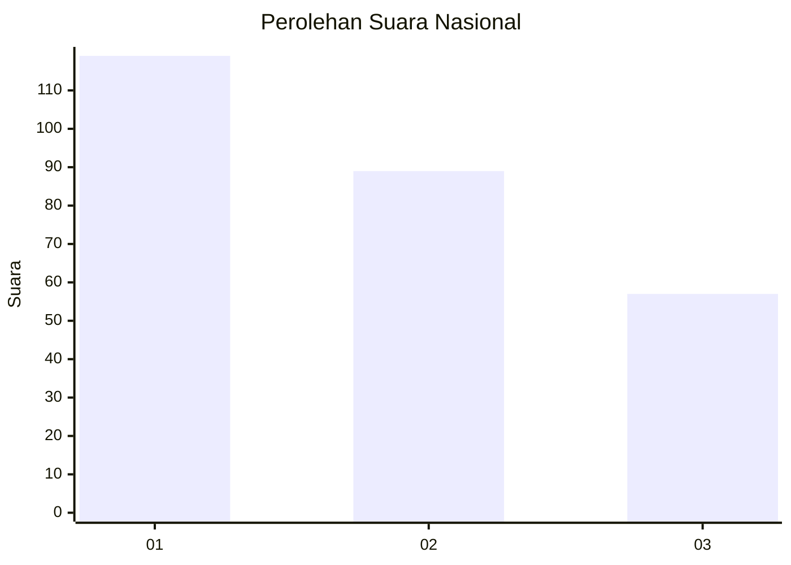
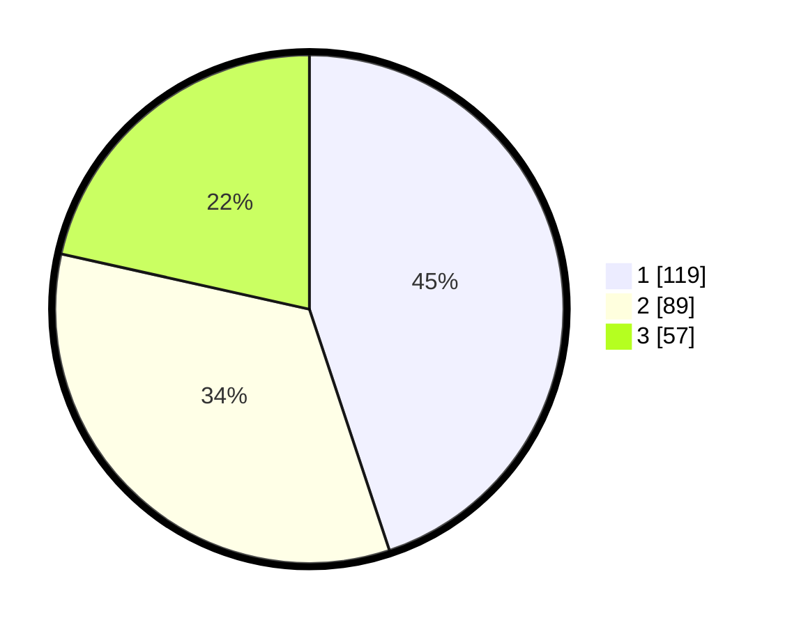

# Hasil

## Grafik

## Tabel

| No.    | Nama Paslon    | Suara | Suara (raw) | Persentase |
|:------ |:-------------- | -----:| -----------:| ----------:|
| 100025 | ANIES MUHAIMIN | 119   | [119][p-1]  | 44,91      |
| 100026 | PRABOWO GIBRAN | 89    | [89][p-2]   | 33,58      |
| 100027 | GANJAR MAHFUD  | 57    | [57][p-3]   | 21,51      |

[p-1]: https://github.com/gigit-pemilu/pemilu-2024/blob/main/pilpres/hitung-suara/sub/31-dki-jakarta/sub/74-jakarta-selatan/sub/06-cilandak/sub/1002-lebak-bulus/sub/016-tps/sub/paslon-1.txt
[p-2]: https://github.com/gigit-pemilu/pemilu-2024/blob/main/pilpres/hitung-suara/sub/31-dki-jakarta/sub/74-jakarta-selatan/sub/06-cilandak/sub/1002-lebak-bulus/sub/016-tps/sub/paslon-2.txt
[p-3]: https://github.com/gigit-pemilu/pemilu-2024/blob/main/pilpres/hitung-suara/sub/31-dki-jakarta/sub/74-jakarta-selatan/sub/06-cilandak/sub/1002-lebak-bulus/sub/016-tps/sub/paslon-3.txt

## Foto C Plano

https://sirekap-obj-formc.kpu.go.id/7713/pemilu/ppwp/31/74/06/10/02/3174061002016-20240216-205422--9db98848-d27d-46cd-81f7-1b648921cc11.jpg

https://sirekap-obj-formc.kpu.go.id/7713/pemilu/ppwp/31/74/06/10/02/3174061002016-20240214-195103--2a42473c-cf13-4037-a411-054171b5878e.jpg

https://sirekap-obj-formc.kpu.go.id/7713/pemilu/ppwp/31/74/06/10/02/3174061002016-20240216-205554--ccfe4274-6014-4812-bd0c-5778e82da125.jpg

## Metadata

| Key        | Value               |
| ---------- | ------------------- |
| Time Stamp | 2024-02-22 13:00:00 |

