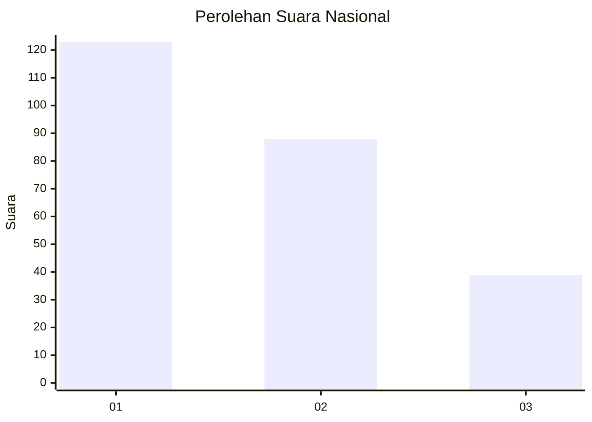
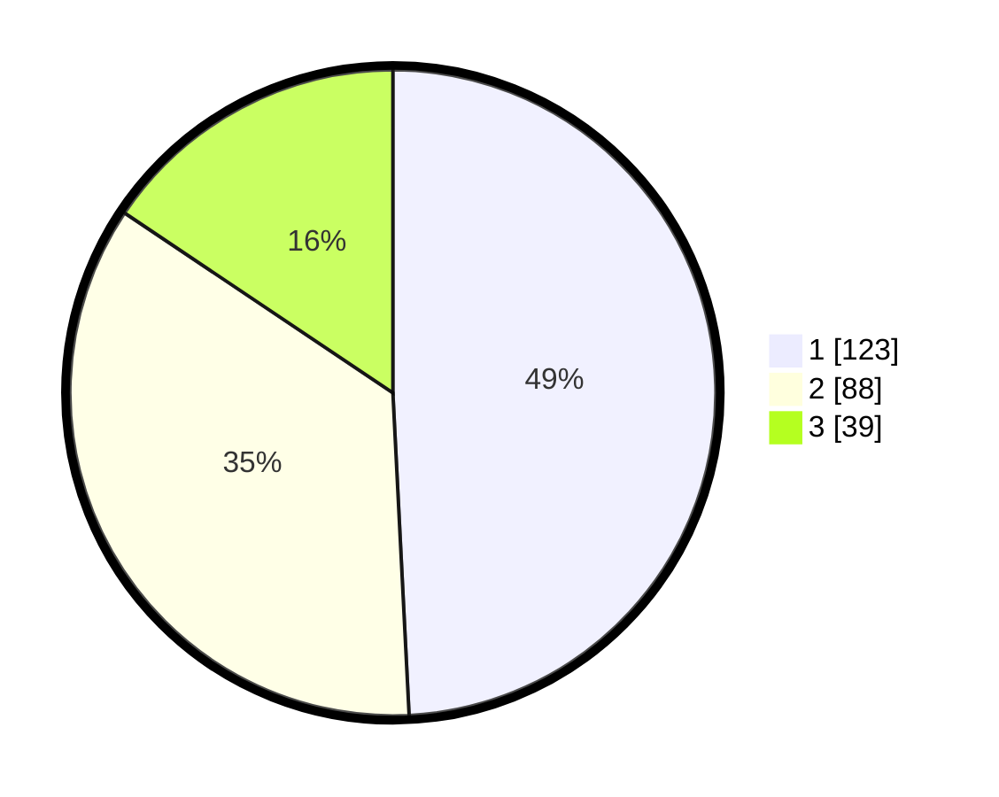

# Hasil

## Grafik

## Tabel

| No.    | Nama Paslon    | Suara | Suara (raw) | Persentase |
|:------ |:-------------- | -----:| -----------:| ----------:|
| 100025 | ANIES MUHAIMIN | 123   | [123][p-1]  | 49,20      |
| 100026 | PRABOWO GIBRAN | 88    | [88][p-2]   | 35,20      |
| 100027 | GANJAR MAHFUD  | 39    | [39][p-3]   | 15,60      |

[p-1]: https://github.com/gigit-pemilu/pemilu-2024/blob/main/pilpres/hitung-suara/sub/31-dki-jakarta/sub/74-jakarta-selatan/sub/06-cilandak/sub/1002-lebak-bulus/sub/021-tps/sub/paslon-1.txt
[p-2]: https://github.com/gigit-pemilu/pemilu-2024/blob/main/pilpres/hitung-suara/sub/31-dki-jakarta/sub/74-jakarta-selatan/sub/06-cilandak/sub/1002-lebak-bulus/sub/021-tps/sub/paslon-2.txt
[p-3]: https://github.com/gigit-pemilu/pemilu-2024/blob/main/pilpres/hitung-suara/sub/31-dki-jakarta/sub/74-jakarta-selatan/sub/06-cilandak/sub/1002-lebak-bulus/sub/021-tps/sub/paslon-3.txt

## Foto C Plano

https://sirekap-obj-formc.kpu.go.id/6310/pemilu/ppwp/31/74/06/10/02/3174061002021-20240214-190153--52bcc261-8ce9-4b6f-b6d2-ccd251c75a91.jpg

https://sirekap-obj-formc.kpu.go.id/6310/pemilu/ppwp/31/74/06/10/02/3174061002021-20240214-190150--aa686599-4b35-49c6-b855-1fd1ac43dc52.jpg

https://sirekap-obj-formc.kpu.go.id/6310/pemilu/ppwp/31/74/06/10/02/3174061002021-20240214-190142--ea745d76-e293-4f01-b5ed-292b04519774.jpg

## Metadata

| Key        | Value               |
| ---------- | ------------------- |
| Time Stamp | 2024-02-22 13:00:00 |

