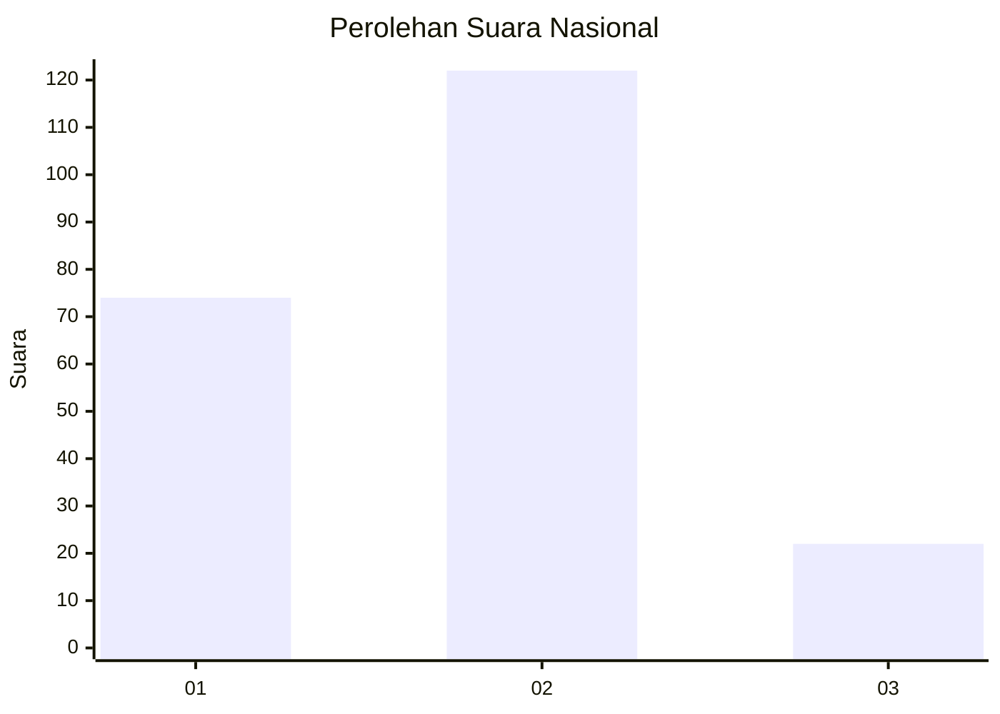
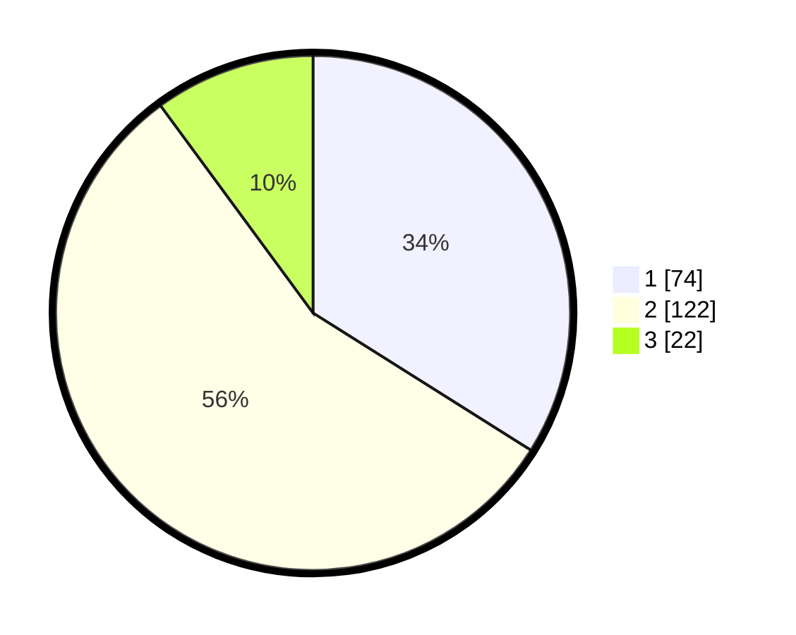

# Hasil

## Grafik

## Tabel

| No.    | Nama Paslon    | Suara | Suara (raw) | Persentase |
|:------ |:-------------- | -----:| -----------:| ----------:|
| 100025 | ANIES MUHAIMIN | 74    | [74][p-1]   | 33,94      |
| 100026 | PRABOWO GIBRAN | 122   | [122][p-2]  | 55,96      |
| 100027 | GANJAR MAHFUD  | 22    | [22][p-3]   | 10,09      |

[p-1]: https://github.com/gigit-pemilu/pemilu-2024/blob/main/pilpres/hitung-suara/sub/31-dki-jakarta/sub/74-jakarta-selatan/sub/06-cilandak/sub/1002-lebak-bulus/sub/022-tps/sub/paslon-1.txt
[p-2]: https://github.com/gigit-pemilu/pemilu-2024/blob/main/pilpres/hitung-suara/sub/31-dki-jakarta/sub/74-jakarta-selatan/sub/06-cilandak/sub/1002-lebak-bulus/sub/022-tps/sub/paslon-2.txt
[p-3]: https://github.com/gigit-pemilu/pemilu-2024/blob/main/pilpres/hitung-suara/sub/31-dki-jakarta/sub/74-jakarta-selatan/sub/06-cilandak/sub/1002-lebak-bulus/sub/022-tps/sub/paslon-3.txt

## Foto C Plano

https://sirekap-obj-formc.kpu.go.id/8a49/pemilu/ppwp/31/74/06/10/02/3174061002022-20240214-225635--4b672ee1-92c7-4964-8e2e-265d8a69e392.jpg

https://sirekap-obj-formc.kpu.go.id/8a49/pemilu/ppwp/31/74/06/10/02/3174061002022-20240214-225639--2ecde1d1-3093-46fa-a871-e8f99ba40b30.jpg

https://sirekap-obj-formc.kpu.go.id/8a49/pemilu/ppwp/31/74/06/10/02/3174061002022-20240214-225643--cd601a69-519e-4531-8b46-98fff02b878b.jpg

## Metadata

| Key        | Value               |
| ---------- | ------------------- |
| Time Stamp | 2024-02-22 13:00:00 |

