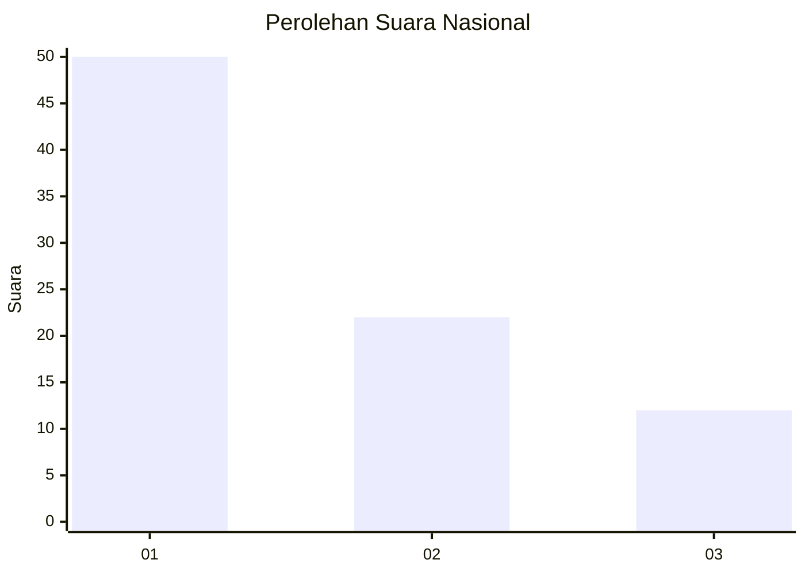
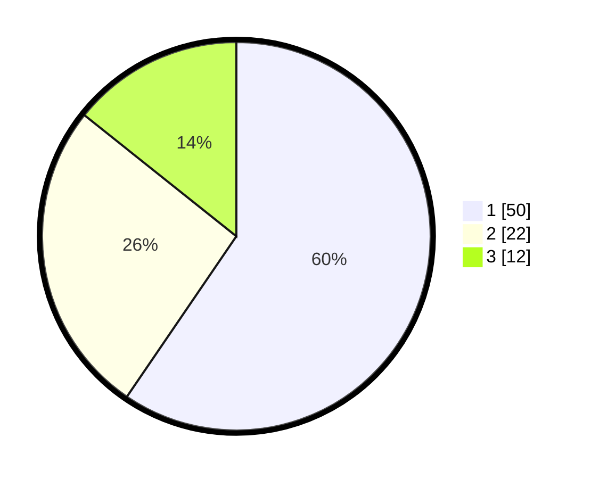

# Hasil

## Grafik

## Tabel

| No.    | Nama Paslon    | Suara | Suara (raw) | Persentase |
|:------ |:-------------- | -----:| -----------:| ----------:|
| 100025 | ANIES MUHAIMIN | 50    | [50][p-1]   | 59,52      |
| 100026 | PRABOWO GIBRAN | 22    | [22][p-2]   | 26,19      |
| 100027 | GANJAR MAHFUD  | 12    | [12][p-3]   | 14,29      |

[p-1]: https://github.com/gigit-pemilu/pemilu-2024/blob/main/pilpres/hitung-suara/sub/31-dki-jakarta/sub/74-jakarta-selatan/sub/06-cilandak/sub/1002-lebak-bulus/sub/038-tps/sub/paslon-1.txt
[p-2]: https://github.com/gigit-pemilu/pemilu-2024/blob/main/pilpres/hitung-suara/sub/31-dki-jakarta/sub/74-jakarta-selatan/sub/06-cilandak/sub/1002-lebak-bulus/sub/038-tps/sub/paslon-2.txt
[p-3]: https://github.com/gigit-pemilu/pemilu-2024/blob/main/pilpres/hitung-suara/sub/31-dki-jakarta/sub/74-jakarta-selatan/sub/06-cilandak/sub/1002-lebak-bulus/sub/038-tps/sub/paslon-3.txt

## Foto C Plano

https://sirekap-obj-formc.kpu.go.id/7882/pemilu/ppwp/31/74/06/10/02/3174061002038-20240214-155144--e9718df1-8656-4848-b947-90051c8afe04.jpg

https://sirekap-obj-formc.kpu.go.id/7882/pemilu/ppwp/31/74/06/10/02/3174061002038-20240214-155158--b34c2c1e-2ebb-4548-ae7a-6d4248ab75b8.jpg

https://sirekap-obj-formc.kpu.go.id/7882/pemilu/ppwp/31/74/06/10/02/3174061002038-20240214-155212--d62b6e1c-aeac-439c-9d11-d36fd8f771bc.jpg

## Metadata

| Key        | Value               |
| ---------- | ------------------- |
| Time Stamp | 2024-02-22 13:00:00 |

