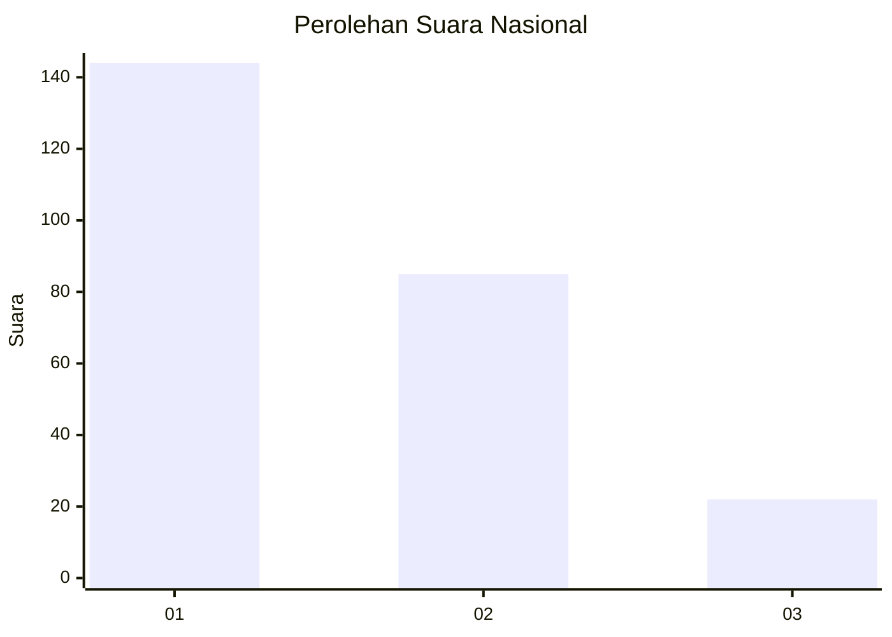
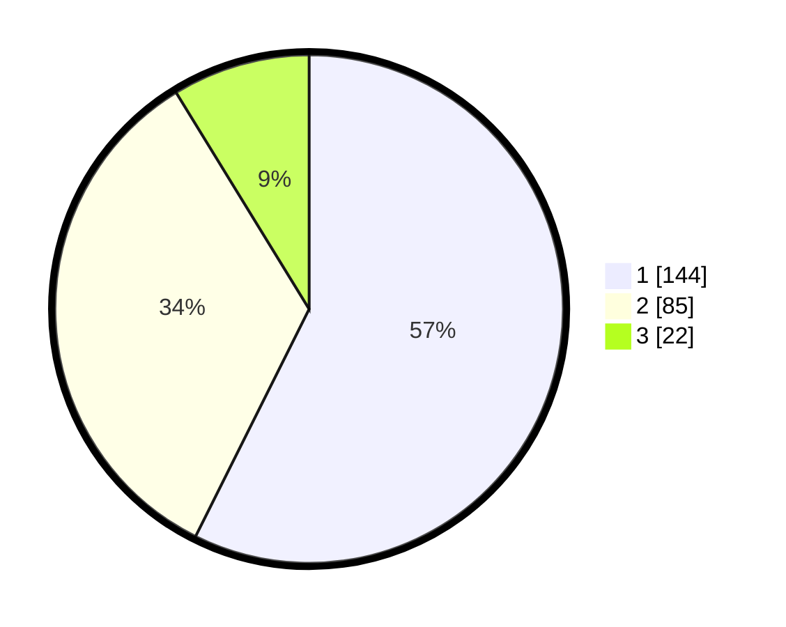

# Hasil

## Grafik

## Tabel

| No. | Nama Paslon    | Suara | Suara (raw) | Persentase |
|:--- |:-------------- | -----:| -----------:| ----------:|
| 1   | ANIES MUHAIMIN | 144   | [144][p-1]  | 57,37      |
| 2   | PRABOWO GIBRAN | 85    | [85][p-2]   | 33,86      |
| 3   | GANJAR MAHFUD  | 22    | [22][p-3]   | 8,76       |

[p-1]: https://github.com/gigit-pemilu/pemilu-2024/blob/main/pilpres/hitung-suara/sub/31-dki-jakarta/sub/74-jakarta-selatan/sub/06-cilandak/sub/1002-lebak-bulus/sub/074-tps/sub/paslon-1.txt
[p-2]: https://github.com/gigit-pemilu/pemilu-2024/blob/main/pilpres/hitung-suara/sub/31-dki-jakarta/sub/74-jakarta-selatan/sub/06-cilandak/sub/1002-lebak-bulus/sub/074-tps/sub/paslon-2.txt
[p-3]: https://github.com/gigit-pemilu/pemilu-2024/blob/main/pilpres/hitung-suara/sub/31-dki-jakarta/sub/74-jakarta-selatan/sub/06-cilandak/sub/1002-lebak-bulus/sub/074-tps/sub/paslon-3.txt

## Foto C Plano

https://sirekap-obj-formc.kpu.go.id/d653/pemilu/ppwp/31/74/06/10/02/3174061002074-20240214-213436--e33cb4c0-1cda-46ca-96d4-51209bb470bd.jpg

https://sirekap-obj-formc.kpu.go.id/d653/pemilu/ppwp/31/74/06/10/02/3174061002074-20240214-213521--58e8d1df-3b09-4799-8794-16abc9cd58b6.jpg

https://sirekap-obj-formc.kpu.go.id/d653/pemilu/ppwp/31/74/06/10/02/3174061002074-20240214-213631--acc5e3df-5402-4a38-b6bd-b9e7e395d487.jpg

## Metadata

| Key        | Value               |
| ---------- | ------------------- |
| Time Stamp | 2024-02-24 22:31:28 |

