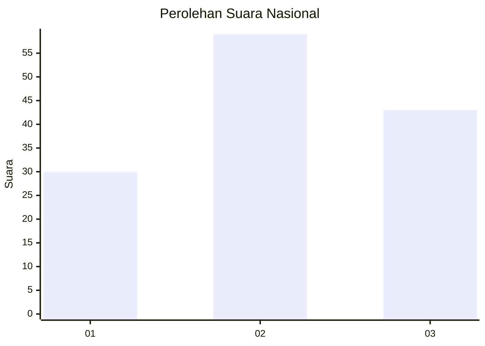
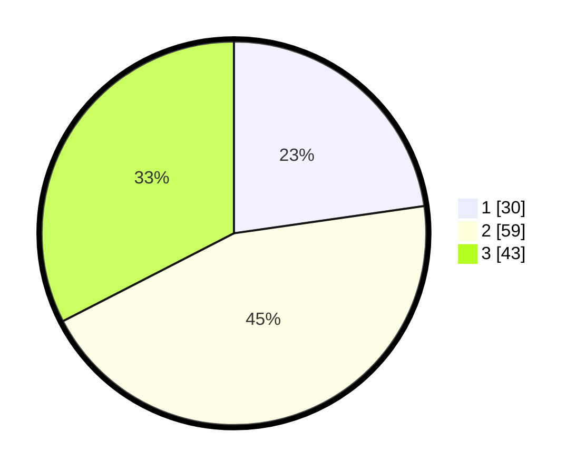

# Hasil

## Grafik

## Tabel

| No.    | Nama Paslon    | Suara | Suara (raw) | Persentase |
|:------ |:-------------- | -----:| -----------:| ----------:|
| 100025 | ANIES MUHAIMIN | 30    | [30][p-1]   | 22,73      |
| 100026 | PRABOWO GIBRAN | 59    | [59][p-2]   | 44,70      |
| 100027 | GANJAR MAHFUD  | 43    | [43][p-3]   | 32,58      |

[p-1]: https://github.com/gigit-pemilu/pemilu-2024/blob/main/pilpres/hitung-suara/sub/31-dki-jakarta/sub/74-jakarta-selatan/sub/06-cilandak/sub/1002-lebak-bulus/sub/086-tps/sub/paslon-1.txt
[p-2]: https://github.com/gigit-pemilu/pemilu-2024/blob/main/pilpres/hitung-suara/sub/31-dki-jakarta/sub/74-jakarta-selatan/sub/06-cilandak/sub/1002-lebak-bulus/sub/086-tps/sub/paslon-2.txt
[p-3]: https://github.com/gigit-pemilu/pemilu-2024/blob/main/pilpres/hitung-suara/sub/31-dki-jakarta/sub/74-jakarta-selatan/sub/06-cilandak/sub/1002-lebak-bulus/sub/086-tps/sub/paslon-3.txt

## Foto C Plano

https://sirekap-obj-formc.kpu.go.id/3270/pemilu/ppwp/31/74/06/10/02/3174061002086-20240215-204120--291169e3-ee30-41c3-85c6-7a38ead82103.jpg

https://sirekap-obj-formc.kpu.go.id/3270/pemilu/ppwp/31/74/06/10/02/3174061002086-20240215-203251--d6d0b189-f60e-4472-b61b-e0eb813c6d82.jpg

https://sirekap-obj-formc.kpu.go.id/3270/pemilu/ppwp/31/74/06/10/02/3174061002086-20240215-213018--7bece668-54b7-4069-9066-083a4783f01b.jpg

## Metadata

| Key        | Value               |
| ---------- | ------------------- |
| Time Stamp | 2024-02-15 22:30:27 |

