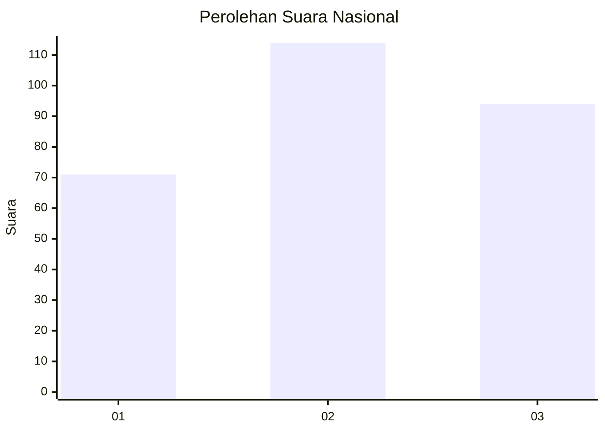
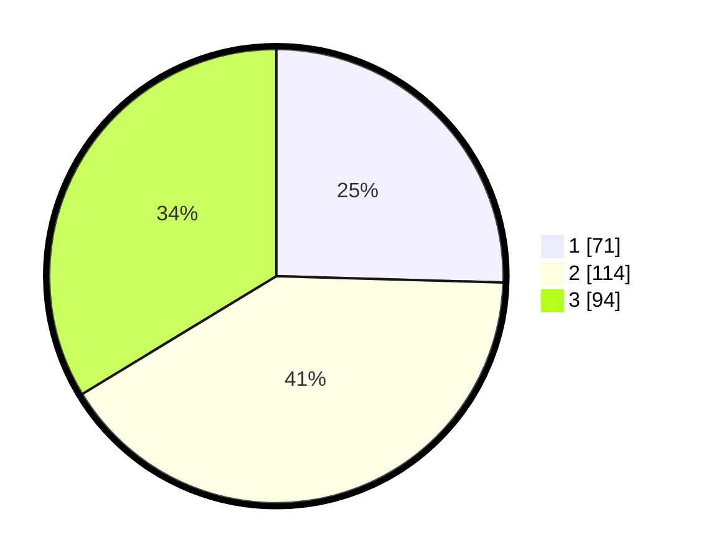

# Hasil

## Grafik

## Tabel

| No.    | Nama Paslon    | Suara | Suara (raw) | Persentase |
|:------ |:-------------- | -----:| -----------:| ----------:|
| 100025 | ANIES MUHAIMIN | 71    | [71][p-1]   | 25,45      |
| 100026 | PRABOWO GIBRAN | 114   | [114][p-2]  | 40,86      |
| 100027 | GANJAR MAHFUD  | 94    | [94][p-3]   | 33,69      |

[p-1]: https://github.com/gigit-pemilu/pemilu-2024/blob/main/pilpres/hitung-suara/sub/31-dki-jakarta/sub/74-jakarta-selatan/sub/06-cilandak/sub/1002-lebak-bulus/sub/091-tps/sub/paslon-1.txt
[p-2]: https://github.com/gigit-pemilu/pemilu-2024/blob/main/pilpres/hitung-suara/sub/31-dki-jakarta/sub/74-jakarta-selatan/sub/06-cilandak/sub/1002-lebak-bulus/sub/091-tps/sub/paslon-2.txt
[p-3]: https://github.com/gigit-pemilu/pemilu-2024/blob/main/pilpres/hitung-suara/sub/31-dki-jakarta/sub/74-jakarta-selatan/sub/06-cilandak/sub/1002-lebak-bulus/sub/091-tps/sub/paslon-3.txt

## Foto C Plano

https://sirekap-obj-formc.kpu.go.id/d063/pemilu/ppwp/31/74/06/10/02/3174061002091-20240218-164838--5f8fe255-facd-4977-8d0c-1a0b6e1f1e9e.jpg

https://sirekap-obj-formc.kpu.go.id/d063/pemilu/ppwp/31/74/06/10/02/3174061002091-20240218-164958--56be8896-0b1a-444d-a78b-fa7358c0d589.jpg

https://sirekap-obj-formc.kpu.go.id/d063/pemilu/ppwp/31/74/06/10/02/3174061002091-20240218-165119--c1d1fc5a-a804-4b32-897f-d96066f61e6f.jpg

## Metadata

| Key        | Value               |
| ---------- | ------------------- |
| Time Stamp | 2024-02-19 11:00:00 |

## DATA PEMILIH TETAP

Jumlah pemilih dalam DPT: **284**.
 * L: **130**.
 * P: **154**.

## DATA PENGGUNA HAK PILIH

Jumlah pengguna hak pilih dalam DPT: **251**.
 * L: **113**.
 * P: **138**.

Jumlah pengguna hak pilih dalam DPTb: **51**.
 * L: **5**.
 * P: **11**.

Jumlah pengguna hak pilih dalam DPK: **17**.
 * L: **8**.
 * P: **409**.

Jumlah pengguna hak pilih: **284**.
 * L: **126**.
 * P: **158**.

## JUMLAH SUARA SAH DAN TIDAK SAH

JUMLAH SELURUH SUARA SAH: **279**.

JUMLAH SUARA TIDAK SAH: **5**.

JUMLAH SELURUH SUARA SAH DAN SUARA TIDAK SAH: **284**.

