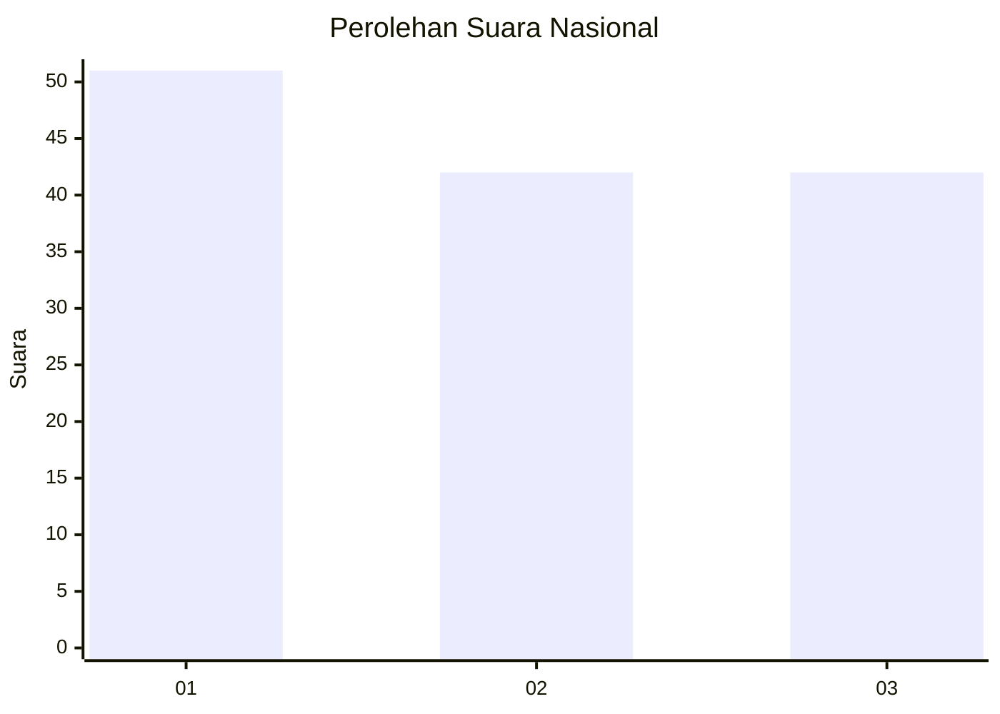
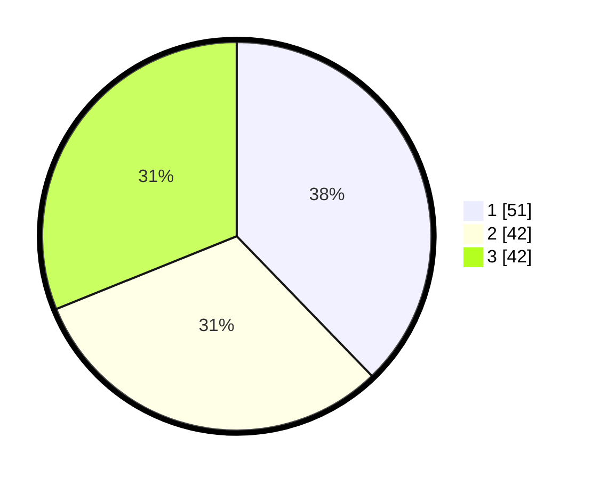

# Hasil

## Grafik

## Tabel

| No.    | Nama Paslon    | Suara | Suara (raw) | Persentase |
|:------ |:-------------- | -----:| -----------:| ----------:|
| 100025 | ANIES MUHAIMIN | 51    | [51][p-1]   | 37,78      |
| 100026 | PRABOWO GIBRAN | 42    | [42][p-2]   | 31,11      |
| 100027 | GANJAR MAHFUD  | 42    | [42][p-3]   | 31,11      |

[p-1]: https://github.com/gigit-pemilu/pemilu-2024/blob/main/pilpres/hitung-suara/sub/31-dki-jakarta/sub/74-jakarta-selatan/sub/06-cilandak/sub/1002-lebak-bulus/sub/099-tps/sub/paslon-1.txt
[p-2]: https://github.com/gigit-pemilu/pemilu-2024/blob/main/pilpres/hitung-suara/sub/31-dki-jakarta/sub/74-jakarta-selatan/sub/06-cilandak/sub/1002-lebak-bulus/sub/099-tps/sub/paslon-2.txt
[p-3]: https://github.com/gigit-pemilu/pemilu-2024/blob/main/pilpres/hitung-suara/sub/31-dki-jakarta/sub/74-jakarta-selatan/sub/06-cilandak/sub/1002-lebak-bulus/sub/099-tps/sub/paslon-3.txt

## Foto C Plano

https://sirekap-obj-formc.kpu.go.id/dbc7/pemilu/ppwp/31/74/06/10/02/3174061002099-20240214-205627--841fc1f1-c02d-48bb-be0c-16a1a3e3cdce.jpg

https://sirekap-obj-formc.kpu.go.id/dbc7/pemilu/ppwp/31/74/06/10/02/3174061002099-20240214-205652--7b58ceea-788c-4138-a24d-93acb9171534.jpg

https://sirekap-obj-formc.kpu.go.id/dbc7/pemilu/ppwp/31/74/06/10/02/3174061002099-20240214-205717--ab824330-14cb-4c1f-9d21-f00da869614a.jpg

## Metadata

| Key        | Value               |
| ---------- | ------------------- |
| Time Stamp | 2024-02-19 12:00:00 |

