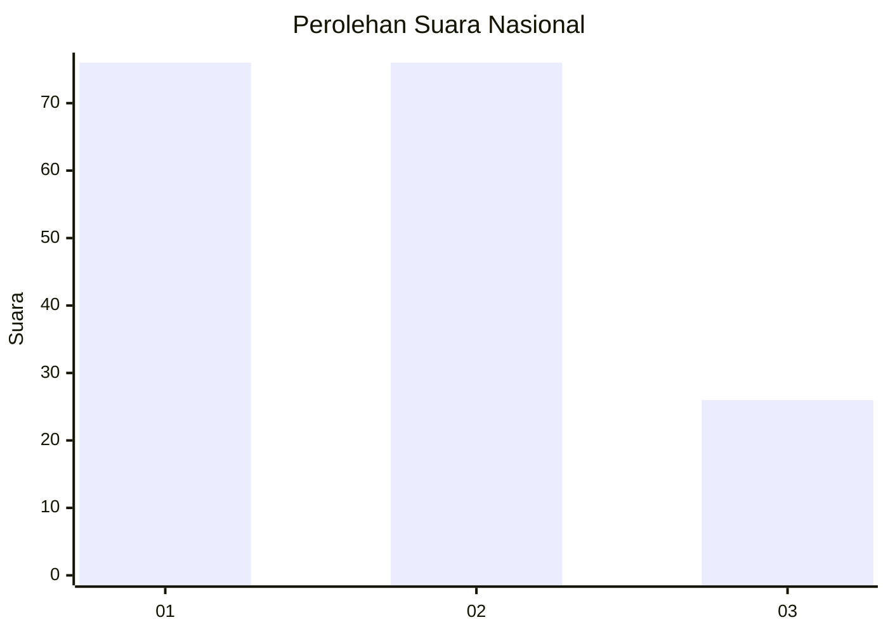
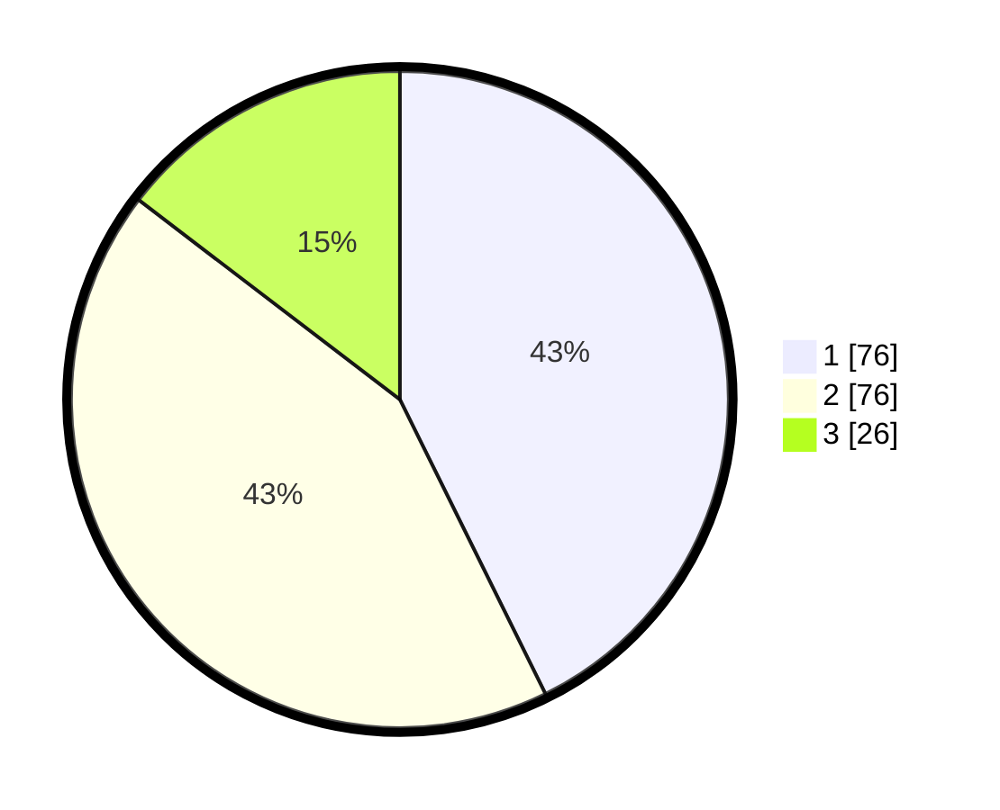

# Hasil

## Grafik

## Tabel

| No.    | Nama Paslon    | Suara | Suara (raw) | Persentase |
|:------ |:-------------- | -----:| -----------:| ----------:|
| 100025 | ANIES MUHAIMIN | 76    | [76][p-1]   | 42,70      |
| 100026 | PRABOWO GIBRAN | 76    | [76][p-2]   | 42,70      |
| 100027 | GANJAR MAHFUD  | 26    | [26][p-3]   | 14,61      |

[p-1]: https://github.com/gigit-pemilu/pemilu-2024/blob/main/pilpres/hitung-suara/sub/31-dki-jakarta/sub/74-jakarta-selatan/sub/06-cilandak/sub/1002-lebak-bulus/sub/101-tps/sub/paslon-1.txt
[p-2]: https://github.com/gigit-pemilu/pemilu-2024/blob/main/pilpres/hitung-suara/sub/31-dki-jakarta/sub/74-jakarta-selatan/sub/06-cilandak/sub/1002-lebak-bulus/sub/101-tps/sub/paslon-2.txt
[p-3]: https://github.com/gigit-pemilu/pemilu-2024/blob/main/pilpres/hitung-suara/sub/31-dki-jakarta/sub/74-jakarta-selatan/sub/06-cilandak/sub/1002-lebak-bulus/sub/101-tps/sub/paslon-3.txt

## Foto C Plano

https://sirekap-obj-formc.kpu.go.id/9e26/pemilu/ppwp/31/74/06/10/02/3174061002101-20240214-235710--433632cf-d5e1-4986-b75d-26aa8d903426.jpg

https://sirekap-obj-formc.kpu.go.id/9e26/pemilu/ppwp/31/74/06/10/02/3174061002101-20240214-235712--6871fffa-0534-4a22-8c39-268eef99223d.jpg

https://sirekap-obj-formc.kpu.go.id/9e26/pemilu/ppwp/31/74/06/10/02/3174061002101-20240214-235713--a84bc239-8e86-4d17-b89c-1654345eda0e.jpg

## Metadata

| Key        | Value               |
| ---------- | ------------------- |
| Time Stamp | 2024-02-19 12:00:00 |

