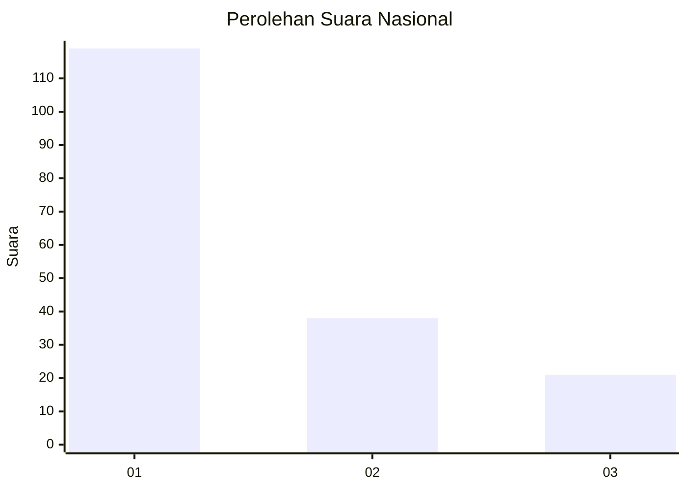
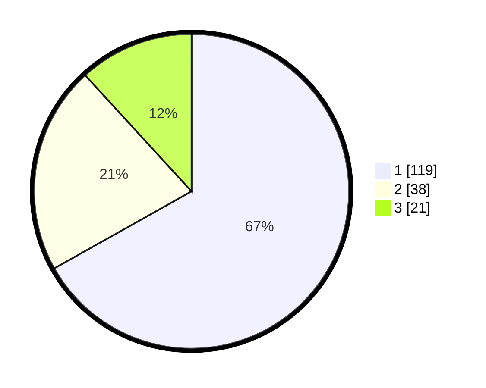

# Hasil

## Grafik

## Tabel

| No.    | Nama Paslon    | Suara | Suara (raw) | Persentase |
|:------ |:-------------- | -----:| -----------:| ----------:|
| 100025 | ANIES MUHAIMIN | 119   | [119][p-1]  | 66,85      |
| 100026 | PRABOWO GIBRAN | 38    | [38][p-2]   | 21,35      |
| 100027 | GANJAR MAHFUD  | 21    | [21][p-3]   | 11,80      |

[p-1]: https://github.com/gigit-pemilu/pemilu-2024/blob/main/pilpres/hitung-suara/sub/31-dki-jakarta/sub/74-jakarta-selatan/sub/06-cilandak/sub/1002-lebak-bulus/sub/109-tps/sub/paslon-1.txt
[p-2]: https://github.com/gigit-pemilu/pemilu-2024/blob/main/pilpres/hitung-suara/sub/31-dki-jakarta/sub/74-jakarta-selatan/sub/06-cilandak/sub/1002-lebak-bulus/sub/109-tps/sub/paslon-2.txt
[p-3]: https://github.com/gigit-pemilu/pemilu-2024/blob/main/pilpres/hitung-suara/sub/31-dki-jakarta/sub/74-jakarta-selatan/sub/06-cilandak/sub/1002-lebak-bulus/sub/109-tps/sub/paslon-3.txt

## Foto C Plano

https://sirekap-obj-formc.kpu.go.id/f7d3/pemilu/ppwp/31/74/06/10/02/3174061002109-20240214-235535--4ca55857-0379-4b34-9477-87cee07e1884.jpg

https://sirekap-obj-formc.kpu.go.id/f7d3/pemilu/ppwp/31/74/06/10/02/3174061002109-20240214-235646--7a9336eb-404c-4faa-8055-5d7e5480f7c3.jpg

https://sirekap-obj-formc.kpu.go.id/f7d3/pemilu/ppwp/31/74/06/10/02/3174061002109-20240214-235701--7965f136-7d9f-4e77-89b6-bd65e374a29a.jpg

## Metadata

| Key        | Value               |
| ---------- | ------------------- |
| Time Stamp | 2024-02-24 22:31:28 |

