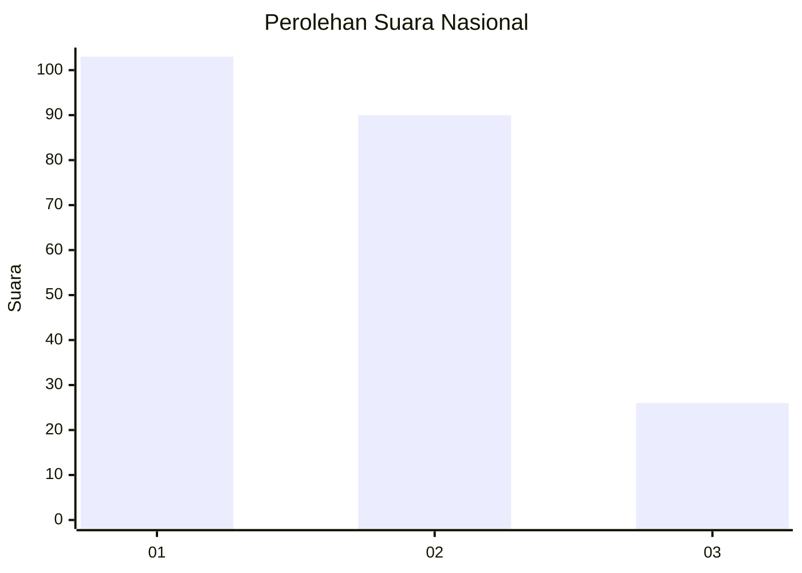
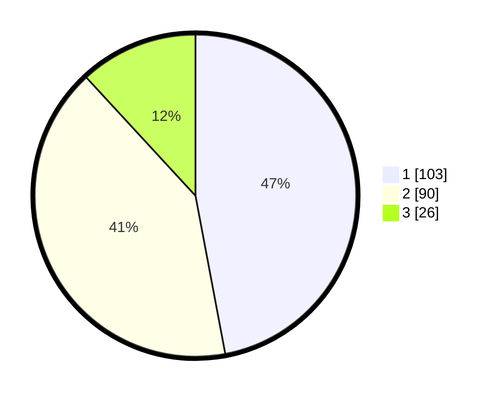

# Hasil

## Grafik

## Tabel

| No.    | Nama Paslon    | Suara | Suara (raw) | Persentase |
|:------ |:-------------- | -----:| -----------:| ----------:|
| 100025 | ANIES MUHAIMIN | 103   | [103][p-1]  | 47,03      |
| 100026 | PRABOWO GIBRAN | 90    | [90][p-2]   | 41,10      |
| 100027 | GANJAR MAHFUD  | 26    | [26][p-3]   | 11,87      |

[p-1]: https://github.com/gigit-pemilu/pemilu-2024/blob/main/pilpres/hitung-suara/sub/31-dki-jakarta/sub/74-jakarta-selatan/sub/06-cilandak/sub/1002-lebak-bulus/sub/115-tps/sub/paslon-1.txt
[p-2]: https://github.com/gigit-pemilu/pemilu-2024/blob/main/pilpres/hitung-suara/sub/31-dki-jakarta/sub/74-jakarta-selatan/sub/06-cilandak/sub/1002-lebak-bulus/sub/115-tps/sub/paslon-2.txt
[p-3]: https://github.com/gigit-pemilu/pemilu-2024/blob/main/pilpres/hitung-suara/sub/31-dki-jakarta/sub/74-jakarta-selatan/sub/06-cilandak/sub/1002-lebak-bulus/sub/115-tps/sub/paslon-3.txt

## Foto C Plano

https://sirekap-obj-formc.kpu.go.id/e356/pemilu/ppwp/31/74/06/10/02/3174061002115-20240214-160105--52f041c0-bc09-4df0-9fc5-225991f9eea3.jpg

https://sirekap-obj-formc.kpu.go.id/e356/pemilu/ppwp/31/74/06/10/02/3174061002115-20240214-160056--0c561ee6-2e19-49d7-a8ae-8f6fdd29d46e.jpg

https://sirekap-obj-formc.kpu.go.id/e356/pemilu/ppwp/31/74/06/10/02/3174061002115-20240214-155637--cc842336-0e74-49b4-8c1a-27e190c55803.jpg

## Metadata

| Key        | Value               |
| ---------- | ------------------- |
| Time Stamp | 2024-02-24 22:31:28 |

