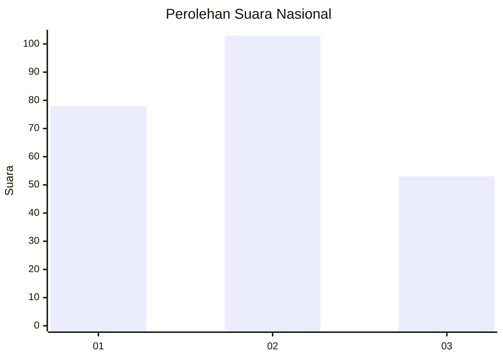
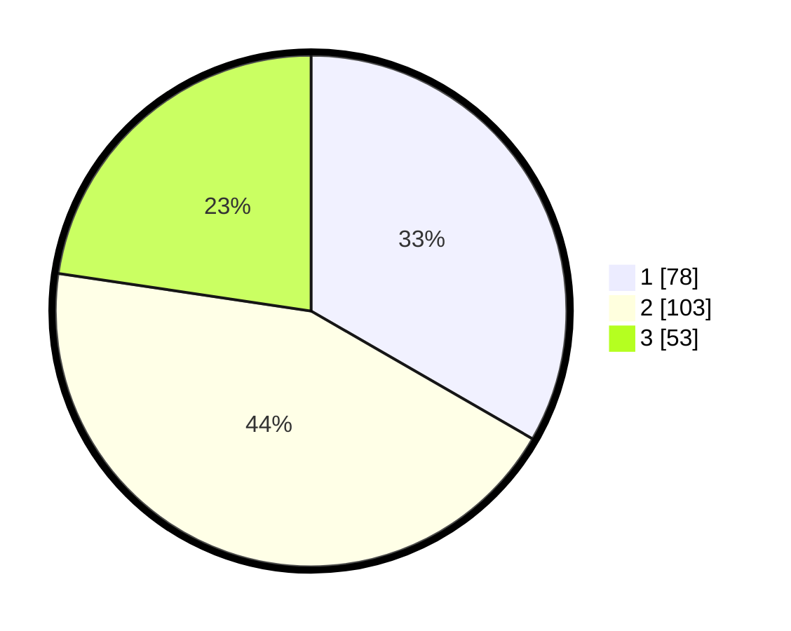

# Hasil

## Grafik

## Tabel

| No.    | Nama Paslon    | Suara | Suara (raw) | Persentase |
|:------ |:-------------- | -----:| -----------:| ----------:|
| 100025 | ANIES MUHAIMIN | 78    | [78][p-1]   | 33,33      |
| 100026 | PRABOWO GIBRAN | 103   | [103][p-2]  | 44,02      |
| 100027 | GANJAR MAHFUD  | 53    | [53][p-3]   | 22,65      |

[p-1]: https://github.com/gigit-pemilu/pemilu-2024/blob/main/pilpres/hitung-suara/sub/31-dki-jakarta/sub/74-jakarta-selatan/sub/06-cilandak/sub/1002-lebak-bulus/sub/129-tps/sub/paslon-1.txt
[p-2]: https://github.com/gigit-pemilu/pemilu-2024/blob/main/pilpres/hitung-suara/sub/31-dki-jakarta/sub/74-jakarta-selatan/sub/06-cilandak/sub/1002-lebak-bulus/sub/129-tps/sub/paslon-2.txt
[p-3]: https://github.com/gigit-pemilu/pemilu-2024/blob/main/pilpres/hitung-suara/sub/31-dki-jakarta/sub/74-jakarta-selatan/sub/06-cilandak/sub/1002-lebak-bulus/sub/129-tps/sub/paslon-3.txt

## Foto C Plano

https://sirekap-obj-formc.kpu.go.id/7dca/pemilu/ppwp/31/74/06/10/02/3174061002129-20240214-215245--e4b600fa-9b48-4552-99a4-30ab9302919b.jpg

https://sirekap-obj-formc.kpu.go.id/7dca/pemilu/ppwp/31/74/06/10/02/3174061002129-20240214-155337--312f85bc-5532-4e0f-b783-3745bf54578b.jpg

https://sirekap-obj-formc.kpu.go.id/7dca/pemilu/ppwp/31/74/06/10/02/3174061002129-20240214-215352--f93823ee-5d5d-4797-83b6-cd0b99021684.jpg

## Metadata

| Key        | Value               |
| ---------- | ------------------- |
| Time Stamp | 2024-02-15 18:30:25 |

