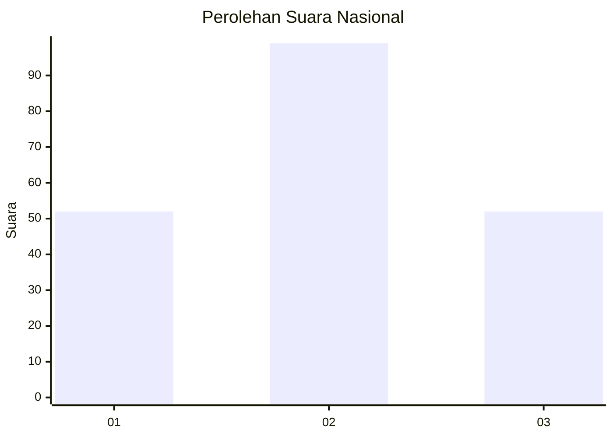
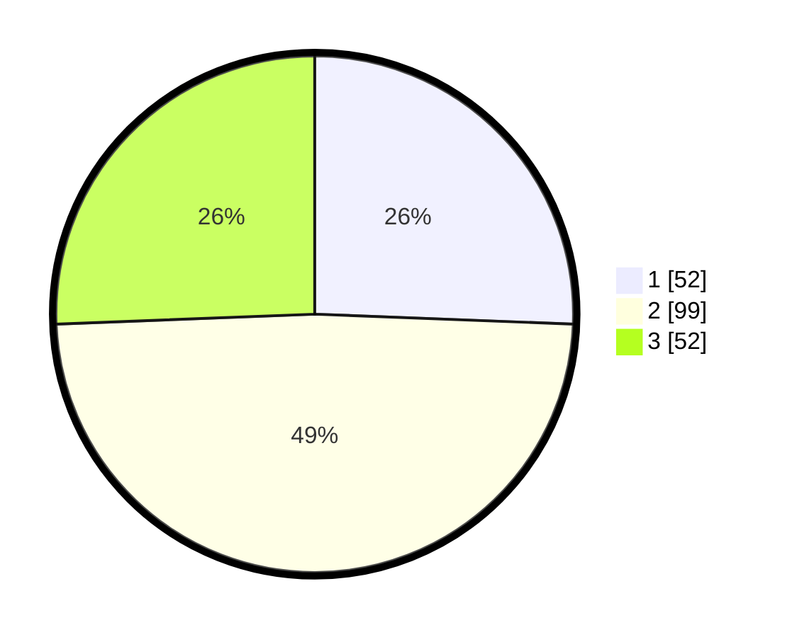

# Hasil

## Grafik

## Tabel

| No.    | Nama Paslon    | Suara | Suara (raw) | Persentase |
|:------ |:-------------- | -----:| -----------:| ----------:|
| 100025 | ANIES MUHAIMIN | 52    | [52][p-1]   | 25,62      |
| 100026 | PRABOWO GIBRAN | 99    | [99][p-2]   | 48,77      |
| 100027 | GANJAR MAHFUD  | 52    | [52][p-3]   | 25,62      |

[p-1]: https://github.com/gigit-pemilu/pemilu-2024/blob/main/pilpres/hitung-suara/sub/31-dki-jakarta/sub/74-jakarta-selatan/sub/06-cilandak/sub/1003-pondok-labu/sub/006-tps/sub/paslon-1.txt
[p-2]: https://github.com/gigit-pemilu/pemilu-2024/blob/main/pilpres/hitung-suara/sub/31-dki-jakarta/sub/74-jakarta-selatan/sub/06-cilandak/sub/1003-pondok-labu/sub/006-tps/sub/paslon-2.txt
[p-3]: https://github.com/gigit-pemilu/pemilu-2024/blob/main/pilpres/hitung-suara/sub/31-dki-jakarta/sub/74-jakarta-selatan/sub/06-cilandak/sub/1003-pondok-labu/sub/006-tps/sub/paslon-3.txt

## Foto C Plano

https://sirekap-obj-formc.kpu.go.id/6d13/pemilu/ppwp/31/74/06/10/03/3174061003006-20240215-002233--c391057a-4d8e-4429-a9e7-14fa30b7a6d6.jpg

https://sirekap-obj-formc.kpu.go.id/6d13/pemilu/ppwp/31/74/06/10/03/3174061003006-20240215-025455--0b910245-3b8d-473d-9ebc-c02582d75809.jpg

https://sirekap-obj-formc.kpu.go.id/6d13/pemilu/ppwp/31/74/06/10/03/3174061003006-20240215-002539--f7e821f6-c7de-4b19-b975-dceda857d280.jpg

## Metadata

| Key        | Value               |
| ---------- | ------------------- |
| Time Stamp | 2024-02-24 22:31:28 |

