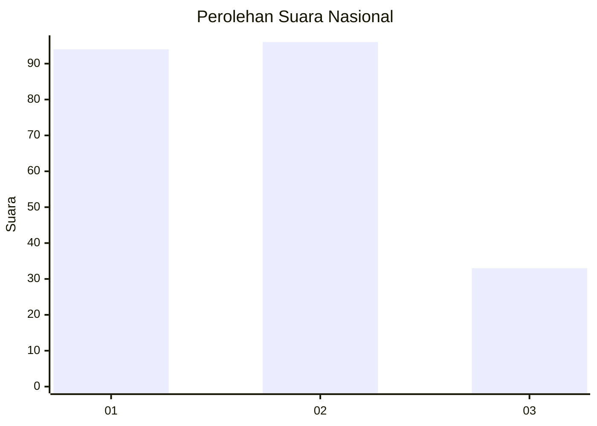
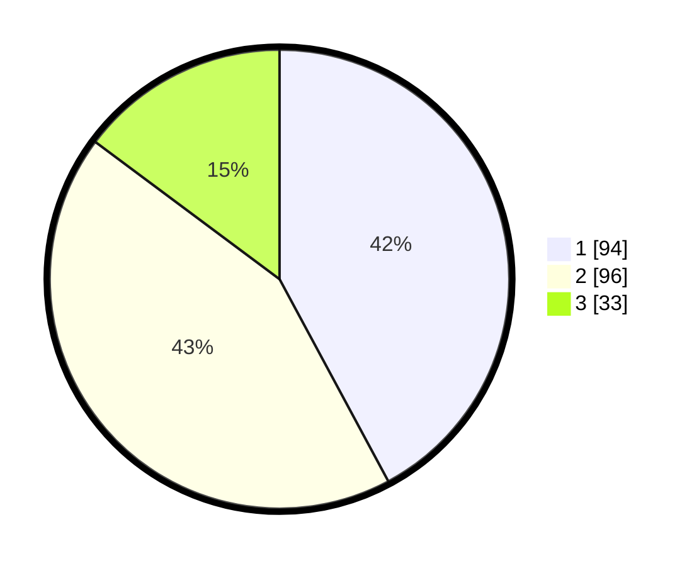

# Hasil

## Grafik

## Tabel

| No.    | Nama Paslon    | Suara | Suara (raw) | Persentase |
|:------ |:-------------- | -----:| -----------:| ----------:|
| 100025 | ANIES MUHAIMIN | 94    | [94][p-1]   | 42,15      |
| 100026 | PRABOWO GIBRAN | 96    | [96][p-2]   | 43,05      |
| 100027 | GANJAR MAHFUD  | 33    | [33][p-3]   | 14,80      |

[p-1]: https://github.com/gigit-pemilu/pemilu-2024/blob/main/pilpres/hitung-suara/sub/31-dki-jakarta/sub/74-jakarta-selatan/sub/06-cilandak/sub/1003-pondok-labu/sub/008-tps/sub/paslon-1.txt
[p-2]: https://github.com/gigit-pemilu/pemilu-2024/blob/main/pilpres/hitung-suara/sub/31-dki-jakarta/sub/74-jakarta-selatan/sub/06-cilandak/sub/1003-pondok-labu/sub/008-tps/sub/paslon-2.txt
[p-3]: https://github.com/gigit-pemilu/pemilu-2024/blob/main/pilpres/hitung-suara/sub/31-dki-jakarta/sub/74-jakarta-selatan/sub/06-cilandak/sub/1003-pondok-labu/sub/008-tps/sub/paslon-3.txt

## Foto C Plano

https://sirekap-obj-formc.kpu.go.id/3ebe/pemilu/ppwp/31/74/06/10/03/3174061003008-20240216-163607--e9426439-f3e9-4026-9eee-f915a7b36b18.jpg

https://sirekap-obj-formc.kpu.go.id/3ebe/pemilu/ppwp/31/74/06/10/03/3174061003008-20240216-163301--7c2ec8d8-a767-4424-9e0c-ef7fefdececc.jpg

https://sirekap-obj-formc.kpu.go.id/3ebe/pemilu/ppwp/31/74/06/10/03/3174061003008-20240216-163345--8edac14e-f755-44bb-99c6-a141cefc2c14.jpg

## Metadata

| Key        | Value               |
| ---------- | ------------------- |
| Time Stamp | 2024-02-24 22:31:28 |

