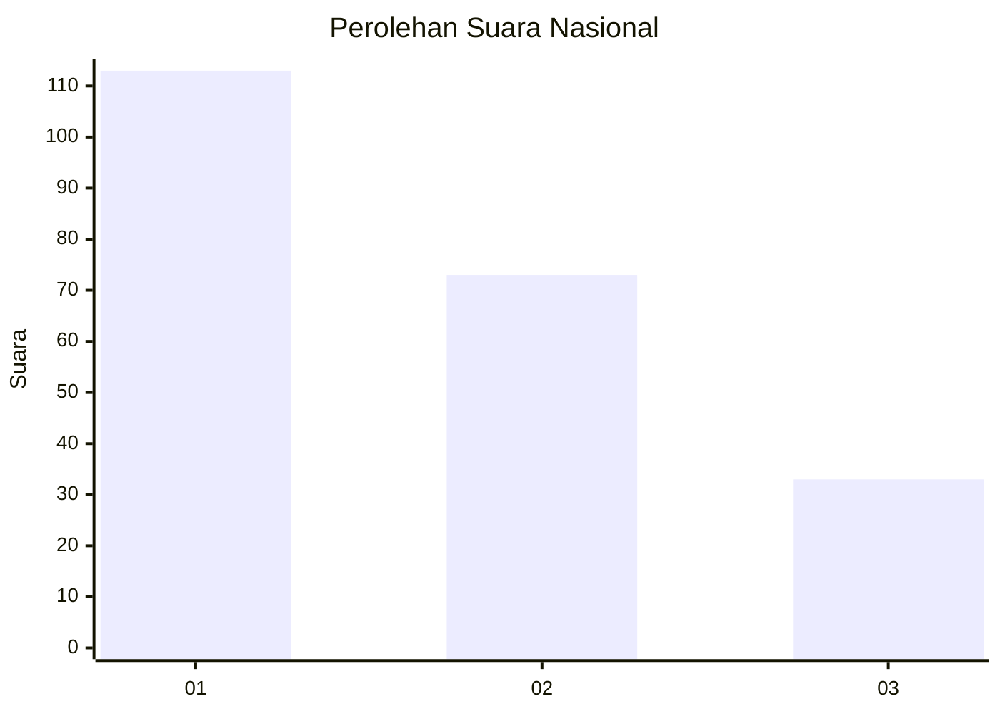
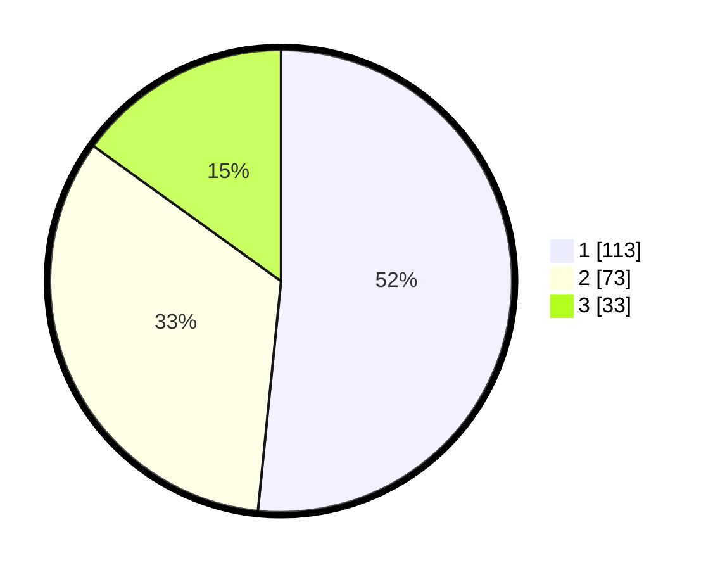

# Hasil

## Grafik

## Tabel

| No.    | Nama Paslon    | Suara | Suara (raw) | Persentase |
|:------ |:-------------- | -----:| -----------:| ----------:|
| 100025 | ANIES MUHAIMIN | 113   | [113][p-1]  | 51,60      |
| 100026 | PRABOWO GIBRAN | 73    | [73][p-2]   | 33,33      |
| 100027 | GANJAR MAHFUD  | 33    | [33][p-3]   | 15,07      |

[p-1]: https://github.com/gigit-pemilu/pemilu-2024/blob/main/pilpres/hitung-suara/sub/31-dki-jakarta/sub/74-jakarta-selatan/sub/06-cilandak/sub/1003-pondok-labu/sub/015-tps/sub/paslon-1.txt
[p-2]: https://github.com/gigit-pemilu/pemilu-2024/blob/main/pilpres/hitung-suara/sub/31-dki-jakarta/sub/74-jakarta-selatan/sub/06-cilandak/sub/1003-pondok-labu/sub/015-tps/sub/paslon-2.txt
[p-3]: https://github.com/gigit-pemilu/pemilu-2024/blob/main/pilpres/hitung-suara/sub/31-dki-jakarta/sub/74-jakarta-selatan/sub/06-cilandak/sub/1003-pondok-labu/sub/015-tps/sub/paslon-3.txt

## Foto C Plano

https://sirekap-obj-formc.kpu.go.id/1709/pemilu/ppwp/31/74/06/10/03/3174061003015-20240214-235610--85a61965-75af-4257-a3c8-e07c7756ab55.jpg

https://sirekap-obj-formc.kpu.go.id/1709/pemilu/ppwp/31/74/06/10/03/3174061003015-20240214-235728--bc4524f3-c7da-49de-9ce4-60e6abad4388.jpg

https://sirekap-obj-formc.kpu.go.id/1709/pemilu/ppwp/31/74/06/10/03/3174061003015-20240214-235848--13950113-adc6-4d88-b807-51035bf91d71.jpg

## Metadata

| Key        | Value               |
| ---------- | ------------------- |
| Time Stamp | 2024-02-24 22:31:28 |

