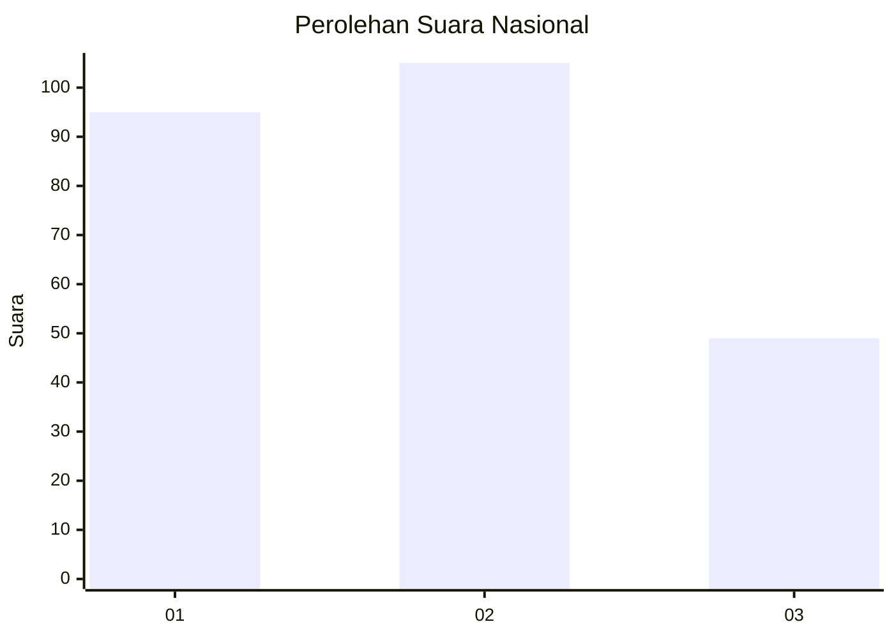
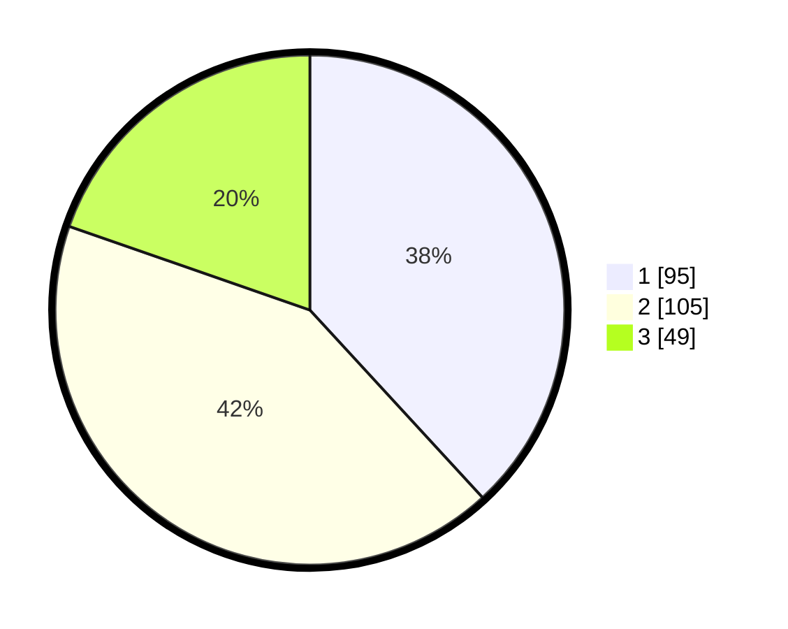

# Hasil

## Grafik

## Tabel

| No.    | Nama Paslon    | Suara | Suara (raw) | Persentase |
|:------ |:-------------- | -----:| -----------:| ----------:|
| 100025 | ANIES MUHAIMIN | 95    | [95][p-1]   | 38,15      |
| 100026 | PRABOWO GIBRAN | 105   | [105][p-2]  | 42,17      |
| 100027 | GANJAR MAHFUD  | 49    | [49][p-3]   | 19,68      |

[p-1]: https://github.com/gigit-pemilu/pemilu-2024/blob/main/pilpres/hitung-suara/sub/31-dki-jakarta/sub/74-jakarta-selatan/sub/06-cilandak/sub/1003-pondok-labu/sub/016-tps/sub/paslon-1.txt
[p-2]: https://github.com/gigit-pemilu/pemilu-2024/blob/main/pilpres/hitung-suara/sub/31-dki-jakarta/sub/74-jakarta-selatan/sub/06-cilandak/sub/1003-pondok-labu/sub/016-tps/sub/paslon-2.txt
[p-3]: https://github.com/gigit-pemilu/pemilu-2024/blob/main/pilpres/hitung-suara/sub/31-dki-jakarta/sub/74-jakarta-selatan/sub/06-cilandak/sub/1003-pondok-labu/sub/016-tps/sub/paslon-3.txt

## Foto C Plano

https://sirekap-obj-formc.kpu.go.id/d9a7/pemilu/ppwp/31/74/06/10/03/3174061003016-20240215-023738--963fc9ea-6edf-49df-8981-b4be41e0ffae.jpg

https://sirekap-obj-formc.kpu.go.id/d9a7/pemilu/ppwp/31/74/06/10/03/3174061003016-20240215-024358--e4015d74-c9b2-40a1-8378-b668da2bfc9e.jpg

https://sirekap-obj-formc.kpu.go.id/d9a7/pemilu/ppwp/31/74/06/10/03/3174061003016-20240215-024707--732613e4-b5a0-4dce-bbf6-c606759b0aeb.jpg

## Metadata

| Key        | Value               |
| ---------- | ------------------- |
| Time Stamp | 2024-02-24 22:31:28 |

