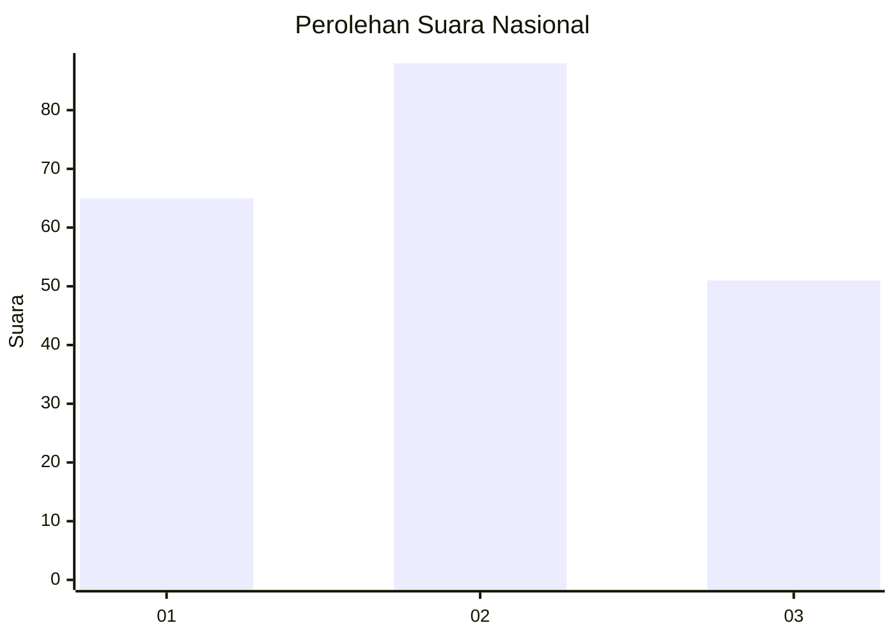
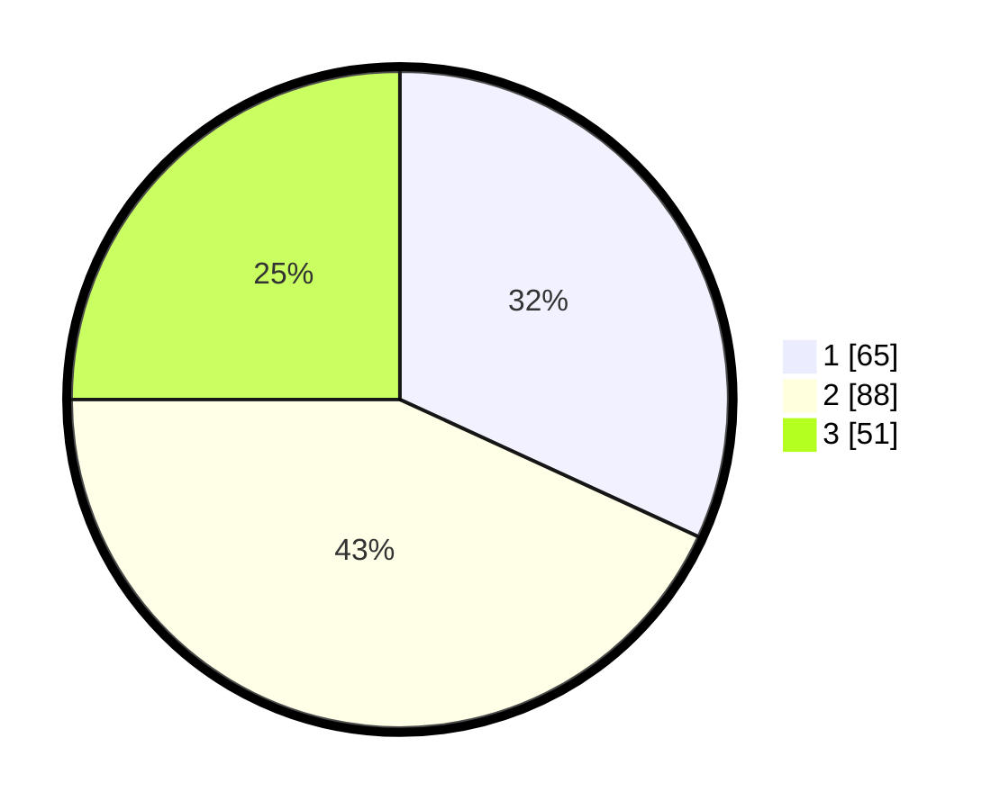

# Hasil

## Grafik

## Tabel

| No.    | Nama Paslon    | Suara | Suara (raw) | Persentase |
|:------ |:-------------- | -----:| -----------:| ----------:|
| 100025 | ANIES MUHAIMIN | 65    | [65][p-1]   | 31,86      |
| 100026 | PRABOWO GIBRAN | 88    | [88][p-2]   | 43,14      |
| 100027 | GANJAR MAHFUD  | 51    | [51][p-3]   | 25,00      |

[p-1]: https://github.com/gigit-pemilu/pemilu-2024/blob/main/pilpres/hitung-suara/sub/31-dki-jakarta/sub/74-jakarta-selatan/sub/06-cilandak/sub/1003-pondok-labu/sub/018-tps/sub/paslon-1.txt
[p-2]: https://github.com/gigit-pemilu/pemilu-2024/blob/main/pilpres/hitung-suara/sub/31-dki-jakarta/sub/74-jakarta-selatan/sub/06-cilandak/sub/1003-pondok-labu/sub/018-tps/sub/paslon-2.txt
[p-3]: https://github.com/gigit-pemilu/pemilu-2024/blob/main/pilpres/hitung-suara/sub/31-dki-jakarta/sub/74-jakarta-selatan/sub/06-cilandak/sub/1003-pondok-labu/sub/018-tps/sub/paslon-3.txt

## Foto C Plano

https://sirekap-obj-formc.kpu.go.id/601d/pemilu/ppwp/31/74/06/10/03/3174061003018-20240214-234809--51691251-39b8-4292-808e-ede74d8dc7b6.jpg

https://sirekap-obj-formc.kpu.go.id/601d/pemilu/ppwp/31/74/06/10/03/3174061003018-20240214-235111--709512a0-b59d-4856-a67e-d9b695160b99.jpg

https://sirekap-obj-formc.kpu.go.id/601d/pemilu/ppwp/31/74/06/10/03/3174061003018-20240214-235323--0af3a952-7a21-4754-a164-bf01aa8e23df.jpg

## Metadata

| Key        | Value               |
| ---------- | ------------------- |
| Time Stamp | 2024-02-24 22:31:28 |

